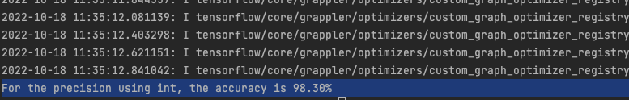

# Ensemble leanring ANN tensorflow log

## 30 May

Have tried to construct a small ANN using the architecture as follow:


```text
Model: "sequential"
_________________________________________________________________
 Layer (type)                Output Shape              Param #   
=================================================================
 flatten (Flatten)           (None, 1023)              0         
                                                                 
 dense (Dense)               (None, 40)                40960     
                                                                 
 dense_1 (Dense)             (None, 18)                738       
                                                                 
=================================================================
Total params: 41,698
Trainable params: 41,698
Non-trainable params: 0
_________________________________________________________________
```

--------------------------------------------------------------------
Piece of the code and settings:

    batch_size = 100

    optimizer=keras.optimizers.Adam(learning_rate=0.001, beta_1=0.9, beta_2=0.999)

    callbacks=[keras.callbacks.EarlyStopping(patience=5)]
--------------------------------------------------------------------

accuracy keeps being below 30%

with the earlystopping callback of patience of 5


## 31 May

Will have to try to use numpy type as input instead of using dataset type from tensorflow.

Added new HeNorm initializer to each layer, this does not help with the loss and accuracy.


Will try 1 cycle schedule and see what is the best learning rate


## 1 June

Have tried the 1 cycle schedule to try to find the best learning rate, however, it seems that it still did not solve the problem with 

high loss and not converging. And also after checking, most of the weight has been reduced to almost 0 (really low value). 

Thought it might be the issue with regularization, have tried to drop out the regularization.


## 3 June

Still no improvement when training without regularization, suspect that the dataset and label has been messed up, will try to start with simple numpy array and corresponding label.

Simply use train_test_split to give a Train set and test set, and add another argument as validation_split=0.15/(0.15+0.70), cancel the flatten layer at the same time.

If this does not work, then I will start writing my own preprocessing stage instead of using the precalculated dataset.

Or I will export the mat data to csv.


**Update: Rewriting the model and cut off the input flatten layer helped with the training process, now thinking probably the l2 reugularization rate of 0.01 might be too high.** 


--------------------------------------------------------------------
Piece of the code and settings:

    callbacks=[keras.callbacks.EarlyStopping(patience=50)
--------------------------------------------------------------------


### updated model summary


```text
Model: "sequential"
_________________________________________________________________
 Layer (type)                Output Shape              Param #   
=================================================================
 dense (Dense)               (None, 40)                40960     
                                                                 
 dense_1 (Dense)             (None, 18)                738       
                                                                 
=================================================================
Total params: 41,698
Trainable params: 41,698
Non-trainable params: 0
_________________________________________________________________
```

Changing the regularization rate to 0.001, the performance was great but it would overfit.


--------------------------------------------------------------------
final training result:

    Epoch 153/400
    197/197 [==============================] - 1s 7ms/step - loss: 0.8879 - accuracy: 0.9774 - val_loss: 1.3972 - val_accuracy: 0.7436
--------------------------------------------------------------------


## 4 June


Changing the regularization rate to 0.005, there is a bit performance drop, but at the same time, the overfit is getting slightly better.


Just realised that I have not let the model evaluate the test set from the first training. Will add that up later.

--------------------------------------------------------------------
final training result:

    Epoch 145/400
    197/197 [==============================] - 1s 7ms/step - loss: 1.9614 - accuracy: 0.7593 - val_loss: 2.1619 - val_accuracy: 0.6275
    43/43 [==============================] - 0s 6ms/step - loss: 2.1735 - accuracy: 0.6222
--------------------------------------------------------------------


It seems that the validation accuracy is just 63%, more or less the same with the test accuracy, the regularization helpped shrink the gap between
training and test from 21% to 14%, seems there should be improvment that could be done.


## 5 June

It seems the previous model with the l2 rete at 0.001 did a better job with the performance.

It could also be concluded that the validation accuracy would match the test accuracy in most cases.

--------------------------------------------------------------------
Evaluation result form the previous model:

    43/43 [==============================] - 0s 5ms/step - loss: 1.3979 - accuracy: 0.7459
    Out[13]: [1.397900938987732, 0.7459259033203125]
--------------------------------------------------------------------


Will try to drop the regularization and have another full on go to see how that goes.


### result without regularization


--------------------------------------------------------------------
Evaluation result for no regularization model:

    Epoch 85/400
    197/197 [==============================] - 1s 7ms/step - loss: 0.0044 - accuracy: 0.9987 - val_loss: 0.8088 - val_accuracy: 0.8017
    43/43 [==============================] - 0s 5ms/step - loss: 0.8663 - accuracy: 0.7963
--------------------------------------------------------------------


It seems that the model without regularization performed well enough, even though the gap between the trainning and validation accuracy 
was about 20%.


Will try to use a customized Adam optimizer to do this model again.


### result with self customized Adam optimizer

`optimizer=keras.optimizers.Adam(learning_rate=0.001, beta_1=0.9, beta_2=0.999)`


--------------------------------------------------------------------
    Epoch 81/400
    197/197 [==============================] - 1s 7ms/step - loss: 0.0039 - accuracy: 0.9990 - val_loss: 0.7909 - val_accuracy: 0.8068
    43/43 [==============================] - 0s 5ms/step - loss: 0.8421 - accuracy: 0.8000
--------------------------------------------------------------------

This result looks teeny_tiny slightly better than the previous model with default Adam optimizer. however, the accuracy keeps staying at 80%.

It has also been spotted that the loss for the validation keeps dropping until one point it started to rise up again, however, the accuracy seems quite stable.

Will try to use Relu instead of sigmoid for the hidden layer's activation function.


### result with relu activation function


--------------------------------------------------------------------
    model = keras.Sequential([
        keras.layers.Dense(40, activation='relu', kernel_initializer=initalizer),        
        keras.layers.Dense(18, activation='softmax', kernel_initializer=initalizer)
    ])
--------------------------------------------------------------------


It seems that relu was not as good as sigmoid in terms of performance and training stability.


--------------------------------------------------------------------
    Epoch 71/400
    197/197 [==============================] - 1s 7ms/step - loss: 4.1040e-04 - accuracy: 1.0000 - val_loss: 1.4422 - val_accuracy: 0.7487
    43/43 [==============================] - 0s 5ms/step - loss: 1.3895 - accuracy: 0.7607
--------------------------------------------------------------------


However, the loss of the training could go as low as the magnitude of $$4e^{-4}$$.

Will switch back to sigmoid and add another feature of saving the best parameters while the validation loss is at its lowest.


### Small study on the model on matlab

The loss graph on matlab could be observed:


The test run on this network is not perfect, the accuracy on this one is not as high as 90%, it is actually 86%

--------------------------------------------------------------------
    ans =

    0.8667
--------------------------------------------------------------------


## 6 June

### Adding dropout in the training layer


Since the accuracy from the model of matlab could be as high as 86.7%, there should be something that could be done to imporove the accuracy on the model we have right now.

Since the training accuracy could be as high as 99.9%, and that would leave a gap of 20% to the validation. This has left us with the 
thought of more regularization to narrow this gap. 

Now with the attempt to add two dropout layers during training as below:


--------------------------------------------------------------------
    model = keras.Sequential([
        keras.layers.Dropout(rate=0.2),
        keras.layers.Dense(40, activation='sigmoid', kernel_initializer=initalizer),
        keras.layers.Dropout(rate=0.2),
        keras.layers.Dense(18, activation='softmax', kernel_initializer=initalizer)
    ])
--------------------------------------------------------------------


This has come to give a fairly good training result to push the validation accuracy above 84%, really close to the matlab golden model.

--------------------------------------------------------------------
    Epoch 389/400
    63/63 [==============================] - 0s 7ms/step - loss: 0.1545 - accuracy: 0.9519 - val_loss: 0.5593 - val_accuracy: 0.8424
    43/43 [==============================] - 0s 5ms/step - loss: 0.5630 - accuracy: 0.8422
--------------------------------------------------------------------


This model has been saved in the project in the path:

`Ensemble_rewrite/CheckPointPath/my_best_model_single_nn_6_June.h5`


## 9 June

**Dropout rate = 0.1**

Since the dropout layer has been working quite well on this regularization, a bit of playing around on the dropout rate shall be performed.

Will change the dropout rate to 0.1 and see how that would.

With the early stopping implemented with the patience of 50. The training stopped at 169 epochs with the accuracy slightly lower 81.6%


--------------------------------------------------------------------
    Epoch 169/400
    63/63 [==============================] - 0s 8ms/step - loss: 0.0606 - accuracy: 0.9868 - val_loss: 0.6417 - val_accuracy: 0.8155
    43/43 [==============================] - 0s 5ms/step - loss: 0.6883 - accuracy: 0.8193
--------------------------------------------------------------------

However, the accuracy on the training keeps being high of around 98.7%. 

It seems that the dropout will shrink the gap between trainng and validation. Will try stronger dropout rate.


**Dropout rate = 0.3**


Change the dropout rate to 0.3 to see how training will perform.


--------------------------------------------------------------------
    Epoch 400/400
    63/63 [==============================] - 0s 7ms/step - loss: 0.3582 - accuracy: 0.8817 - val_loss: 0.4820 - val_accuracy: 0.8446
    43/43 [==============================] - 0s 5ms/step - loss: 0.4955 - accuracy: 0.8422
--------------------------------------------------------------------

From what it seems, the training only stopped here because it runs out of epochs. The training and validation accuracy are getting really close.

Will give it 1000 epochs to see when it will stop and how that will turn out.


>**LONGER RUNS**

The training stopped with the accuracy of 89.2% and 85.7% for training and validation.

A slight boost from previous best model.


--------------------------------------------------------------------
    Epoch 467/1000
    63/63 [==============================] - 0s 7ms/step - loss: 0.3322 - accuracy: 0.8926 - val_loss: 0.4409 - val_accuracy: 0.8569
    43/43 [==============================] - 0s 5ms/step - loss: 0.4552 - accuracy: 0.8556
--------------------------------------------------------------------

This looks promising, would try a value in between 0.2 and 0.3 to see how it does, assumption here is that val_loss will be slightly worse than 0.3 but slightly better than 0.2 and gap of train and val will be lying in between 0.2 and 0.3.

At the same time, this model has been saved as "my_best_model_single_nn_9_June.h5"


**Dropout rate = 0.25**

Change the dropout rate to 0.25 to see about the performance.


--------------------------------------------------------------------
    Epoch 317/1000
    63/63 [==============================] - 0s 7ms/step - loss: 0.2395 - accuracy: 0.9224 - val_loss: 0.4896 - val_accuracy: 0.8577
    43/43 [==============================] - 0s 5ms/step - loss: 0.5016 - accuracy: 0.8541
--------------------------------------------------------------------

Think this model is overall as nearly good as the last one, but this model has a bigger gap and shorter training period.

The tradeoff prefenrece is leaning towards the dropout rate of 0.25.

This model will be saved as: "my_best_model_single_nn_9_June_dropout_025.h5"


### Another network with similar structure and parameter configuration on different bin-ratio

Will implement another simple 3 layer ANN to be trained on the second diagonal, the accuracy should be more or less the same.

Had a look on the second diagonal ANN, it could perform as good as 90%:

    ans =

    0.9015


## 10 June

Have tried to use the same parameters configuration for the second diagonal dataset, the implementation for this network reaches similar accuracy as the previous diagonal implementation of around 85%

--------------------------------------------------------------------
    Epoch 258/1000
    63/63 [==============================] - 0s 7ms/step - loss: 0.2752 - accuracy: 0.9074 - val_loss: 0.4992 - val_accuracy: 0.8460
    43/43 [==============================] - 0s 5ms/step - loss: 0.5035 - accuracy: 0.8407
--------------------------------------------------------------------


Tried to turn the l2 regularizer on to see how it will affect the training.

### l2 rate = 0.001

--------------------------------------------------------------------
    Epoch 305/1000
    63/63 [==============================] - 0s 8ms/step - loss: 1.1739 - accuracy: 0.8170 - val_loss: 1.1964 - val_accuracy: 0.8054
    43/43 [==============================] - 0s 5ms/step - loss: 1.1895 - accuracy: 0.8037
--------------------------------------------------------------------

The gap between the training and validation has been narrowed down greatly. However, the accuracy was not as good as previous results.


Tried to set the dropout rate to 0.2 to see how it behaves. 

**(dropout 0.2 + l2 0.001)**


Yet it seems that the l2 regularizer did not help in terms of performance boosting.

--------------------------------------------------------------------
    Epoch 443/1000
    63/63 [==============================] - 0s 8ms/step - loss: 1.0781 - accuracy: 0.8600 - val_loss: 1.1855 - val_accuracy: 0.8177
    43/43 [==============================] - 0s 5ms/step - loss: 1.1854 - accuracy: 0.8044
--------------------------------------------------------------------

**dropout 0.2**

Result without l2 regularizer


The result shows that dropout rate of 0.2 could not constrain the model as well as the previous rate of 0.25, yet the final validation performance was about the same.

--------------------------------------------------------------------
    Epoch 255/1000
    63/63 [==============================] - 0s 7ms/step - loss: 0.1721 - accuracy: 0.9453 - val_loss: 0.5222 - val_accuracy: 0.8446
    43/43 [==============================] - 0s 8ms/step - loss: 0.5308 - accuracy: 0.8467
--------------------------------------------------------------------

Will keep the dropout rate as 0.25 as before.


**_Think it's time to move on to the ensemble model writing and the final majorvote api research._**


## 13 June

Start writing up for the ensemble model.

Got interrupted by the conference preparation and admin stuff for the conference.


## Resumed on 17 June

Have made a subclassing model for the small ANN since each one has the same structure and model.

```python
class ANN_simple_model(keras.model):
    ...
```

Tried to have a run, but was tossed the error like this:

```Text
Saving the model to HDF5 format requires the model to be a Functional model or a Sequential model. It does not work for subclassed models,
```

This is because the model was not a standard keras model built using Sequantial or Functional API, so older h5 file was not supported on this.

I have changed the way it saves the model by changing it into a path instead of a single file. Everything will be saved in the folder. 

List goes as:

+ assets/  
+ keras_metadata.pb  
+ saved_model.pb  
+ variables/

According to Tensorflow.org:

`The model architecture, and training configuration (including the optimizer, losses, and metrics) are stored in saved_model.pb. 
The weights are saved in the variables/ directory.`

The fianl accuracy is 97.5%, maybe not as good as the one model from matlab, but still good enough.

---------------------------------------------------------------------------
    for i in range(1350):
        bin_count = np.bincount(int_predicted_lb[:,i])
        final_prediction[i] = np.argmax(bin_count)
    diff = correct_lb - final_prediction
    wrong = np.count_nonzero(diff)
    wrong
    Out[15]: 34
    (1350-34)/1350
    Out[16]: 0.9748148148148148
---------------------------------------------------------------------------

This result was accidentally overwritten. But each result of the 20 ANN models were retained as `final_prediction.npy` and `all_20_prediction.npy` 


## 18 June

Trained again, the results were slightly different. However, the overall accuracy was more or less the same, which was 97.2%. with 38 wrongly labelled samples.

This time, the raw results were saved as in `final_raw_prediction.npy`, which contains the softmax results. `final_prediction_18_June.npy` and `all_20_prediction_18_June.npy`

*__The task coming up next should be encapsulation of the original major_vote function. Will have to see if there is any handy API, if not, writing up my own class or function is not 
difficult.__*


## 20 June

Have implemented the majority voting function, which takes the 20 ANNs' raw output and then gives the final output labeling 

```python
def majorvote(all_diagonal_prediction):
    final_class_of_each_ANN = np.argmax(all_diagonal_prediction, axis=2)
    final_prediction_after_voting = np.zeros((total_testing_number),'int')
    for sample_index in range(total_testing_number):
        bin_count = np.bincount(final_class_of_each_ANN[:, sample_index])
        final_prediction_after_voting[sample_index] = np.argmax(bin_count)

    return final_prediction_after_voting
```

Trained the network again and tried to integrate the majorvote function to the final application. Ran into the error with printing.

` print('Final prediction gives a test accuracy of {acc:.00%}'.format(final_accuracy))
KeyError: 'acc'`

This has been fixed by adding `acc=` to `.format(acc=final_accuracy)`. accuracy(97.3%) was more or less close to the matlab model. 

Also have plotted a confusin matrix 

 


Just reading the material sent by Siru about the ensemble voting. Apparently there are *hard-voting* and *soft-voting*.

+ Hard voting: Vote for the class that received most votes from each model.
+ Soft voting: Vote for the class that received most summed probability from each model.

The majorityvote function implemneted in thie version right now is hard-vote.

Will clearly specify this in the future version. Meanwhile, another version of soft-voting will be implmented, and it happens to be easier to implement.

Had a small tryout on the soft-voting implementation, from the result collected on 18 June, the result shows that soft-voting gives a better accuracy of 97.5%.


### Update

Have already implemented a soft-voting as well, the function was defined below:


```python
def marjor_softvote(all_diagona_prediction):
    overall_odds_from_each_ANN = np.sum(all_diagona_prediction, axis=0)
    final_prediction_after_voting = np.argmax(overall_odds_from_each_ANN,axis=1)

    return final_prediction_after_voting
```

At the same time, the original majorvote function has been renamed as `def major_hardvote(all_diagonal_prediction):`

Considering using logarithmic preproceesing now. So that the bin-ratio could be converted into minus.

log(h2/h1) = log(h2) - log(h1)


## 21 June

Did a bit test on both hard voting and soft voting, found out that it might not necessarily be true that soft voting would outperform hard voting.

Will have to stick to a single voting method. But the accuracy is really close after all.


## 8 July

Had a meeting with Ed on Tuesday, talked about what could be done next with the ensemble model implementation. 

So far what could be done is that:
+ retrain the network with logarithmic preprocessed dataset. 
+ Change the activtion function to "relu".

With all seetings mentioned and retrain the network.

**BUT** before the entire network being scripted, a single ANN will be drafted and tested to see what is the best configuration when activation function is "relu".

**Initial configurations of the ANN**

*Dropout rate = 0.25, activation function = relu*

```text
Model: "sequential"
_________________________________________________________________
 Layer (type)                Output Shape              Param #   
=================================================================
 dropout (Dropout)           (None, 1023)              0         
                                                                 
 dense (Dense)               (None, 40)                40960     
                                                                 
 dropout_1 (Dropout)         (None, 40)                0         
                                                                 
 dense_1 (Dense)             (None, 18)                738       
                                                                 
=================================================================
Total params: 41,698
Trainable params: 41,698
Non-trainable params: 0
_________________________________________________________________
```
The difference between training and validation has been quite close. However, this performance is still not as good as sigmoid.

```text
Epoch 448/1000
63/63 [==============================] - 0s 7ms/step - loss: 0.3557 - accuracy: 0.8806 - val_loss: 0.5488 - val_accuracy: 0.8170
Epoch 449/1000
63/63 [==============================] - 0s 7ms/step - loss: 0.3516 - accuracy: 0.8774 - val_loss: 0.5442 - val_accuracy: 0.8192
```


The validation accuracy is only about 80.4%.

Model saved as `/CheckPointPath/my_best_model_single_nn_RELU_8_July_dropout_025.h5`

Will try other configurations to see what is best for RELU.

*Dropout rate = 0, activation function = relu*

```text
Epoch 75/1000
63/63 [==============================] - 0s 7ms/step - loss: 0.0042 - accuracy: 1.0000 - val_loss: 1.0005 - val_accuracy: 0.7538
Epoch 76/1000
63/63 [==============================] - 0s 7ms/step - loss: 0.0041 - accuracy: 1.0000 - val_loss: 1.0096 - val_accuracy: 0.7538
```


This apparently indicates the overfitting of this model without dropout.

The validation accuracy is only 76.2%.

Model saved as `/CheckPointPath/my_best_model_single_nn_RELU_8_July_wo_dropout.h5`

*L2 regulerizer = 0.001, activation function = relu*

```text
Epoch 611/1000
63/63 [==============================] - 0s 7ms/step - loss: 0.2824 - accuracy: 0.9990 - val_loss: 1.0260 - val_accuracy: 0.7691
Epoch 612/1000
63/63 [==============================] - 0s 7ms/step - loss: 0.2765 - accuracy: 0.9987 - val_loss: 1.0315 - val_accuracy: 0.7691
```


The validation accuracy improved slightly to 77.6%.

Model saved as `/CheckPointPath/my_best_model_single_nn_RELU_8_July_l2_0_001.h5`

*L2 regularizer = 0.01, activation function = relu*

```text
Epoch 201/1000
63/63 [==============================] - 0s 7ms/step - loss: 1.3134 - accuracy: 0.8983 - val_loss: 1.6641 - val_accuracy: 0.7262
Epoch 202/1000
63/63 [==============================] - 0s 7ms/step - loss: 1.2950 - accuracy: 0.9117 - val_loss: 1.6677 - val_accuracy: 0.7211
```


The validation accuracy has not been the best with only around 71.9%

*L2 regularizer = 0.005, activation function = relu*


```text
Epoch 379/1000
63/63 [==============================] - 0s 7ms/step - loss: 0.8466 - accuracy: 0.9820 - val_loss: 1.4138 - val_accuracy: 0.7328
Epoch 380/1000
63/63 [==============================] - 0s 7ms/step - loss: 0.8832 - accuracy: 0.9724 - val_loss: 1.4142 - val_accuracy: 0.7386
```


The validation accuracy has not improved much from that of l2 = 0.01 acc = 72.9%


## 13 July

Will try to run a parameter search for the dropout rate and accuracy.

range: [0 : 0.8], step= 0.02 [item*0.02 for item in range(41)]

Wrote the class for ANN with variable dropout rate to run 41 loops for the best dropout rate.

```python
class single_ANN_imp_with_parameter(keras.Model):

    def __init__(self, initializer, dropout_rate):
        super(single_ANN_imp_with_parameter, self).__init__()
        self.initializer = initializer
        self.dp_rate = dropout_rate
        self.hidden = keras.layers.Dense(40, activation='relu', kernel_initializer=self.initializer)
        self.outlayer = keras.layers.Dense(18, activation='softmax', kernel_initializer=self.initializer)
        self.dplay1 = keras.layers.Dropout(rate=self.dp_rate)
        self.dplay2 = keras.layers.Dropout(rate=self.dp_rate)

    def call(self, input_tensor, training=True, **kwargs):
        x = self.dplay1(input_tensor)
        # layer construction
        x = self.hidden(x)

        x = self.dplay2(x)

        return self.outlayer(x)
```

Notice that the activation function has been replaced with 'relu', meanwhile the dp_rate has been included as an input parameter.

After a thorough parameter search, it has been found that the best dropout rate was 0.2 according to the validation accuracy.

However, in terms of the loss, it could be seen that the best performing dropout rate was 0.3.


A more legible figure was plotted with 2 scales:


`Best dropout rate found from range [0:0.8] is 0.2
The highest ccuracy for that is 84.74%`

Search results have been saved into the pickle files in ./parameter_search_Dropout/:

test_acc.pickle
test_loss.pickle

Even though the accuracy was slightly lower than that of 'sigmoid', the accuracy of 84.7% was comparable.

## 15 July

Will try to train the network with the logarithmic preprocess datsets.

Considering do the simple log process first:

$$y_{post} = ln (y_pre) $$

Since the preprocess might have to deal with the case where the input is 0, which would lead to the log preprocess to give -Inf.

So after preprocess, all the -Inf needs to be replaced with 0 instead.

The preprocess has got the first diagonal value saved in the path:

`./Ensemble_rewrite/data_set/log_diagonal_0.npy`

After obtaining the preprocessed dataset, it has been put into the simple ANN for training where it has showed a fairly good result and faster convergence.

*dropoutrate=0.2, 'relu'* 


```text
Epoch 156/1000
63/63 [==============================] - 0s 8ms/step - loss: 0.1940 - accuracy: 0.9377 - val_loss: 0.4562 - val_accuracy: 0.8606
Epoch 157/1000
63/63 [==============================] - 0s 7ms/step - loss: 0.1909 - accuracy: 0.9366 - val_loss: 0.4665 - val_accuracy: 0.8591
```
validation:

`43/43 [==============================] - 0s 5ms/step - loss: 0.4349 - accuracy: 0.8696`

However, the only concern for this preprocess is that the negative input might be difficult to translate.


*dropoutrate=0.3, 'relu'*

Still it seems that the conclusion matches with the previous parameter search.

When the dropout_rate=0.3, we could have lower loss, but the accuracy might not be the best. 


```text
Epoch 309/1000
63/63 [==============================] - 1s 9ms/step - loss: 0.3513 - accuracy: 0.8822 - val_loss: 0.4002 - val_accuracy: 0.8656
Epoch 310/1000
63/63 [==============================] - 1s 9ms/step - loss: 0.3614 - accuracy: 0.8792 - val_loss: 0.4006 - val_accuracy: 0.8620
```
validation:

`43/43 [==============================] - 0s 7ms/step - loss: 0.3951 - accuracy: 0.8637`

Wish to test a bit on the dropoutrate at the middle ground value of 0.25 to see how it does.

*dropoutrate=0.25, 'relu'*

Surprisingly, the loss of this parameter set is not the lowest, but the validation accuracy was the highest and convergence comes faster.


```text
Epoch 181/1000
63/63 [==============================] - 0s 7ms/step - loss: 0.2730 - accuracy: 0.9093 - val_loss: 0.4222 - val_accuracy: 0.8591
Epoch 182/1000
63/63 [==============================] - 0s 7ms/step - loss: 0.2752 - accuracy: 0.9109 - val_loss: 0.4198 - val_accuracy: 0.8577
```
validation:

`43/43 [==============================] - 0s 5ms/step - loss: 0.3861 - accuracy: 0.8719`


## 16 July

Since the dropout rate has been tested on the logrithmic preprocessed dataset. Now Try to build the ensemble model for that with each one tailored for the relu.

All the data has been preprocess and saved in the path in the fashion:

./ensemble_learning/Ensemble_rewrite/data_set/log_preprocess/log_data_preprocess_0.npy

Training results seem quite promising as follows:

```text
Final prediction based on soft voting gives a test accuracy of 97.85%
Final prediction based on hard voting gives a test accuracy of 98.07%
```

The confusion matrix has been plotted as below:


## 22 July

Now instead of doing bin ratio before logrithmic, I'd like to do logrithmic first and then do the minus.

Therefore, the preprocess will go as:

raw_date --> log_preprocessing --> bin_ratio equivalent transition (minus) --> training


Couple details noticed during this process:

+ In the original bin-ratio preprocessing, where if the denominator is 0, the whole ratio will be taken as 0, which is -Inf in log.
+ When the numerator is 0, the whole ratio will naturally be 0, which is also -Inf in log

Therefore, the preprocess should start with log, then do the minus and then convert the -Inf to 0 to make sure the equivalence is retained.

There should be four different cases:

|  A/B          |   normal number   |      0(-Inf)       |  
| ------------- | ----------------- | -------------------|  
| normal number |       normal      |      0(-Inf)       |  
|    0(-Inf)    |       0(-Inf)     |      0(-Inf)       |  

The log preprocessed raw data has been saved in the folder: `ensemble_learning/Ensemble_rewrite/data_set/log_preprocess/log_preprocessed_raw_data.npy`


## 25/26 July

Returned from Manchester, had couple of thoughts exchange and initited this collaboration. A really thought provoking meeting, since the SpiNN-3 board only supports upto 10,000 neurons (Ensemble with around 20,000), I have asked for a bigger computing resource. 

About the model:

+ Ed has tried to contact Andrew, who is in charge of SpiNNaker to seek an alternative to online jupyter note to access the big machine.

+ Also, I was told the log approximation Ed was able to do with the neurons are to approximate the function log(1+x), which is slightly off from the original log prorprocess.

+ But if the preprocessing log(1+x) proves to be working with ANN as well. We might as well go with log(1+x) instead.

+ Restrictions for the conversion have basically just been talked previously with non-negative input, Relu activation, quantisation.

Other stuff:

+ Could try a bit L1 regularisation instead of L2

+ Cross validation to give error bars on each parameter settings while doing parameter sweeping

+ "Highest minimum" error bar when choosing the parameters


## 27 July

Ed agreed that I could plot a contour map to see the equivalence between these two items:

$$ln (\frac{1+h_2}{1+h_1}) \approx ln (\frac{h_2}{h_1}) $$ 

where  $h_2$ and $h_1$ are both non-negative integers. 

The deviation from those two functions has been calculated and plotted in heatmap, but the extreme invalid numbers have been replaced (nan/-inf/inf --> 0)


It could be seen from the calculation that except for the extreme conditions where either one of them is 0. 

The difference is bigger when values are too far off from each other. The replacement may not be able to achieve perfect equivalence.

Counter to the insitinct, the values are pretty close when two values are close to each other. 

The whole range of difference only lives in between [-0.7, 0.7].

At the same time, the bigger one value is, the more stable the difference will be.

To achieve a better replacement, training on the log(1+x) preprocess will be considered. 

But at the same time, the training on the log-->subtraction data will also be carried out.


## 28 July

It has been tested and found that during subtraction, if both numbers are -Inf, the result will be nan.

So it has occurred that preprocessed data could be handled in a non-negative way.

The raw matrix could be written as:


Rewritten version could be written as:


The preprocessed data has been completed. It was saved in the path: 

`./ensemble_learning/Ensemble_rewrite/data_set/log_preprocess/log_subtraction_prepro/diagonal_preprocess_log_X.npy`

However, the data was not processed with np.nan_to_num. Will add this during implementation.


## 29 July

Will use the same code and architecture from previous implementation, but the clipping for handling -Inf and nan will be inserted.

With the approaches like this mentioned. The implementation turns out to be working well still.

```text
Final prediction based on soft voting gives a test accuracy of 97.33%
Final prediction based on hard voting gives a test accuracy of 97.41%
```


It seems that the accuracy keeps being stable and has not been affected that much. It may not be as high as simple log of the ratio.

The trained model has been saved in the path:

`./ensemble_learning/Ensemble_rewrite/Ensemble_CP_log_w_subtraction/diagonal_x`

What comes next would be similar preprocess:

log(1+x) --> subtraction --> training_on_new_data --> conversion


## 1 August

Simple preprocess like log(1+x) could be processed.

Following the same process as before. The preprocessed data could be saved in the path:

`./ensemble_learning/Ensemble_rewrite/data_set/log_preprocess/log_plus_1_subtraction_prepro/diagonal_preprocess_log_plus_1_x.npy`

Because the raw data range starts with 0, the output of this process should not give -Inf.

With the preprocessed data, the training goes on.

Surprisingly, the training gives a really positive result back with:

```text
Final prediction based on soft voting gives a test accuracy of 98.52%
Final prediction based on hard voting gives a test accuracy of 98.52%
```


This route looks promising for conversion and SpiNNaker implementation.


## 2 August

Meeting with Ed, a couple of consutrctive ideas have been made:

+ Deviation between the function intended to implement and the function wanted has been quite small, which is good news
+ In a lot of cases, log(1+x) has been a commonly used data preprocessing approach in general
+ Need to be aware of the floating point precision issue when doing log(1+x), and there is actually a numpy method called log1p that would do the same
+ While implementing the ensemble SNN, a class could be written to to create an object for the network
+ Making well use of the parallellism of SpiNNaker for this project
+ Unfortunately, there is no easier way for me to use the big machine, Ed suggested that I could still use the terminal and git clone to run our scripts
+  ANN conversion to SNN, we could start with a smaller ANN model.
+  Turning off the leakage during implementation to make it a counter.


Following to-do:

+ Ed will keep on investigating the easier way to use the big machine remotely
+ Ed will work on the repo together for the implementation
+ Shouyu will start to learn how to do the conversion
+ Shouyu will start a repo on github
+ Shouyu will experiment on how the accuracy of ANN ensemble will be influenced by the number of ANNs inside.


## 3 August

Have been mentally unstable and could not work.


## 9 Sep

Found the snntoolbox, which is a python package used for converting ANN to SNN. Supported type is the saved h5 file from Keras. This may need some conversion. Since the model written on my end is the subclass model which is a piece of code, searching for the method to convert the model to the supported type.

## 12 Sep

Would probably need to mannually rewrite the model for the application of the toolbox. Also had a meeting today with Ed.

```
Briefing:

1.It might be better and easier to draft our own conversion scripts from scratch instead of using the toolbox, which has a lot of extra features that we don't really need.

2.The newest and most recent conversion approach in the 2021 paper has not been substantially tested. But it could be a good place to start with to look at.

3.Logarithmic tranform needs to be more researched and experimented for the application of this project.

4.As for the dynamic range compression or log tranform in spiking domain, Ed will share part of the thesis on the past research work he has been doing.

5.Introduction to the leakage to the spiking log neuron might help with the edge case where input value is really small to narrow the error between log(x) and log(1+x). This idea could be a good way to eliminate the negeligeble noises.

6.Range of the preprocessed data with log(1+x) substraction changes over different diagonals, the bigeest range is about [-7,12.5]

What to do next:

1.As an easy experiment, a rounding layer in between the substraction(preprocessing) and the actually ANN to see how the ANN would react to the precision change.

2.Quantisation test on the network weight.

3.Figure out possible/equivalent way to implement negative input.

4.A test to do: RELU all the input data in the tensorflow training to see how important the negative values are in the implementation.
```

## 26 Sep

Had a meeting with Ed on 12 Sep to talk how we should move ahead the project.

Have tried to implement the algorithms mentioned in the paper discussed.

Algorithm 1: model-based 
  
  This algorithm only requires the knowledge of the weight from original trained ANN. However, to ensure near loss-less conversion. The ANN has to be restricted with no biases and Relu only activation function.

  Might need longer time to have a relatively good accuracy.

Algorithm 2: data-based
  
  This algorithm requires not just the weights but also the activation value of each neuron, which means the training set is also needed.
  Good point is this method could maintain a good tradeoff between latency and accuracy.

  This approach has also later been extended with the inclusion of biases.

*The rounding layer between preprocessing and ANN*

This experiment was under implementation as a post-training quantisation trial given that it is easier to do.

## 29 Sep

Have implemented both model-based and data-based conversion algorithms. But have not been verified yet.

At the same time, the experiment on the quantisation for the input data has been completed.

simply run the command line at the terminal:
`python preprocess_rounding_layer_ANN.py -p <precision>`

supported precisions include 'float64','float32','float16'

Three different precisions have been tested:
+ float64: The original precision, ensemble model with 98.5%
+ float32: Half the original precision, accuracy still stays at 98.5%
+ float16: Half-precision floating point, accuracy stays at 98.5% still


Based on the experiment above, it seems the model itself has been robust enough for low precisions. 

The ANN model still operates at float64, don't know if this is the main reason that it is not sensitive to the change at the input data precision.

What to do next:

+ Since the input floating point stayed at float16, further test will be done to see if it will handle a mini float (8-bit floating point)
+ Cut down the precision of the ANN weight to see how it will react (tensorflow lite conversion needed)

## 5 Oct

Relu all the input to the ANN and then do the training to see how the ANN would react.

Using this Relu-ed dataset to trainl all the network, it turns out the network would still perform quite well with the accuracy of 98.3%

Slightly lower than previous implementation of 98.5%

Looks like we could eliminate all the negative input from the actual implementation.

## 6 Oct

Will have a look at post-training quantisation and see how far we could go. Tensroflow lite specificially.

After a bit of checking and learning, it seems that conversion to a quantised model is relatively easy, you could even convert the model weights to 8 bits floating point or even uint8. However, extraction of the weights might be something that needs further consideration.


## 7 Oct

After a bit of research, the tensorflow lite conversion to will be done

update:
 the weight observing on the tensorflow lite model could be achived by using an external app called netron with a GUI, or using a more complex way to extracting the weight since the tensorflow lite model is actually a flatbuffer model.

Finished the tensorflow lite implementation with a suprising accuracy of 98.22% compared to the original model of accuracy of 98.5%. The accuracy was barely decreasing.


## 10 Oct

It turns out the Netron (the online version) could actually visualise the whole network with the nice export of the weights and biases.

*Dynamic range quantisation completed model*

It shows that only the first dense layer's weight (40,1023) has been quantised to int8. All of the rest has not been converted.


It could be seen that the biases on the first hidden layer still remains the float32 precision: 


*Full integer quantisation example*

Had a look closer to the tutorial on tensorflow lite, it appears that a full-integer quantisation would require _representative dataset_. This would by default still take floating point input and output and activations but the weight would be all integers.

An example from tensorflow official tutorial:


It could be seen the input/output type is still float32:


This approach should suffice our applicaiton since the precision could be met over time by spiking neurons

Have tried to do the calculation for the quantised model weights, it turns out all we need to do to obtain the converted model weight was to do the following:


Just need to rememebr the final results will need to be rounded to the closest integer, using np.rint() would do the trick


_**Extension to previous rounding layer insertion experiment**_


Previously, we discussed the implementation of inserting a rounding layer in between preprocessing and ANN. 

Now as an extension, this rounding layer could also be used to relu the input data to get the ANN accuracy on the relued input data but trained with the original data.

The updated script would add another option to confirm if the relu should be done or not:

`python preprocess_rounding_layer_ANN.py -r -p <precision>`
  
`-r: with the relu option
The script could still run without the -r option`

Tested on the script and found that if the model was trained on the original data, puting it to do inference on relu-ed data would chop down the accuracy:


## 13 Oct

Have managed to load the representative dataset into the tensorflow lite converter. It requires a dataset generator.

I have written up a generator class for this application since I need to pass in different dataset for each diagonal into the generator.

Now all the weights and biases have been converted into integers.


**Hidden layer 1**


**Hidden layer 2**


Notice that all the weights have been quantized and limited to int8, but the biases have been quantized in int32.

At the same time, the evaluation from the scripts suggest the accuracy remains 98.22%


## 14 Oct

Had a look at the quantization aware training, it seems the process for quantization aware training is not hugely different from post-training quantization. It would go like:

Don't know if it is because during the retraining with new q_aware model. We only used the subset of the training set and we trained 200 epochs for each model. It feels that the new q_aware model was bit overfitting the subset. Therefore, the overall accuracy tends to be lower than before:


parameters are slightly different from before as well.

Will do more research on how to properly use Q_aware quantization especially retraining.


## 17 Oct

It seems that I don't really have to run 200 epochs or following the example from their official website to use a subset. I could still use the full training set and simply give it 2-5 epochs for fine tuning.

200 epochs may be too much for the purpose of fine tuning.

**Experiment 1**

Still use the subset training images, but change the epochs: 200 --> 5, also changed the validation_split: 0.18 --> 0.1

It looks that the accuracy stayed lower than baseline model and even lower than last experiment on 14 Oct.

New accuracy = 96.81%


**Experiment 2**

Use the whole training images instead of the subset of the training set. This time, I inserted the accuracy evaluation before training after Q/DQ nodes insertion. This is to check the accuracy change before and after 'Fine tuning'. But for a quick run check, the settings for the epochs and validation_split remain the same.

It could be observed that the insertion of the Q/DQ nodes have done a tremendous impact on the model accuracy.

*Before finetuning*


*After finetuning*


Meanwhile, it seems different models would react differently to the nodes insertion and finetuning. Some would outperform the baseline model while some would stay under the original.


With the inclusion of the bigger training set, the accuracy stayed same as before.

Accuracy = 98.22%


**Experiment 3**

Will try to train the quantization_aware model a bit more or get a call back function like before to save the best model possible with an earlystopping with patience of 50.

Epochs: 5 --> 200
validation_split: 0.1 --> 0.18

It turns out a lot of models would perform better with longer training, but the overall ensemble model seems would not reach a higher accuracy than 98.22%


## 18 Oct

**Roudning layer test update**

Update on the rounding layer test for the trained model, it seems that it has been really resilient to the input, even the input has been dowgraded to integers. The whole test still stands with 98.30% accuracy, which is really surprising.

The flow:

input data --> np.rint(input data) --> input data.astype(float16) --> tested on ANN




**Data distribution graph**

To assist the analysis of where the key information lies, a data distribution plot needs to be done.

Steps on producing the graph:

data_set --> np.rint(data_set) --> count for each integer --> plot

Because there are 20 different datasets for 20 diagonals, here I will just plot one typical plot from them.

number 5:


Since the number 0 has been overly much more than the rest, the displayed y limit has been set from 0 to 1.5e6

It could be seen that number 1 and -1 and few digits around 0 are the main crowd.

## 19 Oct

Still figuring out how to extract the weight from tensorflow lite model.

But it has occurred to me that I could have a close look on the netron repository to see how it has been done by Netron and probably could do a replica.

It's written in Javascript. Will check closely to figure out.

Turns out it's too complex to read through, and the weight extraction might have been finished before the javascript kicks in.


## 20 Oct

Bumped into this paper talking about tensorflow lite hardware implementation where they needed weight extraction as well. So they need to do a flatbuffer conversion to extract them to store inside the external memory.

`Manor, Erez, and Shlomo Greenberg. "Custom Hardware Inference Accelerator for TensorFlow Lite for Microcontrollers." IEEE Access 10 (2022): 73484-73493.`

## 7 Nov

Continuing from previous implementation, trying the flatbuffer compiler. Trying to convert tflite file into json.

It turns out that the compiler need a proper schema to do the compilation, which ended up yielding the json file that does not look legit.


## 15 Nov

**distribution plot extension**

Resuming previous work on distribution of the input data with logarithmic axis.

The data has been saved in ./data_visual/count_of_the_count/

This plot update will simply be excuted using the extended script log_y_axis_plt.py

It turns out the distribution does not give much information either.


**Integer input value test on tflite**

Just like before, the dataset was clipped at 0, and then rounded to the closest integer number and saved in float 32 number, all the final prediction should also be integers.

With all this done, it turns out the accuracy dropped a bit to 95.56%


## 16 Nov

**Integer inpu value test on QAT tflite**

Just realised that I have been testing the integer test on the simple full integer tflite models instead of the newest quantisation aware trained model. 

Will test on the tflite model that converted from QAT models instead.

After evaluation it appears that the accuray from the tflite models converted from QAT models is slightly higher than post-training quantisation ones.

Accuracy of 96.15%


## 17 Nov

Tried to modify the script of quantisation_aware_training.py to save the model's weight during training before quantisation.

Found out that saving the model into .h5 model would break the model, which would cause loading error. Since there are undefined layers like fakequant layers, which are not supported by keras.

Have fixed this by change the saving method by saving the whole model into a directory.


## 18 Nov

A typical mdoel which has been inserted fake quant layers and trianed would look like this:

```text
Model: "sequential"
_________________________________________________________________
 Layer (type)                Output Shape              Param #   
=================================================================
 quantize_layer (QuantizeLay  (None, 1023)             3         
 er)                                                             
                                                                 
 quant_dropout (QuantizeWrap  (None, 1023)             1         
 perV2)                                                          
                                                                 
 quant_dense (QuantizeWrappe  (None, 40)               40965     
 rV2)                                                            
                                                                 
 quant_dropout_1 (QuantizeWr  (None, 40)               1         
 apperV2)                                                        
                                                                 
 quant_dense_1 (QuantizeWrap  (None, 18)               743       
 perV2)                                                          
                                                                 
=================================================================
Total params: 41,713
Trainable params: 41,698
Non-trainable params: 15
_________________________________________________________________
```


## 29 Nov

Has done the trial of the manual calculation of the integer weights from the original saved model and extracted weight from netron app.

tensor <-- netron observed weights
hidden_lay_w_int <-- manual calculation
diff  <-- tensor^T - hidden_lay_w_int

It turns out the diff is a 0 matrix, which proves the validility of the calculation.

Now just need to decide what we should include and if we should include the calculation in the script: "Quantization_aware_training.py"

Same applies biases.


## 1 Dec

Since the definition of the quantisation is as follow:

```math
r = (q-zero_point)*scale
```

To get the quantised value q, calculation could be expressed as:

```math
q = (r/scale)+zero_point
```

so function as quantisation has been defined in `./mis_fun/fun_def.py`

## 2 Dec

Have managed to understand what each layer in tflite model does and how the quantisation works.

Using the function drafted above, the weight and biases have been extracted from the original tensorflow file and tflite file.

Integer weights are extracted and saved as pickle files in the path `./quantisation_aware_training/QAT_tflite_weight`

later on, the verification script shall be written.


## 5 Dec

Since the weights have been extracted, the verification could probably be considered using the class *ANN_model_imitator*

The verification so far has been proven failed, accuracy only with 32%


Possible cause might be the tflite model still has internal quantisation (quantise every activation and input data) in the range of [-128, 127], this will be further verified.


## 7 Dec

Happen to find the simpler way to extract the quantised weights from tflite models.

Simply just use the provided method `obj.get_tensor(*index)`

This will return the tensor values, like quantised weights if the layer is the key matmul layer.


## 13 Dec

In order to accelerate the verification process, a quantised neural network imitator class has been written. The quantised parameters and weights will be attributes for this class in the data strucutre as:

```python
    def __init__(self, layer_graph, quantised_w, quantisation_parameters, quantise_layer_existence=None):
        self.layer_graph = layer_graph  ## a list of number of neurons in each layer
        self.quantisation_parameters = quantisation_parameters ## all the scales and zero points for each quantisation operation
        self.quantise_layer_existence = quantise_layer_existence ## the existence of quantise layers (activation rescale back to int 8
        self.quantised_w = quantised_w ## a list of quantised weights and biases

```

The attribute "quantise_layer_existence" should be "Existing" by default, cus the precision for activation values is supposed to be int32(float 32 for the input, which can be taken as the very first activation), which needs to be rescaled back into int 8.

This attribute might be deprecated at later version of implementation.

*layer_graph* is supposed to be the list of # of neurons at each layer, including the input and output layer.

*quantisation_parameters* is a list of scales and zero points for each quantisation. According to the topology of the network, suppose there are N layers, there should be N\*3-2 elements. 

e.g.:
(first_lay_act --> first_hidden_lay_w --> first_hidden_lay_b --> first_hidden_lay_act --> second_hidden_lay_w --> second_hidden_lay_b......)

*quantised_w* is supposed to be the list of quantised weights and biases. Suppose there are N layers, there should be N\*2-2 elements.

e.g.:
(first_hidden_lay_w --> first_hidden_lay_b --> second_hidden_lay_w --> ......)


Within the class, there are two methods. 

One namely output_dequantised_calcualtion_act(self, data_set_ndarr):

This method will output a list of activations of each layer using dequantised weights and biases. Calculation takes in the quantised weights and biases. 

```code
partially_quant_real_w = Quant_w - zero_point_w
temp_act = input_data * partially_quant_real_w + Quant_bias
act = Relu(scale_bias*temp_act)
```

The other as output_quantised_calculation_act(self, data_set_ndarr):

This method will output a list of activations at each computation node. Calculation takes place in total integers.

```code
quant_input_data = scale * (input_data - bias)
temp_product = quant_input_data * Quant_w
temp_product = temp_product - z_w * quant_input_data
temp_product = temp_product - z_a * Quant_w
temp_product = temp_product + z_w * z_a
temp_product = temp_product + Quant_bias
temp_act = s_w * s_a * temp_product
act = Relu(temp_product)
```
Because in our quantisation scheme, the weight quantisation is symmetric but activation rescale is still asymmetric, which means in every case, z_w = 0, z_a != 0. This suggests that the 3rd and 5tht line are simply for formality. 

## 14 Dec

With the implementation of this class of quantised network imitator, the activation could be verified with the quantised weights.

The totally quantised calculation seems to work, the weights are correct with the verification. However, the dequantised calculation for the activation seems invalid.

Debugging:

Realised that the calculation in the dequantised activation calculation mentioned above is not logically sound.

Supposedly it should follow the calculation as in :


However in the implementation, the calculation flow has been like this:


So the activation has been multiplied with s_1 twice.

This logic error has been fixed, now the verification could be done with the class.


## 15 Dec

Preliminary verification has presented to be quite promising. With the first 20 samples out of 9000 infered as:

Dequantised activation calculation of the first 20 samples have been presented as follows:


Quansied activation calculation of the first 20 samples could be presented as:


The corresponding label of the first 20 samples could be seen here:


## 19 Dec

Have fixed the previous implementation of the code for verification with the newly defined class to do the verification.

Where there's a new method added to the class as prediction. This predicition simply just takes the second to the last layer of the activation as the prediction.

The vefification shows that the implementation still holds up the accuracy of around 96%


## 2 Jan

Had a thorough read on the DRC part of the thesis from Ed, had a breif idea about how that works.


## 6 Jan

Just had an idea, since ANN basically can learn anything. Technically, I could train an ANN to do the logrithmic and then do the conversion. Probably we need more neurons to do the representation?


## 9 Jan

Found this piece of code on tensorflow official site, could be useful:

```python
import tensorflow as tf
converter = tf.lite.TFLiteConverter.from_saved_model(saved_model_dir)
converter.optimizations = [tf.lite.Optimize.DEFAULT]
converter.representative_dataset = representative_dataset
converter.target_spec.supported_ops = [tf.lite.OpsSet.TFLITE_BUILTINS_INT8]
converter.inference_input_type = tf.int8  # or tf.uint8
converter.inference_output_type = tf.int8  # or tf.uint8
tflite_quant_model = converter.convert()
```
Here it says users could define the input and output type as in unsigned integers, which is what I needed.

After tried this conversion in the python console, surely the input and output types have been changed to uint8, but the activation still remains to be quantised, which is not helpful in this case.

According to the specification, the tool will primarily use int8 quantization. Which means that there may always be the quantize layer to rescale the activation back to [-128, 127]. This will be an issue for the conversion to ANN.

[Quantization specification](https://www.tensorflow.org/lite/performance/quantization_spec)


Really need to rethink about our route.

Probably will try Ed's code now to see how that works.

## 27 Feb

As an essential compontent, I have to consider the inclusion for the biases in the SNN. This could be implemented using the offset current parameter.

So I played around with this parameter and see how it does for the IF_curr_exp neuron.

With a bit of the tuning and tweaking, I could achieve an almost non-leaking IF neuron with linear behaviour.

Negative input offset current -50 nA:


Positive input offset current 50 nA:


Will start off with simple ANN implementation like a 3 layer ANN for mnist dataset.

Got the simple ANN in the folder and saved.

summary below:

```text
Model: "sequential"
_________________________________________________________________
 Layer (type)                Output Shape              Param #   
=================================================================
 flatten (Flatten)           (None, 784)               0         
                                                                 
 dense (Dense)               (None, 50)                39250     
                                                                 
 dense_1 (Dense)             (None, 10)                510       
                                                                 
=================================================================
Total params: 39,760
Trainable params: 39,760
Non-trainable params: 0
_________________________________________________________________
```


## 28 Feb

Will now attempt this conversion. 

But it seems the use of neuron model IF_curr_exp somehow does not show a strong linear behaviour. Where the input current, even as "tau_syn_E" was set 1, the input current shape is still quite exponential. And it won't match too well with the membrane potential.


## 1 Mar

After the meeting with Ed, I was enlightened that I should probably use IF_curr_delta where the input current was shaped in delta function. 

And yes, this modeling offers much higher linearity for the model behaviour.

Input current was modeled as the delta function:


Memebrane potential has been more linear:


 Also noticed that I cannot set the refrac time as 0 when the simulation timestep is 0.1, this will cause the neuron to stay in refractory period forever. Membrane potential stay at 0. But could work at some cases.

But this is totally doable when the timestep is 1

Will have to avoid using timestep=0.1, since I could not make the v update when ts=0.1 with no matter what setting tau_refrac is.

Best behaviour and simulation setting is timestep set as 1, and tau_m set as 2000.

Now I am actually curious to see why this happen. If this is an issue that only happens with v1.6.0.1. Will now try this out in v1.6.0.0.

After verification, I found out that this is not an issue at v1.6.0.0. So potentially, this is another bug with the new spynnaker package.

Now the flow will just be:

Training on my Mac using tensorflow or pytorch --> Export the parameters and converted implementation --> Simulation on Linux

Also I noticed that when timestep was set to 1, the input current with different weights are bringing the same impact to the membrane potential. (specifically at neuron 1 and 2, green and amber):


It could be seen that at least the input current has been shown as different in 0.2 and 0.3 in terms of the intensity:


So I will have to stick to the simulation timestep at 0.1, and so far this could only be run on my linux machine.

Correction: it turns out SpiNNaker just hate some settings, timestep=0.1 and refrac=0, tau_m=2000, cm=200, works on both my Mac and Linux.

So I will probably stick with this setting.


## 2 Mar

Did a simple test on the weight assignment and reimplement on SpiNNaker, it appears there's no spikes coming out. 

Observing the activation in the hidden layer, it could be noticed that there are some similarities on the pattern of the activation of the hidden layer and membrane potential of the hidden layer.


It could be seen there are some similarities between these two, but the issue with it is the part the should be zero is not zero in the membrane potential. The contrast of the memebrane potential is not big enough.

While I was checking closely to the code I drafted previously for the conversion algorithm.

I found that I have not been updating the previous_factor, which stayed as 1 the whole time?


Also It seems the original pseudo code made a mistake(is it ?) by updating previous_factor with scale_factor instead of applied_factor as indicated in their code.


Will also check closely for the model based normalisation (even though not used often).

Appears that the model based weight normalisation is ok.

Will update my implementation with scale_factor for now.

Noticed an interesting thing with the final layer's membrane potential, with the i_offset, it seems all the neurons will increase its potential at the same rate, the difference is simply just how long this increase will last. So in a sense, this amount of increase is proportional to the actual bias. And this does not agree with what I had in mind how the offset current would do

But still, there are some issues to be sorted out.

## 3 Mar

Because I tried the SpiNNaker but it is not giving me the right prediction. Considering the old project was using the software based LIF simulaiton. I thought I could do the same.

Wrote up my own class of LIF spiking layer and also poisson layer. Meanwhile I have also added them together into the network class.

This has not yet included the supoort for biases.


## 4 Mar

I wrote a simple script to verify the previously converted weights from ANN. A simple 3 layer SNN was loaded with the newly drafted class.

Again, biases are still being ignored for now.

I simply tried the first 20 samples with the LIF implementation without biases. My implementation got 19 correct.

Kinda proves that the converted weights were working.

## 5 Mar

Did some further verificaiton and it seems the accuracy so far is still ok.

Tried 50 samples where we had 48 correct.


## 6 Mar

Verified the implementation on SpiNNaker with larger input intensity (1000Hz), even though there are still not many spikes coming out of the final layer, the overall trend observed has been more positive than last week.

One simple test on the sample


Sample 9284 number 2:


The side by side comparison of the spike activity and ANN activation:


I still do not know how exactly the offset current works. It seems odd to me.

It looks that it is doable, but I need to figure out why the offset current is behaving oddly.


It could be seen that neuron number 8 has an advantage becuase of the offeset current. The final layer would do better without the current cus the neuron number 2(the correct class) would totally make it if not for current boost. And from my understanding, the current should give increase or decrease at every single timestep instead of this where it will just bring a certain amout of potential change and stop. And according to the hidden layer's spike activity, there's no spike to the final layer before 200 ms.

It should be more like this:


## 8 Mar

In terms of the offset current, I am not sure if it is the issue with new spinnaker package, so I will run this simple implementation on Linux the old package to verify the current behaviour.


So I have just run the same script on the old package on linux, and it seems that this may be an issue that exists both on the new and old package?

Will send an email to ask Ed about this and see his experience on this topic.

Will try to add the offset current into my class defined implementation.

Also just tried to use the implementation on testing data, it seems it has gone wild. Somehow the accuracy dropped significantly.

It seems that I could still make it work with the normalised weight on training datasets without biases by adjusting the threshold to 0.1

Yes, I am being silly by checking the output of the net's inference on the testing dataset agains training label. So of course the accuracy would be low.

After fixing this issue, yes, it shows that the network is working just fine with the normalised weights.


## 9 Mar

Fixed a small issue I found in my class that lies in the function propogate, I wrote = instead of + where it was intended.

This seems to have brought extra accuracy. 

Added one time step latency between each layer with a simple buffer. Seems it does not bring any drop on accuracy.

Since for ANN, biases is only like a one-off calculation during inference, I assume during the whole sample inferencing, the total increase towards the membrane potential should simply just be the value of the bias. Therefore, I divide the converted biases by total calculaiton steps and added one portion at each time step.

It seems it brings a slight increase towards the network.

Will verify the test dataset again, to see the best possible accuracy I am achieving here.

In total, the accuracy is 96.4%, by comparison, the ANN offers 97.12% accuracy.

## 12 Mar

Aim here is to convert and simulate the network based on the ANN ensemble that was trained on the positive log_plus_1_subtraction_data.

But I reliased that the data that the ANN was trained on was not normalised, they are distributed in the range of \[0, 10.19\], this is just the first ANN's input range. So apparently I could not find a universal way to normalise every dataset.

## 13 Mar

Did the conversion of the network anyway, but still, I have not entirely ironed out the input source issue.

Converted weights were saved in the folder ensemble_model_imp/saved_model_w/ as in pke pickle files.


## 14 Mar

Ran a very simple verification on the first ANN network, which takes the data of the first diagonal, even though this issue was not entirely addressed, the inferencing on the first 1000 samples still seem promising with the accuracy of 94.6%

Now I shuffled the dataset, so I could test every possible label 0-17 to see how the network is. I am doubtful about the performance of the network. This is too optimistic.

Surprisingly, the accuracy is 85.1%, probably not too far off from the actuall ANN.
And my network verifying 1000 testing samples only took around 2 mins with each sample lasting 1 seconds of running.

Now I am verifying the whole testing set to see the overall accuracy difference between these two.

After verifying this thoroughly, I got the accuracy from SNN as 84.37%, the corresponding ANN is 89.7%, there's around 5% accuracy loss here. 

I will need to observe in detail how many spikes were generated at the input. 


## 15 Mar

Simulation options:
```python
sim_opt = {"time_step": 0.001,
           "duration": 1,
           "max_rate": 100
           }
```

After observing the simulation closely, I noticed that the input spike counts are basically 100 times the original input data value:

```text
e.g:

6.84801 -->  666 spikes (expecting 685 spikes)
0.92853 -->  85  spikes (expecting 93  spikes)
```
But because the precision was lost (could be seen apparently) during this process, the results are not as accurate as intended.

The generation process goes like:

```text
---------------------------------------------------------------------
                      Poisson spikes generation:
---------------------------------------------------------------------

rate              <-         input_rate 
scale_factor      <-        max_possible_rate/max_rate
random_num        <-        rng.next(0,1)\*scale_factor
spike             <-        if (random_num < rate)
```

In our case where the input rate ranges from [0, 10.19], the random number generated ranges 

from (0, 1)\*(1000/100) --> (0,10).

This gives a more or less good fit to the original rate. This means we are generating random numbers in the range of (0,10) and compare it to input range [0,10.19], this would somehow give the input rate that satisfy the maxium possible rate = 1000.

We would have big issue if the input rate range is bigger or smaller than this.

Alternative ways of generating spikes needed.

Another thing I noticed is that random number generation is not actually random, it is more pseudorandom. Cus clearly there's a period where of the input spikes.

But overall I am pleased with how this is working.

Probably if I need to make this work, 6 spikes could not be a good enough to represent the input data.


To keep the precision, probably the best I could do is to either divide the input rate by 100 so that the range will be [0, 0.1019] or [0, 0.17] at the worst case and set max_rate = 1000. This should give us the input spikes from [0, 102].

Or

I multiply the input rate by 100 so that the range will be [0, 101.9] and take the literal input number as the absolute rate. This needs some modification of the code.

Will try the first solution now cus it's easier.

By doing this, we are getting the overall accuracy of 68.15%, so apparently, we are not getting enough spikes from input.

By comparison this approach offers a different expected spike rate:

```text
e.g:

6.84801 -->  77 spikes (expecting 68 spikes)
0.92853 -->  8  spikes (expecting 9  spikes) 
```

I could change the simulation threshold to give us more spikes in the hidden layer. But I doubt about the accuracy.

Input range [0, 102]:

max_rate = 1000 Hz

Changed threshold to 0.5, and the accuracy is: 80%

Changed threshold to 0.25, and the accuracy is: 80.29%

Changed threshold to 0.1, and the accuracy is: 79.11%

I don't think there's any more point to drop threshold.


## 29 Mar

Started exploring Arduino board as it could run tensorflow-lite model on it. This could be a benchmarking implementation for our SNN model.

Tried its example for its hello world example where it tried to implement a simple ANN to inference the sine wave function and use that value to dim the light.

Over the example, it could be noticed that the process for the inferencing on edge device is basically the same as using the tflite interpreter:

Initialise the tensorflow-lite and load the tflite model --> 

Check the model version (add op resolver) and instantiate interpreter -->

Allocate memory (arena) get input and output tensor -->

Set tensor for the input -->

Invoke and read the output tensor -->

Output handling

Have converted my simple 3 layer ANN model for handwritten digits into .cc file and included into the Arduino sketch. Now I just have to figure out how to send in the data.

Meanwhile, I have also tried to add the peripherals like LCD screen and camera. But it has been a bit bumpy along the road.

Will try to add the simple ANN for handwritten digits first.

Figured probably the simplest way so far is to send in information through UART export the information on LCD screen.

And I need to figure out how to send in floating numbers like 10.17

## 30 Mar

successfully merged the LCD with my neural network sketch. But had error at the stage of tensor dimension check:

```text
Bad input tensor parameters in model
3
1
28
28
1
```

First number represent the input dimension which is 3, or straightly (1,28,28).

Last number represents the input data type. It is Float32 here as defined in the tflite cpp file.

```c++
typedef enum {
  kTfLiteNoType = 0,
  kTfLiteFloat32 = 1,
  kTfLiteInt32 = 2,
  kTfLiteUInt8 = 3,
  kTfLiteInt64 = 4,
  kTfLiteString = 5,
  kTfLiteBool = 6,
  kTfLiteInt16 = 7,
  kTfLiteComplex64 = 8,
  kTfLiteInt8 = 9,
  kTfLiteFloat16 = 10,
  kTfLiteFloat64 = 11,
  kTfLiteComplex128 = 12,
  kTfLiteUInt64 = 13,
  kTfLiteResource = 14,
  kTfLiteVariant = 15,
  kTfLiteUInt32 = 16,
  kTfLiteUInt16 = 17,
  kTfLiteInt4 = 18,
} TfLiteType;
```
Will find ways to do this tflite conversion. This link is a good example:
[How to make tflite model take int8 input](https://stackoverflow.com/questions/66551794/tflite-cant-quantize-the-input-and-output-of-tensorflow-model-to-int8)

Used this method and tried to convert the model into lite model that takes in int8 for input.

## 31 Mar

Have converted my model into the form where it takes in the int8 as input.

Will now convert it into cpp and added into the board.

Somehow with the input from terminal, the network is not responding or stuck at the data collection stage.

Will find a more granular way to send over chunky data like 784 piece of floating point.

## 1 Apr

Wrote my python script to send over information through UART with my laptop and display on LCD. But it turns out that python might be too fast to dump all the information for Arduino board to do the preprocessing. So there is a big data loss with the script and the Arduino board.

Could probably convert the number into integer and load them directly into the board. This may be faster.

But the communication between laptop and Arduino is established.


Given that there's no data loss(I inserted sleep time between each serial packet which resulted in a really slow process), the inferencing is actually correct!

Now just have to optimise the data transfer.

So It turns out driving LCD screen might be the actual bottleneck, I tried to not display every received number and only update the display every 100 samples, and it is working fine. Will try to see how fast I could go.

Wonder if increasing the baudrate would actually speed up the inferencing. Will try this later.

Optimisation: dropped the tensor Arena size from 6000 to  2500, turns out we do not need that much space for the interpreter.

At the same time, I tried to do all the 30 samples in one go, it could be really fast, but if I run all samples continuously, there would be wrong inferencing. However, if I run each sample individually, all 30 samples will pass with no errors.
This could be the improvement that could be done with a better data transmission interface. UART would sometimes send wrong data it seems.

But overall, the tensorflow lite implementation proves to be feasible, and it could be a good application if we have some better co-processing or data transmission peripherals. Could probably try to measure the power consumption of this platform as a good benchmarking.

Next step, I will transfer ensemble ANN over.

## 3 Apr

I simply added one more line to the original imp on Arduino to send the inference result back to the laptop. And the issue that happens during batch running was solved.

So Yeah, it seems that the scripts run much faster than the board, so that there needs to be "handshake", i.e. information exchange to stay synced.
```text
 ______          __________
|   A  |        |          |
|   R  |------->|     P    |
|   D  |        |          |
|   U  |<-------|          |
|   I  |        |          |
|   N  |        |     C    |
|   O  |        |          |
|______|        |__________|
```
Honestly I do not want to work today, feeling sooo tired.

Could probably think how to speed up the software based SNN simulation and raise the query on SpiNNaker user group.


## 6 Apr

Will now move over to the bin-ratio tensorflow-lite implementation. Since logarithmic calculation is more expensive than division, I will simply just implement the original ensemble rewrite into the board. But probably the issue is the memory size.

Since right now it's just 20 individual ANNS for the same task, can I add another layer just for the summary work to give each network different weights on the final decision making?

## 7 Apr

Tried the keras API where layers could be concatenated by using:

```python
keras.layers.concatenate([model1.layer, model2.layer])
```

However, this may not work with subclssing defined keras model. Will try to convert them into sequential or functional defined keras model.

My conversion seems simple where I recreate a same network using sequential API, load them with the variables from the old network by using

```python
new_model.build(input_shape)
new_model.set_weights(weight_variable)
new_model.compile(loss=New_loss, optimizer=New_optim, metrics=New_metrics)
```
And then the new model is ready to use.


All I have to do at the concatenation is:

```python

keras.layers.concatenate([new_model_1.output, new_model_2.output])
```

training results shows that adding one extra layer could not give better results.


Compared to the original simple method where we could get 97.26% accuracy, adding another layer does nothing but making it more complicated than it should be.


