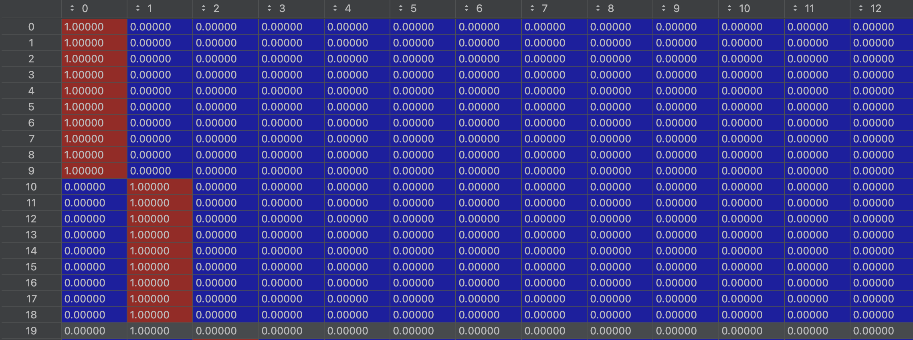
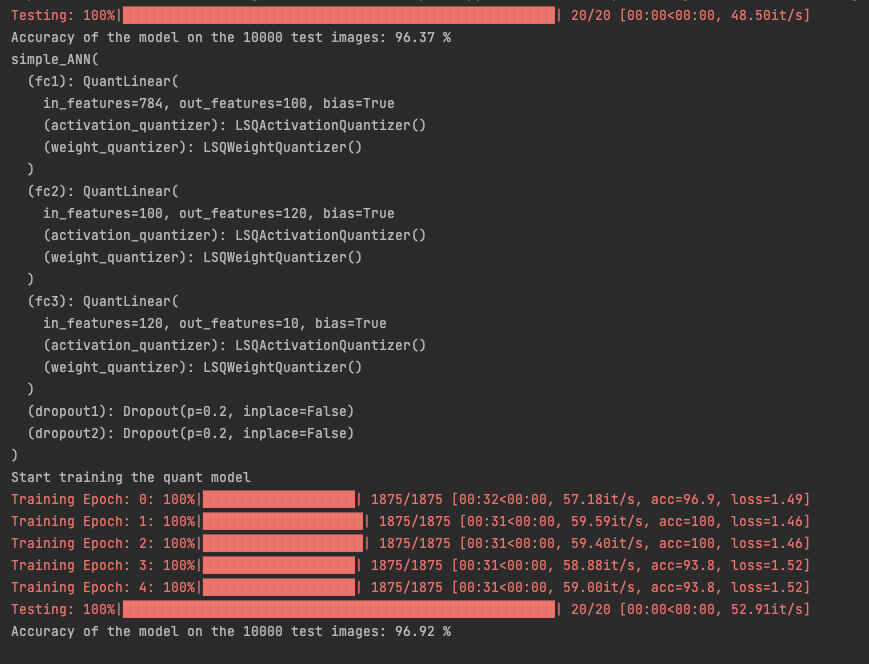
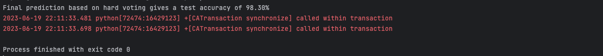
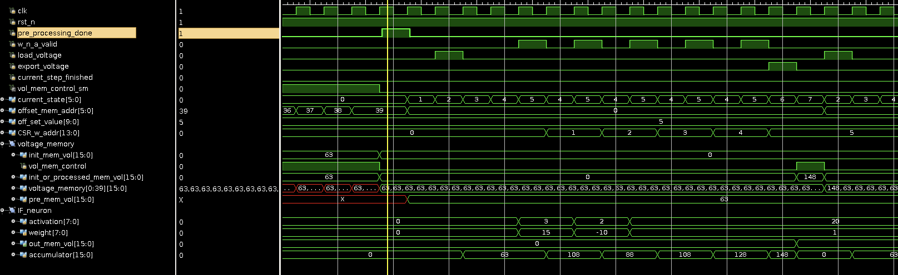
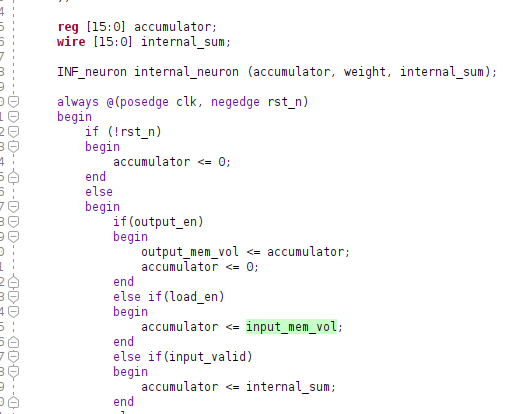

# Ensemble leanring ANN tensorflow log

## 30 May

Have tried to construct a small ANN using the architecture as follow:


```text
Model: "sequential"
_________________________________________________________________
 Layer (type)                Output Shape              Param #   
=================================================================
 flatten (Flatten)           (None, 1023)              0         
                                                                 
 dense (Dense)               (None, 40)                40960     
                                                                 
 dense_1 (Dense)             (None, 18)                738       
                                                                 
=================================================================
Total params: 41,698
Trainable params: 41,698
Non-trainable params: 0
_________________________________________________________________
```

--------------------------------------------------------------------
Piece of the code and settings:

    batch_size = 100

    optimizer=keras.optimizers.Adam(learning_rate=0.001, beta_1=0.9, beta_2=0.999)

    callbacks=[keras.callbacks.EarlyStopping(patience=5)]
--------------------------------------------------------------------

accuracy keeps being below 30%

with the earlystopping callback of patience of 5


## 31 May

Will have to try to use numpy type as input instead of using dataset type from tensorflow.

Added new HeNorm initializer to each layer, this does not help with the loss and accuracy.


Will try 1 cycle schedule and see what is the best learning rate


## 1 June

Have tried the 1 cycle schedule to try to find the best learning rate, however, it seems that it still did not solve the problem with 

high loss and not converging. And also after checking, most of the weight has been reduced to almost 0 (really low value). 

Thought it might be the issue with regularization, have tried to drop out the regularization.


## 3 June

Still no improvement when training without regularization, suspect that the dataset and label has been messed up, will try to start with simple numpy array and corresponding label.

Simply use train_test_split to give a Train set and test set, and add another argument as validation_split=0.15/(0.15+0.70), cancel the flatten layer at the same time.

If this does not work, then I will start writing my own preprocessing stage instead of using the precalculated dataset.

Or I will export the mat data to csv.


**Update: Rewriting the model and cut off the input flatten layer helped with the training process, now thinking probably the l2 reugularization rate of 0.01 might be too high.** 


--------------------------------------------------------------------
Piece of the code and settings:

    callbacks=[keras.callbacks.EarlyStopping(patience=50)
--------------------------------------------------------------------


### updated model summary


```text
Model: "sequential"
_________________________________________________________________
 Layer (type)                Output Shape              Param #   
=================================================================
 dense (Dense)               (None, 40)                40960     
                                                                 
 dense_1 (Dense)             (None, 18)                738       
                                                                 
=================================================================
Total params: 41,698
Trainable params: 41,698
Non-trainable params: 0
_________________________________________________________________
```

Changing the regularization rate to 0.001, the performance was great but it would overfit.


--------------------------------------------------------------------
final training result:

    Epoch 153/400
    197/197 [==============================] - 1s 7ms/step - loss: 0.8879 - accuracy: 0.9774 - val_loss: 1.3972 - val_accuracy: 0.7436
--------------------------------------------------------------------


## 4 June


Changing the regularization rate to 0.005, there is a bit performance drop, but at the same time, the overfit is getting slightly better.


Just realised that I have not let the model evaluate the test set from the first training. Will add that up later.

--------------------------------------------------------------------
final training result:

    Epoch 145/400
    197/197 [==============================] - 1s 7ms/step - loss: 1.9614 - accuracy: 0.7593 - val_loss: 2.1619 - val_accuracy: 0.6275
    43/43 [==============================] - 0s 6ms/step - loss: 2.1735 - accuracy: 0.6222
--------------------------------------------------------------------


It seems that the validation accuracy is just 63%, more or less the same with the test accuracy, the regularization helpped shrink the gap between
training and test from 21% to 14%, seems there should be improvment that could be done.


## 5 June

It seems the previous model with the l2 rete at 0.001 did a better job with the performance.

It could also be concluded that the validation accuracy would match the test accuracy in most cases.

--------------------------------------------------------------------
Evaluation result form the previous model:

    43/43 [==============================] - 0s 5ms/step - loss: 1.3979 - accuracy: 0.7459
    Out[13]: [1.397900938987732, 0.7459259033203125]
--------------------------------------------------------------------


Will try to drop the regularization and have another full on go to see how that goes.


### result without regularization


--------------------------------------------------------------------
Evaluation result for no regularization model:

    Epoch 85/400
    197/197 [==============================] - 1s 7ms/step - loss: 0.0044 - accuracy: 0.9987 - val_loss: 0.8088 - val_accuracy: 0.8017
    43/43 [==============================] - 0s 5ms/step - loss: 0.8663 - accuracy: 0.7963
--------------------------------------------------------------------


It seems that the model without regularization performed well enough, even though the gap between the trainning and validation accuracy 
was about 20%.


Will try to use a customized Adam optimizer to do this model again.


### result with self customized Adam optimizer

`optimizer=keras.optimizers.Adam(learning_rate=0.001, beta_1=0.9, beta_2=0.999)`


--------------------------------------------------------------------
    Epoch 81/400
    197/197 [==============================] - 1s 7ms/step - loss: 0.0039 - accuracy: 0.9990 - val_loss: 0.7909 - val_accuracy: 0.8068
    43/43 [==============================] - 0s 5ms/step - loss: 0.8421 - accuracy: 0.8000
--------------------------------------------------------------------

This result looks teeny_tiny slightly better than the previous model with default Adam optimizer. however, the accuracy keeps staying at 80%.

It has also been spotted that the loss for the validation keeps dropping until one point it started to rise up again, however, the accuracy seems quite stable.

Will try to use Relu instead of sigmoid for the hidden layer's activation function.


### result with relu activation function


--------------------------------------------------------------------
    model = keras.Sequential([
        keras.layers.Dense(40, activation='relu', kernel_initializer=initalizer),        
        keras.layers.Dense(18, activation='softmax', kernel_initializer=initalizer)
    ])
--------------------------------------------------------------------


It seems that relu was not as good as sigmoid in terms of performance and training stability.


--------------------------------------------------------------------
    Epoch 71/400
    197/197 [==============================] - 1s 7ms/step - loss: 4.1040e-04 - accuracy: 1.0000 - val_loss: 1.4422 - val_accuracy: 0.7487
    43/43 [==============================] - 0s 5ms/step - loss: 1.3895 - accuracy: 0.7607
--------------------------------------------------------------------


However, the loss of the training could go as low as the magnitude of $$4e^{-4}$$.

Will switch back to sigmoid and add another feature of saving the best parameters while the validation loss is at its lowest.


### Small study on the model on matlab

The loss graph on matlab could be observed:


The test run on this network is not perfect, the accuracy on this one is not as high as 90%, it is actually 86%

--------------------------------------------------------------------
    ans =

    0.8667
--------------------------------------------------------------------


## 6 June

### Adding dropout in the training layer


Since the accuracy from the model of matlab could be as high as 86.7%, there should be something that could be done to imporove the accuracy on the model we have right now.

Since the training accuracy could be as high as 99.9%, and that would leave a gap of 20% to the validation. This has left us with the 
thought of more regularization to narrow this gap. 

Now with the attempt to add two dropout layers during training as below:


--------------------------------------------------------------------
    model = keras.Sequential([
        keras.layers.Dropout(rate=0.2),
        keras.layers.Dense(40, activation='sigmoid', kernel_initializer=initalizer),
        keras.layers.Dropout(rate=0.2),
        keras.layers.Dense(18, activation='softmax', kernel_initializer=initalizer)
    ])
--------------------------------------------------------------------


This has come to give a fairly good training result to push the validation accuracy above 84%, really close to the matlab golden model.

--------------------------------------------------------------------
    Epoch 389/400
    63/63 [==============================] - 0s 7ms/step - loss: 0.1545 - accuracy: 0.9519 - val_loss: 0.5593 - val_accuracy: 0.8424
    43/43 [==============================] - 0s 5ms/step - loss: 0.5630 - accuracy: 0.8422
--------------------------------------------------------------------


This model has been saved in the project in the path:

`Ensemble_rewrite/CheckPointPath/my_best_model_single_nn_6_June.h5`


## 9 June

**Dropout rate = 0.1**

Since the dropout layer has been working quite well on this regularization, a bit of playing around on the dropout rate shall be performed.

Will change the dropout rate to 0.1 and see how that would.

With the early stopping implemented with the patience of 50. The training stopped at 169 epochs with the accuracy slightly lower 81.6%


--------------------------------------------------------------------
    Epoch 169/400
    63/63 [==============================] - 0s 8ms/step - loss: 0.0606 - accuracy: 0.9868 - val_loss: 0.6417 - val_accuracy: 0.8155
    43/43 [==============================] - 0s 5ms/step - loss: 0.6883 - accuracy: 0.8193
--------------------------------------------------------------------

However, the accuracy on the training keeps being high of around 98.7%. 

It seems that the dropout will shrink the gap between trainng and validation. Will try stronger dropout rate.


**Dropout rate = 0.3**


Change the dropout rate to 0.3 to see how training will perform.


--------------------------------------------------------------------
    Epoch 400/400
    63/63 [==============================] - 0s 7ms/step - loss: 0.3582 - accuracy: 0.8817 - val_loss: 0.4820 - val_accuracy: 0.8446
    43/43 [==============================] - 0s 5ms/step - loss: 0.4955 - accuracy: 0.8422
--------------------------------------------------------------------

From what it seems, the training only stopped here because it runs out of epochs. The training and validation accuracy are getting really close.

Will give it 1000 epochs to see when it will stop and how that will turn out.


>**LONGER RUNS**

The training stopped with the accuracy of 89.2% and 85.7% for training and validation.

A slight boost from previous best model.


--------------------------------------------------------------------
    Epoch 467/1000
    63/63 [==============================] - 0s 7ms/step - loss: 0.3322 - accuracy: 0.8926 - val_loss: 0.4409 - val_accuracy: 0.8569
    43/43 [==============================] - 0s 5ms/step - loss: 0.4552 - accuracy: 0.8556
--------------------------------------------------------------------

This looks promising, would try a value in between 0.2 and 0.3 to see how it does, assumption here is that val_loss will be slightly worse than 0.3 but slightly better than 0.2 and gap of train and val will be lying in between 0.2 and 0.3.

At the same time, this model has been saved as "my_best_model_single_nn_9_June.h5"


**Dropout rate = 0.25**

Change the dropout rate to 0.25 to see about the performance.


--------------------------------------------------------------------
    Epoch 317/1000
    63/63 [==============================] - 0s 7ms/step - loss: 0.2395 - accuracy: 0.9224 - val_loss: 0.4896 - val_accuracy: 0.8577
    43/43 [==============================] - 0s 5ms/step - loss: 0.5016 - accuracy: 0.8541
--------------------------------------------------------------------

Think this model is overall as nearly good as the last one, but this model has a bigger gap and shorter training period.

The tradeoff prefenrece is leaning towards the dropout rate of 0.25.

This model will be saved as: "my_best_model_single_nn_9_June_dropout_025.h5"


### Another network with similar structure and parameter configuration on different bin-ratio

Will implement another simple 3 layer ANN to be trained on the second diagonal, the accuracy should be more or less the same.

Had a look on the second diagonal ANN, it could perform as good as 90%:

    ans =

    0.9015


## 10 June

Have tried to use the same parameters configuration for the second diagonal dataset, the implementation for this network reaches similar accuracy as the previous diagonal implementation of around 85%

--------------------------------------------------------------------
    Epoch 258/1000
    63/63 [==============================] - 0s 7ms/step - loss: 0.2752 - accuracy: 0.9074 - val_loss: 0.4992 - val_accuracy: 0.8460
    43/43 [==============================] - 0s 5ms/step - loss: 0.5035 - accuracy: 0.8407
--------------------------------------------------------------------


Tried to turn the l2 regularizer on to see how it will affect the training.

### l2 rate = 0.001

--------------------------------------------------------------------
    Epoch 305/1000
    63/63 [==============================] - 0s 8ms/step - loss: 1.1739 - accuracy: 0.8170 - val_loss: 1.1964 - val_accuracy: 0.8054
    43/43 [==============================] - 0s 5ms/step - loss: 1.1895 - accuracy: 0.8037
--------------------------------------------------------------------

The gap between the training and validation has been narrowed down greatly. However, the accuracy was not as good as previous results.


Tried to set the dropout rate to 0.2 to see how it behaves. 

**(dropout 0.2 + l2 0.001)**


Yet it seems that the l2 regularizer did not help in terms of performance boosting.

--------------------------------------------------------------------
    Epoch 443/1000
    63/63 [==============================] - 0s 8ms/step - loss: 1.0781 - accuracy: 0.8600 - val_loss: 1.1855 - val_accuracy: 0.8177
    43/43 [==============================] - 0s 5ms/step - loss: 1.1854 - accuracy: 0.8044
--------------------------------------------------------------------

**dropout 0.2**

Result without l2 regularizer


The result shows that dropout rate of 0.2 could not constrain the model as well as the previous rate of 0.25, yet the final validation performance was about the same.

--------------------------------------------------------------------
    Epoch 255/1000
    63/63 [==============================] - 0s 7ms/step - loss: 0.1721 - accuracy: 0.9453 - val_loss: 0.5222 - val_accuracy: 0.8446
    43/43 [==============================] - 0s 8ms/step - loss: 0.5308 - accuracy: 0.8467
--------------------------------------------------------------------

Will keep the dropout rate as 0.25 as before.


**_Think it's time to move on to the ensemble model writing and the final majorvote api research._**


## 13 June

Start writing up for the ensemble model.

Got interrupted by the conference preparation and admin stuff for the conference.


## Resumed on 17 June

Have made a subclassing model for the small ANN since each one has the same structure and model.

```python
class ANN_simple_model(keras.model):
    ...
```

Tried to have a run, but was tossed the error like this:

```Text
Saving the model to HDF5 format requires the model to be a Functional model or a Sequential model. It does not work for subclassed models,
```

This is because the model was not a standard keras model built using Sequantial or Functional API, so older h5 file was not supported on this.

I have changed the way it saves the model by changing it into a path instead of a single file. Everything will be saved in the folder. 

List goes as:

+ assets/  
+ keras_metadata.pb  
+ saved_model.pb  
+ variables/

According to Tensorflow.org:

`The model architecture, and training configuration (including the optimizer, losses, and metrics) are stored in saved_model.pb. 
The weights are saved in the variables/ directory.`

The fianl accuracy is 97.5%, maybe not as good as the one model from matlab, but still good enough.

---------------------------------------------------------------------------
    for i in range(1350):
        bin_count = np.bincount(int_predicted_lb[:,i])
        final_prediction[i] = np.argmax(bin_count)
    diff = correct_lb - final_prediction
    wrong = np.count_nonzero(diff)
    wrong
    Out[15]: 34
    (1350-34)/1350
    Out[16]: 0.9748148148148148
---------------------------------------------------------------------------

This result was accidentally overwritten. But each result of the 20 ANN models were retained as `final_prediction.npy` and `all_20_prediction.npy` 


## 18 June

Trained again, the results were slightly different. However, the overall accuracy was more or less the same, which was 97.2%. with 38 wrongly labelled samples.

This time, the raw results were saved as in `final_raw_prediction.npy`, which contains the softmax results. `final_prediction_18_June.npy` and `all_20_prediction_18_June.npy`

*__The task coming up next should be encapsulation of the original major_vote function. Will have to see if there is any handy API, if not, writing up my own class or function is not 
difficult.__*


## 20 June

Have implemented the majority voting function, which takes the 20 ANNs' raw output and then gives the final output labeling 

```python
def majorvote(all_diagonal_prediction):
    final_class_of_each_ANN = np.argmax(all_diagonal_prediction, axis=2)
    final_prediction_after_voting = np.zeros((total_testing_number),'int')
    for sample_index in range(total_testing_number):
        bin_count = np.bincount(final_class_of_each_ANN[:, sample_index])
        final_prediction_after_voting[sample_index] = np.argmax(bin_count)

    return final_prediction_after_voting
```

Trained the network again and tried to integrate the majorvote function to the final application. Ran into the error with printing.

` print('Final prediction gives a test accuracy of {acc:.00%}'.format(final_accuracy))
KeyError: 'acc'`

This has been fixed by adding `acc=` to `.format(acc=final_accuracy)`. accuracy(97.3%) was more or less close to the matlab model. 

Also have plotted a confusin matrix 

 


Just reading the material sent by Siru about the ensemble voting. Apparently there are *hard-voting* and *soft-voting*.

+ Hard voting: Vote for the class that received most votes from each model.
+ Soft voting: Vote for the class that received most summed probability from each model.

The majorityvote function implemneted in thie version right now is hard-vote.

Will clearly specify this in the future version. Meanwhile, another version of soft-voting will be implmented, and it happens to be easier to implement.

Had a small tryout on the soft-voting implementation, from the result collected on 18 June, the result shows that soft-voting gives a better accuracy of 97.5%.


### Update

Have already implemented a soft-voting as well, the function was defined below:


```python
def marjor_softvote(all_diagona_prediction):
    overall_odds_from_each_ANN = np.sum(all_diagona_prediction, axis=0)
    final_prediction_after_voting = np.argmax(overall_odds_from_each_ANN,axis=1)

    return final_prediction_after_voting
```

At the same time, the original majorvote function has been renamed as `def major_hardvote(all_diagonal_prediction):`

Considering using logarithmic preproceesing now. So that the bin-ratio could be converted into minus.

log(h2/h1) = log(h2) - log(h1)


## 21 June

Did a bit test on both hard voting and soft voting, found out that it might not necessarily be true that soft voting would outperform hard voting.

Will have to stick to a single voting method. But the accuracy is really close after all.


## 8 July

Had a meeting with Ed on Tuesday, talked about what could be done next with the ensemble model implementation. 

So far what could be done is that:
+ retrain the network with logarithmic preprocessed dataset. 
+ Change the activtion function to "relu".

With all seetings mentioned and retrain the network.

**BUT** before the entire network being scripted, a single ANN will be drafted and tested to see what is the best configuration when activation function is "relu".

**Initial configurations of the ANN**

*Dropout rate = 0.25, activation function = relu*

```text
Model: "sequential"
_________________________________________________________________
 Layer (type)                Output Shape              Param #   
=================================================================
 dropout (Dropout)           (None, 1023)              0         
                                                                 
 dense (Dense)               (None, 40)                40960     
                                                                 
 dropout_1 (Dropout)         (None, 40)                0         
                                                                 
 dense_1 (Dense)             (None, 18)                738       
                                                                 
=================================================================
Total params: 41,698
Trainable params: 41,698
Non-trainable params: 0
_________________________________________________________________
```
The difference between training and validation has been quite close. However, this performance is still not as good as sigmoid.

```text
Epoch 448/1000
63/63 [==============================] - 0s 7ms/step - loss: 0.3557 - accuracy: 0.8806 - val_loss: 0.5488 - val_accuracy: 0.8170
Epoch 449/1000
63/63 [==============================] - 0s 7ms/step - loss: 0.3516 - accuracy: 0.8774 - val_loss: 0.5442 - val_accuracy: 0.8192
```


The validation accuracy is only about 80.4%.

Model saved as `/CheckPointPath/my_best_model_single_nn_RELU_8_July_dropout_025.h5`

Will try other configurations to see what is best for RELU.

*Dropout rate = 0, activation function = relu*

```text
Epoch 75/1000
63/63 [==============================] - 0s 7ms/step - loss: 0.0042 - accuracy: 1.0000 - val_loss: 1.0005 - val_accuracy: 0.7538
Epoch 76/1000
63/63 [==============================] - 0s 7ms/step - loss: 0.0041 - accuracy: 1.0000 - val_loss: 1.0096 - val_accuracy: 0.7538
```


This apparently indicates the overfitting of this model without dropout.

The validation accuracy is only 76.2%.

Model saved as `/CheckPointPath/my_best_model_single_nn_RELU_8_July_wo_dropout.h5`

*L2 regulerizer = 0.001, activation function = relu*

```text
Epoch 611/1000
63/63 [==============================] - 0s 7ms/step - loss: 0.2824 - accuracy: 0.9990 - val_loss: 1.0260 - val_accuracy: 0.7691
Epoch 612/1000
63/63 [==============================] - 0s 7ms/step - loss: 0.2765 - accuracy: 0.9987 - val_loss: 1.0315 - val_accuracy: 0.7691
```


The validation accuracy improved slightly to 77.6%.

Model saved as `/CheckPointPath/my_best_model_single_nn_RELU_8_July_l2_0_001.h5`

*L2 regularizer = 0.01, activation function = relu*

```text
Epoch 201/1000
63/63 [==============================] - 0s 7ms/step - loss: 1.3134 - accuracy: 0.8983 - val_loss: 1.6641 - val_accuracy: 0.7262
Epoch 202/1000
63/63 [==============================] - 0s 7ms/step - loss: 1.2950 - accuracy: 0.9117 - val_loss: 1.6677 - val_accuracy: 0.7211
```


The validation accuracy has not been the best with only around 71.9%

*L2 regularizer = 0.005, activation function = relu*


```text
Epoch 379/1000
63/63 [==============================] - 0s 7ms/step - loss: 0.8466 - accuracy: 0.9820 - val_loss: 1.4138 - val_accuracy: 0.7328
Epoch 380/1000
63/63 [==============================] - 0s 7ms/step - loss: 0.8832 - accuracy: 0.9724 - val_loss: 1.4142 - val_accuracy: 0.7386
```


The validation accuracy has not improved much from that of l2 = 0.01 acc = 72.9%


## 13 July

Will try to run a parameter search for the dropout rate and accuracy.

range: [0 : 0.8], step= 0.02 [item*0.02 for item in range(41)]

Wrote the class for ANN with variable dropout rate to run 41 loops for the best dropout rate.

```python
class single_ANN_imp_with_parameter(keras.Model):

    def __init__(self, initializer, dropout_rate):
        super(single_ANN_imp_with_parameter, self).__init__()
        self.initializer = initializer
        self.dp_rate = dropout_rate
        self.hidden = keras.layers.Dense(40, activation='relu', kernel_initializer=self.initializer)
        self.outlayer = keras.layers.Dense(18, activation='softmax', kernel_initializer=self.initializer)
        self.dplay1 = keras.layers.Dropout(rate=self.dp_rate)
        self.dplay2 = keras.layers.Dropout(rate=self.dp_rate)

    def call(self, input_tensor, training=True, **kwargs):
        x = self.dplay1(input_tensor)
        # layer construction
        x = self.hidden(x)

        x = self.dplay2(x)

        return self.outlayer(x)
```

Notice that the activation function has been replaced with 'relu', meanwhile the dp_rate has been included as an input parameter.

After a thorough parameter search, it has been found that the best dropout rate was 0.2 according to the validation accuracy.

However, in terms of the loss, it could be seen that the best performing dropout rate was 0.3.


A more legible figure was plotted with 2 scales:


`Best dropout rate found from range [0:0.8] is 0.2
The highest ccuracy for that is 84.74%`

Search results have been saved into the pickle files in ./parameter_search_Dropout/:

test_acc.pickle
test_loss.pickle

Even though the accuracy was slightly lower than that of 'sigmoid', the accuracy of 84.7% was comparable.

## 15 July

Will try to train the network with the logarithmic preprocess datsets.

Considering do the simple log process first:

$$y_{post} = ln (y_{pre}) $$

Since the preprocess might have to deal with the case where the input is 0, which would lead to the log preprocess to give -Inf.

So after preprocess, all the -Inf needs to be replaced with 0 instead.

The preprocess has got the first diagonal value saved in the path:

`./Ensemble_rewrite/data_set/log_diagonal_0.npy`

After obtaining the preprocessed dataset, it has been put into the simple ANN for training where it has showed a fairly good result and faster convergence.

*dropoutrate=0.2, 'relu'* 


```text
Epoch 156/1000
63/63 [==============================] - 0s 8ms/step - loss: 0.1940 - accuracy: 0.9377 - val_loss: 0.4562 - val_accuracy: 0.8606
Epoch 157/1000
63/63 [==============================] - 0s 7ms/step - loss: 0.1909 - accuracy: 0.9366 - val_loss: 0.4665 - val_accuracy: 0.8591
```
validation:

`43/43 [==============================] - 0s 5ms/step - loss: 0.4349 - accuracy: 0.8696`

However, the only concern for this preprocess is that the negative input might be difficult to translate.


*dropoutrate=0.3, 'relu'*

Still it seems that the conclusion matches with the previous parameter search.

When the dropout_rate=0.3, we could have lower loss, but the accuracy might not be the best. 


```text
Epoch 309/1000
63/63 [==============================] - 1s 9ms/step - loss: 0.3513 - accuracy: 0.8822 - val_loss: 0.4002 - val_accuracy: 0.8656
Epoch 310/1000
63/63 [==============================] - 1s 9ms/step - loss: 0.3614 - accuracy: 0.8792 - val_loss: 0.4006 - val_accuracy: 0.8620
```
validation:

`43/43 [==============================] - 0s 7ms/step - loss: 0.3951 - accuracy: 0.8637`

Wish to test a bit on the dropoutrate at the middle ground value of 0.25 to see how it does.

*dropoutrate=0.25, 'relu'*

Surprisingly, the loss of this parameter set is not the lowest, but the validation accuracy was the highest and convergence comes faster.


```text
Epoch 181/1000
63/63 [==============================] - 0s 7ms/step - loss: 0.2730 - accuracy: 0.9093 - val_loss: 0.4222 - val_accuracy: 0.8591
Epoch 182/1000
63/63 [==============================] - 0s 7ms/step - loss: 0.2752 - accuracy: 0.9109 - val_loss: 0.4198 - val_accuracy: 0.8577
```
validation:

`43/43 [==============================] - 0s 5ms/step - loss: 0.3861 - accuracy: 0.8719`


## 16 July

Since the dropout rate has been tested on the logrithmic preprocessed dataset. Now Try to build the ensemble model for that with each one tailored for the relu.

All the data has been preprocess and saved in the path in the fashion:

./ensemble_learning/Ensemble_rewrite/data_set/log_preprocess/log_data_preprocess_0.npy

Training results seem quite promising as follows:

```text
Final prediction based on soft voting gives a test accuracy of 97.85%
Final prediction based on hard voting gives a test accuracy of 98.07%
```

The confusion matrix has been plotted as below:


## 22 July

Now instead of doing bin ratio before logrithmic, I'd like to do logrithmic first and then do the minus.

Therefore, the preprocess will go as:

raw_date --> log_preprocessing --> bin_ratio equivalent transition (minus) --> training


Couple details noticed during this process:

+ In the original bin-ratio preprocessing, where if the denominator is 0, the whole ratio will be taken as 0, which is -Inf in log.
+ When the numerator is 0, the whole ratio will naturally be 0, which is also -Inf in log

Therefore, the preprocess should start with log, then do the minus and then convert the -Inf to 0 to make sure the equivalence is retained.

There should be four different cases:

|  A/B          |   normal number   |      0(-Inf)       |  
| ------------- | ----------------- | -------------------|  
| normal number |       normal      |      0(-Inf)       |  
|    0(-Inf)    |       0(-Inf)     |      0(-Inf)       |  

The log preprocessed raw data has been saved in the folder: `ensemble_learning/Ensemble_rewrite/data_set/log_preprocess/log_preprocessed_raw_data.npy`


## 25/26 July

Returned from Manchester, had couple of thoughts exchange and initited this collaboration. A really thought provoking meeting, since the SpiNN-3 board only supports upto 10,000 neurons (Ensemble with around 20,000), I have asked for a bigger computing resource. 

About the model:

+ Ed has tried to contact Andrew, who is in charge of SpiNNaker to seek an alternative to online jupyter note to access the big machine.

+ Also, I was told the log approximation Ed was able to do with the neurons are to approximate the function log(1+x), which is slightly off from the original log prorprocess.

+ But if the preprocessing log(1+x) proves to be working with ANN as well. We might as well go with log(1+x) instead.

+ Restrictions for the conversion have basically just been talked previously with non-negative input, Relu activation, quantisation.

Other stuff:

+ Could try a bit L1 regularisation instead of L2

+ Cross validation to give error bars on each parameter settings while doing parameter sweeping

+ "Highest minimum" error bar when choosing the parameters


## 27 July

Ed agreed that I could plot a contour map to see the equivalence between these two items:

$$ln (\frac{1+h_2}{1+h_1}) \approx ln (\frac{h_2}{h_1}) $$ 

where  $h_2$ and $h_1$ are both non-negative integers. 

The deviation from those two functions has been calculated and plotted in heatmap, but the extreme invalid numbers have been replaced (nan/-inf/inf --> 0)


It could be seen from the calculation that except for the extreme conditions where either one of them is 0. 

The difference is bigger when values are too far off from each other. The replacement may not be able to achieve perfect equivalence.

Counter to the insitinct, the values are pretty close when two values are close to each other. 

The whole range of difference only lives in between [-0.7, 0.7].

At the same time, the bigger one value is, the more stable the difference will be.

To achieve a better replacement, training on the log(1+x) preprocess will be considered. 

But at the same time, the training on the log-->subtraction data will also be carried out.


## 28 July

It has been tested and found that during subtraction, if both numbers are -Inf, the result will be nan.

So it has occurred that preprocessed data could be handled in a non-negative way.

The raw matrix could be written as:


Rewritten version could be written as:


The preprocessed data has been completed. It was saved in the path: 

`./ensemble_learning/Ensemble_rewrite/data_set/log_preprocess/log_subtraction_prepro/diagonal_preprocess_log_X.npy`

However, the data was not processed with np.nan_to_num. Will add this during implementation.


## 29 July

Will use the same code and architecture from previous implementation, but the clipping for handling -Inf and nan will be inserted.

With the approaches like this mentioned. The implementation turns out to be working well still.

```text
Final prediction based on soft voting gives a test accuracy of 97.33%
Final prediction based on hard voting gives a test accuracy of 97.41%
```


It seems that the accuracy keeps being stable and has not been affected that much. It may not be as high as simple log of the ratio.

The trained model has been saved in the path:

`./ensemble_learning/Ensemble_rewrite/Ensemble_CP_log_w_subtraction/diagonal_x`

What comes next would be similar preprocess:

log(1+x) --> subtraction --> training_on_new_data --> conversion


## 1 August

Simple preprocess like log(1+x) could be processed.

Following the same process as before. The preprocessed data could be saved in the path:

`./ensemble_learning/Ensemble_rewrite/data_set/log_preprocess/log_plus_1_subtraction_prepro/diagonal_preprocess_log_plus_1_x.npy`

Because the raw data range starts with 0, the output of this process should not give -Inf.

With the preprocessed data, the training goes on.

Surprisingly, the training gives a really positive result back with:

```text
Final prediction based on soft voting gives a test accuracy of 98.52%
Final prediction based on hard voting gives a test accuracy of 98.52%
```


This route looks promising for conversion and SpiNNaker implementation.


## 2 August

Meeting with Ed, a couple of consutrctive ideas have been made:

+ Deviation between the function intended to implement and the function wanted has been quite small, which is good news
+ In a lot of cases, log(1+x) has been a commonly used data preprocessing approach in general
+ Need to be aware of the floating point precision issue when doing log(1+x), and there is actually a numpy method called log1p that would do the same
+ While implementing the ensemble SNN, a class could be written to to create an object for the network
+ Making well use of the parallellism of SpiNNaker for this project
+ Unfortunately, there is no easier way for me to use the big machine, Ed suggested that I could still use the terminal and git clone to run our scripts
+  ANN conversion to SNN, we could start with a smaller ANN model.
+  Turning off the leakage during implementation to make it a counter.


Following to-do:

+ Ed will keep on investigating the easier way to use the big machine remotely
+ Ed will work on the repo together for the implementation
+ Shouyu will start to learn how to do the conversion
+ Shouyu will start a repo on github
+ Shouyu will experiment on how the accuracy of ANN ensemble will be influenced by the number of ANNs inside.


## 3 August

Have been mentally unstable and could not work.


## 9 Sep

Found the snntoolbox, which is a python package used for converting ANN to SNN. Supported type is the saved h5 file from Keras. This may need some conversion. Since the model written on my end is the subclass model which is a piece of code, searching for the method to convert the model to the supported type.

## 12 Sep

Would probably need to mannually rewrite the model for the application of the toolbox. Also had a meeting today with Ed.

```
Briefing:

1.It might be better and easier to draft our own conversion scripts from scratch instead of using the toolbox, which has a lot of extra features that we don't really need.

2.The newest and most recent conversion approach in the 2021 paper has not been substantially tested. But it could be a good place to start with to look at.

3.Logarithmic tranform needs to be more researched and experimented for the application of this project.

4.As for the dynamic range compression or log tranform in spiking domain, Ed will share part of the thesis on the past research work he has been doing.

5.Introduction to the leakage to the spiking log neuron might help with the edge case where input value is really small to narrow the error between log(x) and log(1+x). This idea could be a good way to eliminate the negeligeble noises.

6.Range of the preprocessed data with log(1+x) substraction changes over different diagonals, the bigeest range is about [-7,12.5]

What to do next:

1.As an easy experiment, a rounding layer in between the substraction(preprocessing) and the actually ANN to see how the ANN would react to the precision change.

2.Quantisation test on the network weight.

3.Figure out possible/equivalent way to implement negative input.

4.A test to do: RELU all the input data in the tensorflow training to see how important the negative values are in the implementation.
```

## 26 Sep

Had a meeting with Ed on 12 Sep to talk how we should move ahead the project.

Have tried to implement the algorithms mentioned in the paper discussed.

Algorithm 1: model-based 
  
  This algorithm only requires the knowledge of the weight from original trained ANN. However, to ensure near loss-less conversion. The ANN has to be restricted with no biases and Relu only activation function.

  Might need longer time to have a relatively good accuracy.

Algorithm 2: data-based
  
  This algorithm requires not just the weights but also the activation value of each neuron, which means the training set is also needed.
  Good point is this method could maintain a good tradeoff between latency and accuracy.

  This approach has also later been extended with the inclusion of biases.

*The rounding layer between preprocessing and ANN*

This experiment was under implementation as a post-training quantisation trial given that it is easier to do.

## 29 Sep

Have implemented both model-based and data-based conversion algorithms. But have not been verified yet.

At the same time, the experiment on the quantisation for the input data has been completed.

simply run the command line at the terminal:
`python preprocess_rounding_layer_ANN.py -p <precision>`

supported precisions include 'float64','float32','float16'

Three different precisions have been tested:
+ float64: The original precision, ensemble model with 98.5%
+ float32: Half the original precision, accuracy still stays at 98.5%
+ float16: Half-precision floating point, accuracy stays at 98.5% still


Based on the experiment above, it seems the model itself has been robust enough for low precisions. 

The ANN model still operates at float64, don't know if this is the main reason that it is not sensitive to the change at the input data precision.

What to do next:

+ Since the input floating point stayed at float16, further test will be done to see if it will handle a mini float (8-bit floating point)
+ Cut down the precision of the ANN weight to see how it will react (tensorflow lite conversion needed)

## 5 Oct

Relu all the input to the ANN and then do the training to see how the ANN would react.

Using this Relu-ed dataset to trainl all the network, it turns out the network would still perform quite well with the accuracy of 98.3%

Slightly lower than previous implementation of 98.5%

Looks like we could eliminate all the negative input from the actual implementation.

## 6 Oct

Will have a look at post-training quantisation and see how far we could go. Tensroflow lite specificially.

After a bit of checking and learning, it seems that conversion to a quantised model is relatively easy, you could even convert the model weights to 8 bits floating point or even uint8. However, extraction of the weights might be something that needs further consideration.


## 7 Oct

After a bit of research, the tensorflow lite conversion to will be done

update:
 the weight observing on the tensorflow lite model could be achived by using an external app called netron with a GUI, or using a more complex way to extracting the weight since the tensorflow lite model is actually a flatbuffer model.

Finished the tensorflow lite implementation with a suprising accuracy of 98.22% compared to the original model of accuracy of 98.5%. The accuracy was barely decreasing.


## 10 Oct

It turns out the Netron (the online version) could actually visualise the whole network with the nice export of the weights and biases.

*Dynamic range quantisation completed model*

It shows that only the first dense layer's weight (40,1023) has been quantised to int8. All of the rest has not been converted.


It could be seen that the biases on the first hidden layer still remains the float32 precision: 


*Full integer quantisation example*

Had a look closer to the tutorial on tensorflow lite, it appears that a full-integer quantisation would require _representative dataset_. This would by default still take floating point input and output and activations but the weight would be all integers.

An example from tensorflow official tutorial:


It could be seen the input/output type is still float32:


This approach should suffice our applicaiton since the precision could be met over time by spiking neurons

Have tried to do the calculation for the quantised model weights, it turns out all we need to do to obtain the converted model weight was to do the following:


Just need to rememebr the final results will need to be rounded to the closest integer, using np.rint() would do the trick


_**Extension to previous rounding layer insertion experiment**_


Previously, we discussed the implementation of inserting a rounding layer in between preprocessing and ANN. 

Now as an extension, this rounding layer could also be used to relu the input data to get the ANN accuracy on the relued input data but trained with the original data.

The updated script would add another option to confirm if the relu should be done or not:

`python preprocess_rounding_layer_ANN.py -r -p <precision>`
  
`-r: with the relu option
The script could still run without the -r option`

Tested on the script and found that if the model was trained on the original data, puting it to do inference on relu-ed data would chop down the accuracy:


## 13 Oct

Have managed to load the representative dataset into the tensorflow lite converter. It requires a dataset generator.

I have written up a generator class for this application since I need to pass in different dataset for each diagonal into the generator.

Now all the weights and biases have been converted into integers.


**Hidden layer 1**


**Hidden layer 2**


Notice that all the weights have been quantized and limited to int8, but the biases have been quantized in int32.

At the same time, the evaluation from the scripts suggest the accuracy remains 98.22%


## 14 Oct

Had a look at the quantization aware training, it seems the process for quantization aware training is not hugely different from post-training quantization. It would go like:

Don't know if it is because during the retraining with new q_aware model. We only used the subset of the training set and we trained 200 epochs for each model. It feels that the new q_aware model was bit overfitting the subset. Therefore, the overall accuracy tends to be lower than before:


parameters are slightly different from before as well.

Will do more research on how to properly use Q_aware quantization especially retraining.


## 17 Oct

It seems that I don't really have to run 200 epochs or following the example from their official website to use a subset. I could still use the full training set and simply give it 2-5 epochs for fine tuning.

200 epochs may be too much for the purpose of fine tuning.

**Experiment 1**

Still use the subset training images, but change the epochs: 200 --> 5, also changed the validation_split: 0.18 --> 0.1

It looks that the accuracy stayed lower than baseline model and even lower than last experiment on 14 Oct.

New accuracy = 96.81%


**Experiment 2**

Use the whole training images instead of the subset of the training set. This time, I inserted the accuracy evaluation before training after Q/DQ nodes insertion. This is to check the accuracy change before and after 'Fine tuning'. But for a quick run check, the settings for the epochs and validation_split remain the same.

It could be observed that the insertion of the Q/DQ nodes have done a tremendous impact on the model accuracy.

*Before finetuning*


*After finetuning*


Meanwhile, it seems different models would react differently to the nodes insertion and finetuning. Some would outperform the baseline model while some would stay under the original.


With the inclusion of the bigger training set, the accuracy stayed same as before.

Accuracy = 98.22%


**Experiment 3**

Will try to train the quantization_aware model a bit more or get a call back function like before to save the best model possible with an earlystopping with patience of 50.

Epochs: 5 --> 200
validation_split: 0.1 --> 0.18

It turns out a lot of models would perform better with longer training, but the overall ensemble model seems would not reach a higher accuracy than 98.22%


## 18 Oct

**Roudning layer test update**

Update on the rounding layer test for the trained model, it seems that it has been really resilient to the input, even the input has been dowgraded to integers. The whole test still stands with 98.30% accuracy, which is really surprising.

The flow:

input data --> np.rint(input data) --> input data.astype(float16) --> tested on ANN


**Data distribution graph**

To assist the analysis of where the key information lies, a data distribution plot needs to be done.

Steps on producing the graph:

data_set --> np.rint(data_set) --> count for each integer --> plot

Because there are 20 different datasets for 20 diagonals, here I will just plot one typical plot from them.

number 5:


Since the number 0 has been overly much more than the rest, the displayed y limit has been set from 0 to 1.5e6

It could be seen that number 1 and -1 and few digits around 0 are the main crowd.

## 19 Oct

Still figuring out how to extract the weight from tensorflow lite model.

But it has occurred to me that I could have a close look on the netron repository to see how it has been done by Netron and probably could do a replica.

It's written in Javascript. Will check closely to figure out.

Turns out it's too complex to read through, and the weight extraction might have been finished before the javascript kicks in.


## 20 Oct

Bumped into this paper talking about tensorflow lite hardware implementation where they needed weight extraction as well. So they need to do a flatbuffer conversion to extract them to store inside the external memory.

`Manor, Erez, and Shlomo Greenberg. "Custom Hardware Inference Accelerator for TensorFlow Lite for Microcontrollers." IEEE Access 10 (2022): 73484-73493.`

## 7 Nov

Continuing from previous implementation, trying the flatbuffer compiler. Trying to convert tflite file into json.

It turns out that the compiler need a proper schema to do the compilation, which ended up yielding the json file that does not look legit.


## 15 Nov

**distribution plot extension**

Resuming previous work on distribution of the input data with logarithmic axis.

The data has been saved in ./data_visual/count_of_the_count/

This plot update will simply be excuted using the extended script log_y_axis_plt.py

It turns out the distribution does not give much information either.


**Integer input value test on tflite**

Just like before, the dataset was clipped at 0, and then rounded to the closest integer number and saved in float 32 number, all the final prediction should also be integers.

With all this done, it turns out the accuracy dropped a bit to 95.56%


## 16 Nov

**Integer inpu value test on QAT tflite**

Just realised that I have been testing the integer test on the simple full integer tflite models instead of the newest quantisation aware trained model. 

Will test on the tflite model that converted from QAT models instead.

After evaluation it appears that the accuray from the tflite models converted from QAT models is slightly higher than post-training quantisation ones.

Accuracy of 96.15%


## 17 Nov

Tried to modify the script of quantisation_aware_training.py to save the model's weight during training before quantisation.

Found out that saving the model into .h5 model would break the model, which would cause loading error. Since there are undefined layers like fakequant layers, which are not supported by keras.

Have fixed this by change the saving method by saving the whole model into a directory.


## 18 Nov

A typical mdoel which has been inserted fake quant layers and trianed would look like this:

```text
Model: "sequential"
_________________________________________________________________
 Layer (type)                Output Shape              Param #   
=================================================================
 quantize_layer (QuantizeLay  (None, 1023)             3         
 er)                                                             
                                                                 
 quant_dropout (QuantizeWrap  (None, 1023)             1         
 perV2)                                                          
                                                                 
 quant_dense (QuantizeWrappe  (None, 40)               40965     
 rV2)                                                            
                                                                 
 quant_dropout_1 (QuantizeWr  (None, 40)               1         
 apperV2)                                                        
                                                                 
 quant_dense_1 (QuantizeWrap  (None, 18)               743       
 perV2)                                                          
                                                                 
=================================================================
Total params: 41,713
Trainable params: 41,698
Non-trainable params: 15
_________________________________________________________________
```


## 29 Nov

Has done the trial of the manual calculation of the integer weights from the original saved model and extracted weight from netron app.

tensor <-- netron observed weights
hidden_lay_w_int <-- manual calculation
diff  <-- tensor^T - hidden_lay_w_int

It turns out the diff is a 0 matrix, which proves the validility of the calculation.

Now just need to decide what we should include and if we should include the calculation in the script: "Quantization_aware_training.py"

Same applies biases.


## 1 Dec

Since the definition of the quantisation is as follow:

```math
r = (q-zero_point)*scale
```

To get the quantised value q, calculation could be expressed as:

```math
q = (r/scale)+zero_point
```

so function as quantisation has been defined in `./mis_fun/fun_def.py`

## 2 Dec

Have managed to understand what each layer in tflite model does and how the quantisation works.

Using the function drafted above, the weight and biases have been extracted from the original tensorflow file and tflite file.

Integer weights are extracted and saved as pickle files in the path `./quantisation_aware_training/QAT_tflite_weight`

later on, the verification script shall be written.


## 5 Dec

Since the weights have been extracted, the verification could probably be considered using the class *ANN_model_imitator*

The verification so far has been proven failed, accuracy only with 32%


Possible cause might be the tflite model still has internal quantisation (quantise every activation and input data) in the range of [-128, 127], this will be further verified.


## 7 Dec

Happen to find the simpler way to extract the quantised weights from tflite models.

Simply just use the provided method `obj.get_tensor(*index)`

This will return the tensor values, like quantised weights if the layer is the key matmul layer.


## 13 Dec

In order to accelerate the verification process, a quantised neural network imitator class has been written. The quantised parameters and weights will be attributes for this class in the data strucutre as:

```python
    def __init__(self, layer_graph, quantised_w, quantisation_parameters, quantise_layer_existence=None):
        self.layer_graph = layer_graph  ## a list of number of neurons in each layer
        self.quantisation_parameters = quantisation_parameters ## all the scales and zero points for each quantisation operation
        self.quantise_layer_existence = quantise_layer_existence ## the existence of quantise layers (activation rescale back to int 8
        self.quantised_w = quantised_w ## a list of quantised weights and biases

```

The attribute "quantise_layer_existence" should be "Existing" by default, cus the precision for activation values is supposed to be int32(float 32 for the input, which can be taken as the very first activation), which needs to be rescaled back into int 8.

This attribute might be deprecated at later version of implementation.

*layer_graph* is supposed to be the list of # of neurons at each layer, including the input and output layer.

*quantisation_parameters* is a list of scales and zero points for each quantisation. According to the topology of the network, suppose there are N layers, there should be N\*3-2 elements. 

e.g.:
(first_lay_act --> first_hidden_lay_w --> first_hidden_lay_b --> first_hidden_lay_act --> second_hidden_lay_w --> second_hidden_lay_b......)

*quantised_w* is supposed to be the list of quantised weights and biases. Suppose there are N layers, there should be N\*2-2 elements.

e.g.:
(first_hidden_lay_w --> first_hidden_lay_b --> second_hidden_lay_w --> ......)


Within the class, there are two methods. 

One namely output_dequantised_calcualtion_act(self, data_set_ndarr):

This method will output a list of activations of each layer using dequantised weights and biases. Calculation takes in the quantised weights and biases. 

```code
partially_quant_real_w = Quant_w - zero_point_w
temp_act = input_data * partially_quant_real_w + Quant_bias
act = Relu(scale_bias*temp_act)
```

The other as output_quantised_calculation_act(self, data_set_ndarr):

This method will output a list of activations at each computation node. Calculation takes place in total integers.

```code
quant_input_data = scale * (input_data - bias)
temp_product = quant_input_data * Quant_w
temp_product = temp_product - z_w * quant_input_data
temp_product = temp_product - z_a * Quant_w
temp_product = temp_product + z_w * z_a
temp_product = temp_product + Quant_bias
temp_act = s_w * s_a * temp_product
act = Relu(temp_product)
```
Because in our quantisation scheme, the weight quantisation is symmetric but activation rescale is still asymmetric, which means in every case, z_w = 0, z_a != 0. This suggests that the 3rd and 5tht line are simply for formality. 

## 14 Dec

With the implementation of this class of quantised network imitator, the activation could be verified with the quantised weights.

The totally quantised calculation seems to work, the weights are correct with the verification. However, the dequantised calculation for the activation seems invalid.

Debugging:

Realised that the calculation in the dequantised activation calculation mentioned above is not logically sound.

Supposedly it should follow the calculation as in :


However in the implementation, the calculation flow has been like this:


So the activation has been multiplied with s_1 twice.

This logic error has been fixed, now the verification could be done with the class.


## 15 Dec

Preliminary verification has presented to be quite promising. With the first 20 samples out of 9000 infered as:

Dequantised activation calculation of the first 20 samples have been presented as follows:


Quansied activation calculation of the first 20 samples could be presented as:


The corresponding label of the first 20 samples could be seen here:




## 19 Dec

Have fixed the previous implementation of the code for verification with the newly defined class to do the verification.

Where there's a new method added to the class as prediction. This predicition simply just takes the second to the last layer of the activation as the prediction.

The vefification shows that the implementation still holds up the accuracy of around 96%


## 2 Jan

Had a thorough read on the DRC part of the thesis from Ed, had a breif idea about how that works.


## 6 Jan

Just had an idea, since ANN basically can learn anything. Technically, I could train an ANN to do the logrithmic and then do the conversion. Probably we need more neurons to do the representation?


## 9 Jan

Found this piece of code on tensorflow official site, could be useful:

```python
import tensorflow as tf
converter = tf.lite.TFLiteConverter.from_saved_model(saved_model_dir)
converter.optimizations = [tf.lite.Optimize.DEFAULT]
converter.representative_dataset = representative_dataset
converter.target_spec.supported_ops = [tf.lite.OpsSet.TFLITE_BUILTINS_INT8]
converter.inference_input_type = tf.int8  # or tf.uint8
converter.inference_output_type = tf.int8  # or tf.uint8
tflite_quant_model = converter.convert()
```
Here it says users could define the input and output type as in unsigned integers, which is what I needed.

After tried this conversion in the python console, surely the input and output types have been changed to uint8, but the activation still remains to be quantised, which is not helpful in this case.

According to the specification, the tool will primarily use int8 quantization. Which means that there may always be the quantize layer to rescale the activation back to [-128, 127]. This will be an issue for the conversion to ANN.

[Quantization specification](https://www.tensorflow.org/lite/performance/quantization_spec)


Really need to rethink about our route.

Probably will try Ed's code now to see how that works.

## 27 Feb

As an essential compontent, I have to consider the inclusion for the biases in the SNN. This could be implemented using the offset current parameter.

So I played around with this parameter and see how it does for the IF_curr_exp neuron.

With a bit of the tuning and tweaking, I could achieve an almost non-leaking IF neuron with linear behaviour.

Negative input offset current -50 nA:


Positive input offset current 50 nA:


Will start off with simple ANN implementation like a 3 layer ANN for mnist dataset.

Got the simple ANN in the folder and saved.

summary below:

```text
Model: "sequential"
_________________________________________________________________
 Layer (type)                Output Shape              Param #   
=================================================================
 flatten (Flatten)           (None, 784)               0         
                                                                 
 dense (Dense)               (None, 50)                39250     
                                                                 
 dense_1 (Dense)             (None, 10)                510       
                                                                 
=================================================================
Total params: 39,760
Trainable params: 39,760
Non-trainable params: 0
_________________________________________________________________
```


## 28 Feb

Will now attempt this conversion. 

But it seems the use of neuron model IF_curr_exp somehow does not show a strong linear behaviour. Where the input current, even as "tau_syn_E" was set 1, the input current shape is still quite exponential. And it won't match too well with the membrane potential.


## 1 Mar

After the meeting with Ed, I was enlightened that I should probably use IF_curr_delta where the input current was shaped in delta function. 

And yes, this modeling offers much higher linearity for the model behaviour.

Input current was modeled as the delta function:


Memebrane potential has been more linear:


 Also noticed that I cannot set the refrac time as 0 when the simulation timestep is 0.1, this will cause the neuron to stay in refractory period forever. Membrane potential stay at 0. But could work at some cases.

But this is totally doable when the timestep is 1

Will have to avoid using timestep=0.1, since I could not make the v update when ts=0.1 with no matter what setting tau_refrac is.

Best behaviour and simulation setting is timestep set as 1, and tau_m set as 2000.

Now I am actually curious to see why this happen. If this is an issue that only happens with v1.6.0.1. Will now try this out in v1.6.0.0.

After verification, I found out that this is not an issue at v1.6.0.0. So potentially, this is another bug with the new spynnaker package.

Now the flow will just be:

Training on my Mac using tensorflow or pytorch --> Export the parameters and converted implementation --> Simulation on Linux

Also I noticed that when timestep was set to 1, the input current with different weights are bringing the same impact to the membrane potential. (specifically at neuron 1 and 2, green and amber):


It could be seen that at least the input current has been shown as different in 0.2 and 0.3 in terms of the intensity:


So I will have to stick to the simulation timestep at 0.1, and so far this could only be run on my linux machine.

Correction: it turns out SpiNNaker just hate some settings, timestep=0.1 and refrac=0, tau_m=2000, cm=200, works on both my Mac and Linux.

So I will probably stick with this setting.


## 2 Mar

Did a simple test on the weight assignment and reimplement on SpiNNaker, it appears there's no spikes coming out. 

Observing the activation in the hidden layer, it could be noticed that there are some similarities on the pattern of the activation of the hidden layer and membrane potential of the hidden layer.


It could be seen there are some similarities between these two, but the issue with it is the part the should be zero is not zero in the membrane potential. The contrast of the memebrane potential is not big enough.

While I was checking closely to the code I drafted previously for the conversion algorithm.

I found that I have not been updating the previous_factor, which stayed as 1 the whole time?


Also It seems the original pseudo code made a mistake(is it ?) by updating previous_factor with scale_factor instead of applied_factor as indicated in their code.


Will also check closely for the model based normalisation (even though not used often).

Appears that the model based weight normalisation is ok.

Will update my implementation with scale_factor for now.

Noticed an interesting thing with the final layer's membrane potential, with the i_offset, it seems all the neurons will increase its potential at the same rate, the difference is simply just how long this increase will last. So in a sense, this amount of increase is proportional to the actual bias. And this does not agree with what I had in mind how the offset current would do

But still, there are some issues to be sorted out.

## 3 Mar

Because I tried the SpiNNaker but it is not giving me the right prediction. Considering the old project was using the software based LIF simulaiton. I thought I could do the same.

Wrote up my own class of LIF spiking layer and also poisson layer. Meanwhile I have also added them together into the network class.

This has not yet included the supoort for biases.


## 4 Mar

I wrote a simple script to verify the previously converted weights from ANN. A simple 3 layer SNN was loaded with the newly drafted class.

Again, biases are still being ignored for now.

I simply tried the first 20 samples with the LIF implementation without biases. My implementation got 19 correct.

Kinda proves that the converted weights were working.

## 5 Mar

Did some further verificaiton and it seems the accuracy so far is still ok.

Tried 50 samples where we had 48 correct.


## 6 Mar

Verified the implementation on SpiNNaker with larger input intensity (1000Hz), even though there are still not many spikes coming out of the final layer, the overall trend observed has been more positive than last week.

One simple test on the sample


Sample 9284 number 2:


The side by side comparison of the spike activity and ANN activation:


I still do not know how exactly the offset current works. It seems odd to me.

It looks that it is doable, but I need to figure out why the offset current is behaving oddly.


It could be seen that neuron number 8 has an advantage becuase of the offeset current. The final layer would do better without the current cus the neuron number 2(the correct class) would totally make it if not for current boost. And from my understanding, the current should give increase or decrease at every single timestep instead of this where it will just bring a certain amout of potential change and stop. And according to the hidden layer's spike activity, there's no spike to the final layer before 200 ms.

It should be more like this:


## 8 Mar

In terms of the offset current, I am not sure if it is the issue with new spinnaker package, so I will run this simple implementation on Linux the old package to verify the current behaviour.


So I have just run the same script on the old package on linux, and it seems that this may be an issue that exists both on the new and old package?

Will send an email to ask Ed about this and see his experience on this topic.

Will try to add the offset current into my class defined implementation.

Also just tried to use the implementation on testing data, it seems it has gone wild. Somehow the accuracy dropped significantly.

It seems that I could still make it work with the normalised weight on training datasets without biases by adjusting the threshold to 0.1

Yes, I am being silly by checking the output of the net's inference on the testing dataset agains training label. So of course the accuracy would be low.

After fixing this issue, yes, it shows that the network is working just fine with the normalised weights.


## 9 Mar

Fixed a small issue I found in my class that lies in the function propogate, I wrote = instead of + where it was intended.

This seems to have brought extra accuracy. 

Added one time step latency between each layer with a simple buffer. Seems it does not bring any drop on accuracy.

Since for ANN, biases is only like a one-off calculation during inference, I assume during the whole sample inferencing, the total increase towards the membrane potential should simply just be the value of the bias. Therefore, I divide the converted biases by total calculaiton steps and added one portion at each time step.

It seems it brings a slight increase towards the network.

Will verify the test dataset again, to see the best possible accuracy I am achieving here.

In total, the accuracy is 96.4%, by comparison, the ANN offers 97.12% accuracy.

## 12 Mar

Aim here is to convert and simulate the network based on the ANN ensemble that was trained on the positive log_plus_1_subtraction_data.

But I reliased that the data that the ANN was trained on was not normalised, they are distributed in the range of \[0, 10.19\], this is just the first ANN's input range. So apparently I could not find a universal way to normalise every dataset.

## 13 Mar

Did the conversion of the network anyway, but still, I have not entirely ironed out the input source issue.

Converted weights were saved in the folder ensemble_model_imp/saved_model_w/ as in pke pickle files.


## 14 Mar

Ran a very simple verification on the first ANN network, which takes the data of the first diagonal, even though this issue was not entirely addressed, the inferencing on the first 1000 samples still seem promising with the accuracy of 94.6%

Now I shuffled the dataset, so I could test every possible label 0-17 to see how the network is. I am doubtful about the performance of the network. This is too optimistic.

Surprisingly, the accuracy is 85.1%, probably not too far off from the actuall ANN.
And my network verifying 1000 testing samples only took around 2 mins with each sample lasting 1 seconds of running.

Now I am verifying the whole testing set to see the overall accuracy difference between these two.

After verifying this thoroughly, I got the accuracy from SNN as 84.37%, the corresponding ANN is 89.7%, there's around 5% accuracy loss here. 

I will need to observe in detail how many spikes were generated at the input. 


## 15 Mar

Simulation options:
```python
sim_opt = {"time_step": 0.001,
           "duration": 1,
           "max_rate": 100
           }
```

After observing the simulation closely, I noticed that the input spike counts are basically 100 times the original input data value:

```text
e.g:

6.84801 -->  666 spikes (expecting 685 spikes)
0.92853 -->  85  spikes (expecting 93  spikes)
```
But because the precision was lost (could be seen apparently) during this process, the results are not as accurate as intended.

The generation process goes like:

```text
---------------------------------------------------------------------
                      Poisson spikes generation:
---------------------------------------------------------------------

rate              <-         input_rate 
scale_factor      <-        max_possible_rate/max_rate
random_num        <-        rng.next(0,1)\*scale_factor
spike             <-        if (random_num < rate)
```

In our case where the input rate ranges from [0, 10.19], the random number generated ranges 

from (0, 1)\*(1000/100) --> (0,10).

This gives a more or less good fit to the original rate. This means we are generating random numbers in the range of (0,10) and compare it to input range [0,10.19], this would somehow give the input rate that satisfy the maxium possible rate = 1000.

We would have big issue if the input rate range is bigger or smaller than this.

Alternative ways of generating spikes needed.

Another thing I noticed is that random number generation is not actually random, it is more pseudorandom. Cus clearly there's a period where of the input spikes.

But overall I am pleased with how this is working.

Probably if I need to make this work, 6 spikes could not be a good enough to represent the input data.


To keep the precision, probably the best I could do is to either divide the input rate by 100 so that the range will be [0, 0.1019] or [0, 0.17] at the worst case and set max_rate = 1000. This should give us the input spikes from [0, 102].

Or

I multiply the input rate by 100 so that the range will be [0, 101.9] and take the literal input number as the absolute rate. This needs some modification of the code.

Will try the first solution now cus it's easier.

By doing this, we are getting the overall accuracy of 68.15%, so apparently, we are not getting enough spikes from input.

By comparison this approach offers a different expected spike rate:

```text
e.g:

6.84801 -->  77 spikes (expecting 68 spikes)
0.92853 -->  8  spikes (expecting 9  spikes) 
```

I could change the simulation threshold to give us more spikes in the hidden layer. But I doubt about the accuracy.

Input range [0, 102]:

max_rate = 1000 Hz

Changed threshold to 0.5, and the accuracy is: 80%

Changed threshold to 0.25, and the accuracy is: 80.29%

Changed threshold to 0.1, and the accuracy is: 79.11%

I don't think there's any more point to drop threshold.


## 29 Mar

Started exploring Arduino board as it could run tensorflow-lite model on it. This could be a benchmarking implementation for our SNN model.

Tried its example for its hello world example where it tried to implement a simple ANN to inference the sine wave function and use that value to dim the light.

Over the example, it could be noticed that the process for the inferencing on edge device is basically the same as using the tflite interpreter:

Initialise the tensorflow-lite and load the tflite model --> 

Check the model version (add op resolver) and instantiate interpreter -->

Allocate memory (arena) get input and output tensor -->

Set tensor for the input -->

Invoke and read the output tensor -->

Output handling

Have converted my simple 3 layer ANN model for handwritten digits into .cc file and included into the Arduino sketch. Now I just have to figure out how to send in the data.

Meanwhile, I have also tried to add the peripherals like LCD screen and camera. But it has been a bit bumpy along the road.

Will try to add the simple ANN for handwritten digits first.

Figured probably the simplest way so far is to send in information through UART export the information on LCD screen.

And I need to figure out how to send in floating numbers like 10.17

## 30 Mar

successfully merged the LCD with my neural network sketch. But had error at the stage of tensor dimension check:

```text
Bad input tensor parameters in model
3
1
28
28
1
```

First number represent the input dimension which is 3, or straightly (1,28,28).

Last number represents the input data type. It is Float32 here as defined in the tflite cpp file.

```c++
typedef enum {
  kTfLiteNoType = 0,
  kTfLiteFloat32 = 1,
  kTfLiteInt32 = 2,
  kTfLiteUInt8 = 3,
  kTfLiteInt64 = 4,
  kTfLiteString = 5,
  kTfLiteBool = 6,
  kTfLiteInt16 = 7,
  kTfLiteComplex64 = 8,
  kTfLiteInt8 = 9,
  kTfLiteFloat16 = 10,
  kTfLiteFloat64 = 11,
  kTfLiteComplex128 = 12,
  kTfLiteUInt64 = 13,
  kTfLiteResource = 14,
  kTfLiteVariant = 15,
  kTfLiteUInt32 = 16,
  kTfLiteUInt16 = 17,
  kTfLiteInt4 = 18,
} TfLiteType;
```
Will find ways to do this tflite conversion. This link is a good example:
[How to make tflite model take int8 input](https://stackoverflow.com/questions/66551794/tflite-cant-quantize-the-input-and-output-of-tensorflow-model-to-int8)

Used this method and tried to convert the model into lite model that takes in int8 for input.

## 31 Mar

Have converted my model into the form where it takes in the int8 as input.

Will now convert it into cpp and added into the board.

Somehow with the input from terminal, the network is not responding or stuck at the data collection stage.

Will find a more granular way to send over chunky data like 784 piece of floating point.

## 1 Apr

Wrote my python script to send over information through UART with my laptop and display on LCD. But it turns out that python might be too fast to dump all the information for Arduino board to do the preprocessing. So there is a big data loss with the script and the Arduino board.

Could probably convert the number into integer and load them directly into the board. This may be faster.

But the communication between laptop and Arduino is established.


Given that there's no data loss(I inserted sleep time between each serial packet which resulted in a really slow process), the inferencing is actually correct!

Now just have to optimise the data transfer.

So It turns out driving LCD screen might be the actual bottleneck, I tried to not display every received number and only update the display every 100 samples, and it is working fine. Will try to see how fast I could go.

Wonder if increasing the baudrate would actually speed up the inferencing. Will try this later.

Optimisation: dropped the tensor Arena size from 6000 to  2500, turns out we do not need that much space for the interpreter.

At the same time, I tried to do all the 30 samples in one go, it could be really fast, but if I run all samples continuously, there would be wrong inferencing. However, if I run each sample individually, all 30 samples will pass with no errors.
This could be the improvement that could be done with a better data transmission interface. UART would sometimes send wrong data it seems.

But overall, the tensorflow lite implementation proves to be feasible, and it could be a good application if we have some better co-processing or data transmission peripherals. Could probably try to measure the power consumption of this platform as a good benchmarking.

Next step, I will transfer ensemble ANN over.

## 3 Apr

I simply added one more line to the original imp on Arduino to send the inference result back to the laptop. And the issue that happens during batch running was solved.

So Yeah, it seems that the scripts run much faster than the board, so that there needs to be "handshake", i.e. information exchange to stay synced.
```text
 ______          __________
|   A  |        |          |
|   R  |------->|     P    |
|   D  |        |          |
|   U  |<-------|          |
|   I  |        |          |
|   N  |        |     C    |
|   O  |        |          |
|______|        |__________|
```
Honestly I do not want to work today, feeling sooo tired.

Could probably think how to speed up the software based SNN simulation and raise the query on SpiNNaker user group.


## 6 Apr

Will now move over to the bin-ratio tensorflow-lite implementation. Since logarithmic calculation is more expensive than division, I will simply just implement the original ensemble rewrite into the board. But probably the issue is the memory size.

Since right now it's just 20 individual ANNS for the same task, can I add another layer just for the summary work to give each network different weights on the final decision making?

## 7 Apr

Tried the keras API where layers could be concatenated by using:

```python
keras.layers.concatenate([model1.layer, model2.layer])
```

However, this may not work with subclssing defined keras model. Will try to convert them into sequential or functional defined keras model.

My conversion seems simple where I recreate a same network using sequential API, load them with the variables from the old network by using

```python
new_model.build(input_shape)
new_model.set_weights(weight_variable)
new_model.compile(loss=New_loss, optimizer=New_optim, metrics=New_metrics)
```
And then the new model is ready to use.


All I have to do at the concatenation is:

```python

keras.layers.concatenate([new_model_1.output, new_model_2.output])
```

training results shows that adding one extra layer could not give better results.


Compared to the original simple method where we could get 97.26% accuracy, adding another layer does nothing but making it more complicated than it should be.


## 10 Apr

Now since the implementation of 20 networks may be way too big to hold in the arduino board. Probably some experiments on how many networks we need could be done.

Will try to run the same inference but make change to numbers of nets we have in the whole implementation and see how good each selection is. A range and bar plot is needed here.

Found a useful package to generate all possible combinations from a list called itertools.

```python
for iterable in itertools.combinations(range(20), number_of_element):
```

each iterable will be a tuple of size \[number_of_element\]

The plot could be seen here:


Zoomed in view of the nets and accuracy from number 4 to 20:


It could be seen that with the increase of the numebr of nets, the stability is higher, but the average of accuracy does not increase as much. Meanwhile, the lower bound for the overall accuracy also increases.


## 11 Apr

Since the subclassing models are problematic, I could save all the network into simple h5 files.

This will be done automatically.

Everything was saved inside the Ensemble_CP/HDF5/ folder

Probably I could replace the bin-ratio operation with neural network?


## 12 Apr

probably could find the best combo when the number of nets are 5, 7, 8

Why these numbers?

5 may be the biggest number of nets to be fit into Arduino.

7/8 are probably the smallest number to have the high accuracy of somewhere near 98%

And as for the number of 5, the top few accuracy goes as:

```text
There are  19 different combos
[0.9385185185185185, 0.9392592592592592, 0.9474074074074074, 0.9496296296296296, 0.9503703703703704, 0.9555555555555556, 0.9562962962962963, 0.9577777777777777, 0.9585185185185185, 0.9592592592592593, 0.9629629629629629, 0.9637037037037037, 0.9644444444444444, 0.965925925925926, 0.9666666666666667, 0.9696296296296296, 0.9711111111111111, 0.9718518518518519, 0.9740740740740741]
[(0, 1, 2, 3, 4), (0, 1, 2, 3, 7), (0, 1, 2, 3, 9), (0, 1, 2, 3, 10), (0, 1, 2, 4, 9), (0, 1, 2, 4, 15), (0, 1, 2, 4, 17), (0, 1, 2, 5, 17), (0, 1, 2, 9, 15), (0, 1, 2, 9, 17), (0, 1, 2, 10, 17), (0, 1, 4, 5, 18), (0, 1, 4, 9, 17), (0, 1, 4, 15, 18), (0, 1, 5, 10, 17), (0, 1, 5, 15, 18), (0, 1, 9, 15, 17), (0, 1, 9, 15, 18), (0, 2, 10, 16, 17)]
```

As for the number of 7, the top few accuracy is:

```text
There are  19 different combos
[0.9540740740740741, 0.9555555555555556, 0.9562962962962963, 0.9592592592592593, 0.9607407407407408, 0.9622222222222222, 0.9629629629629629, 0.9644444444444444, 0.9666666666666667, 0.9681481481481482, 0.9688888888888889, 0.9696296296296296, 0.9703703703703703, 0.9718518518518519, 0.9733333333333334, 0.9740740740740741, 0.9748148148148148, 0.9762962962962963, 0.9777777777777777]
[(0, 1, 2, 3, 4, 5, 6), (0, 1, 2, 3, 4, 5, 8), (0, 1, 2, 3, 4, 5, 9), (0, 1, 2, 3, 4, 5, 10), (0, 1, 2, 3, 4, 5, 15), (0, 1, 2, 3, 4, 5, 17), (0, 1, 2, 3, 4, 6, 9), (0, 1, 2, 3, 4, 6, 17), (0, 1, 2, 3, 4, 9, 17), (0, 1, 2, 3, 4, 10, 17), (0, 1, 2, 3, 4, 11, 17), (0, 1, 2, 3, 9, 13, 15), (0, 1, 2, 3, 10, 15, 17), (0, 1, 2, 3, 13, 15, 17), (0, 1, 2, 5, 10, 15, 17), (0, 1, 2, 6, 10, 13, 17), (0, 1, 2, 6, 10, 15, 17), (0, 1, 2, 8, 10, 15, 17), (0, 1, 6, 10, 15, 17, 19)]
```

As for number of 8, the top accuracy and combos are:

```text
There are  17 different combos
[0.9548148148148148, 0.9622222222222222, 0.9629629629629629, 0.9674074074074074, 0.9681481481481482, 0.9688888888888889, 0.9696296296296296, 0.9718518518518519, 0.9725925925925926, 0.9733333333333334, 0.9740740740740741, 0.9755555555555555, 0.9762962962962963, 0.977037037037037, 0.9777777777777777, 0.9785185185185186, 0.9792592592592593]
[(0, 1, 2, 3, 4, 5, 6, 7), (0, 1, 2, 3, 4, 5, 6, 9), (0, 1, 2, 3, 4, 5, 6, 16), (0, 1, 2, 3, 4, 5, 6, 17), (0, 1, 2, 3, 4, 5, 10, 17), (0, 1, 2, 3, 4, 5, 12, 17), (0, 1, 2, 3, 4, 5, 15, 17), (0, 1, 2, 3, 4, 8, 15, 17), (0, 1, 2, 3, 6, 10, 15, 17), (0, 1, 2, 3, 13, 15, 17, 18), (0, 1, 2, 4, 5, 15, 17, 18), (0, 1, 2, 4, 6, 10, 13, 17), (0, 1, 2, 4, 6, 10, 15, 17), (0, 1, 2, 9, 10, 17, 18, 19), (0, 1, 2, 10, 16, 17, 18, 19), (0, 2, 4, 9, 10, 11, 15, 17), (0, 2, 10, 13, 16, 17, 18, 19)]
```

It could be observed that the good combination normally has network 10,17,19. Will prove this point by make another bin count graph.


## 13 Apr

After the exploration, I want to build the tflite model and concat the input and output.

### Option A
I could either build a concatenated layer of the five networks input and same for the output and rebuild the model,

```python
concat_input_layer = keras.layer.concatenate([layer1, layer2, layer3])
```

### Option B
or I could use the simple definition keras.Model(inputs=\[layer1, layer2, layer3\], outputs=\[layer4, layer5, layer6\])

### Issues with option A

Find that if I use the first approach,  I would run into the error 

```text
ValueError: Found input tensor cannot be reached given provided output tensors. Please make sure the tensor KerasTensor(type_spec=TensorSpec(shape=(None, 1023), dtype=tf.float32, name='dense_input'), name='dense_input', description="created by layer 'dense_input'") is included in the model inputs when building functional model.
```
So I will try to use the other approach to simply concatenate the layer in the model definition.

### Issues with option B

But if I use the other approach, I will run into another error that has issue with the representative dataset generator.

Realised that I did not define the input layer during my subclassing to sequential model conversion, this would most likely cause the issue I am having right now. Will probably fix this later today.

Tried to define the input layer in the sequential model, but still, this does not make any difference. Since I actually defined the input shape in the original implementation by using build function.

### Solution

Find a way to merge the network into one with some simple statements. 

[How to merge multiple networks into one keras](https://stackoverflow.com/questions/47265412/custom-connections-between-layers-keras)

This helped a lot, and I could simplify the quantisation process as well with less trouble to worry about generator.

This is the merged network with 5 nets inside


This is the quantised network with 5 nets inside, it actually looks a bit like CNN to some extent.


Meanwhile, the network of 5 tflite only has the size of 217 KB, this might be a good size to fit into the tiny Arduino.

Could wrap up for today.


## 14 Apr

Converted the 5 network ensemble model into cc files, it shows that the network has the footprint of 217368, which is about 217 KB.

In the meantime, I find that the example provided in the tflite library shows that the CNN model actually takes about 300568, which is about 301 KB.

So theoretically, I could fit in more networks into the board.

At the same time, I was reminded about the pruning idea to make the network even smaller. This also happens to be compatible with post-training quantization, so this is a good idea to do.

Will check this today.

## 16 Apr

I could probably also apply the feature selection technique to the input to drop a significant amount of inputs and connections.


## 17 Apr

I could send in the integers into the Arduino and do the bin ratio inside the board. Which should not be a big computation overhead.

But before sending this tflite model inside the Arduino, I would like to verify the accuracy of the model first using tensorflow interpreter.

While i was verifying the network, I had serious issue with input quantisation. It seems that If I have all the numbers here converted to int8 numbers by the input tensor's quantisation parameters. I would push all the numbers to negative. The input layer has a really ridiculous quantisation parameters combo. (665.2470703125, -128). This does not seem right, I must have made some kind of mistake with the quantisation stage.

After simple verification, I found that the concated network itself may be wrong, the verified accuracy with one big network does not perform as good as 97% but 18%. This is not right.

Wait I should probably do a split at the end of the prediction, and use the old hard_major_vote.

### Correction: I should not simply use the big model and evaluate to do the accuracy checking. When I use the prediction and then major hardvote, I could get the results I wanted. Still 97.4%

So the quantisation might be the step where issue is.


Will now try to save the model without quantisation just by default and see how the accuracy will go.

Yes, when I just use the normal tflite without quantisation, the network gives me 0.96% accuracy.

So there must be something that was missing during quantisation. But it does not give full integer quantisation. 

Tried integer quantisation again, now it gives me 33.78%.

Quantisation is wrong, it seems.


## 18 Apr

Could see that in the original dataset, the range is ridiculously big [0, 265870], this would inevitably lead to the fact that during quantisation, all the information will be lost if we want to compress that to [-127, 128]

### Happen to find that Arduino board supports log computation. This could be helpful! Otherwise, I will have to find my own implementation of logarithmic.

Hardware implementation of logarithmic, possible route:

+ Taylor expansion
+ CORDIC implementation (it is an IP in Vivado)
+ Pad approximation 
+ Piecewise linear approximation (LUT)

Some useful references for log implementation:

+ [A new hardware implementation of Log on FPGA from 2015](https://www.researchgate.net/profile/Ahmed-Mansour-14/publication/290140679_A_New_Hardware_Implementation_of_Base_2_Logarithm_for_FPGA/links/5732e53608ae9ace8404a4f3/A-New-Hardware-Implementation-of-Base-2-Logarithm-for-FPGA.pdf?_sg%5B0%5D=started_experiment_milestone&origin=journalDetail)
+ [Piece wise linear approximation](https://ieeexplore.ieee.org/stamp/stamp.jsp?tp=&arnumber=5608540)

Will try to do some simple implementation or calculation of the log calculation on Arduino to see if it works, if it does, then my plan next will be convert the log(1+x) and subtracted model into the board. We don't have the big range for this implementation, so quantisation should be able to be done.


## 19 Apr

Have tried simple implementation of logarithmic computation on Arduino board, it seems that log could work!

Will now try to do the same process for log-implemented ensemble and see how much accuracy we would have.

Somehow, the converted sequential models from subclassing model only yields accuracy of 92.3%. This is not what I was expecting.

Now rerun my old script to see how it actually does.

According to my log, it could give 98% of accuracy.

Tried to rerun the code, yes, it produces 98.67% accuracy.

I think it might be that the call back did not properly save the model, the inference stage used the latest model, while I do not really know which model was saved by the call back.

Will physically make the model save right before the prediction. Now we should have the same model as the one used to generate confusion matrix.

Still produces the same error.

Now trying to do the prediction with original subclassing model and converted model.

It seems that the original model is working perfectly, while converted model was giving dropped accuracy. So it must be the conversion process that was wrong.


Realised that my conversion function `sub_cls_to_sequential` will build ANNs with sigmoid activation function instead of Relu which was used in the original implementation.

Will fix this now!

This issue has been fixed! Now I have the model that gives off 98.81% of accuracy.

Now verify the net of 5, 7 and 8 to see how much accuracy we could get out of 5 nets.

For a nets of 5, it will give the following accuracy:
```text
There are  20 different combos
[0.965925925925926, 0.9703703703703703, 0.9711111111111111, 0.9740740740740741, 0.9755555555555555, 0.977037037037037, 0.9785185185185186, 0.9792592592592593, 0.9807407407407407, 0.9814814814814815, 0.9822222222222222, 0.9829629629629629, 0.9837037037037037, 0.9851851851851852, 0.9859259259259259, 0.9866666666666667, 0.9874074074074074, 0.9888888888888889, 0.9896296296296296, 0.9903703703703703]
[(0, 1, 2, 3, 4), (0, 1, 2, 3, 5), (0, 1, 2, 3, 8), (0, 1, 2, 3, 9), (0, 1, 2, 5, 7), (0, 1, 2, 5, 9), (0, 1, 2, 5, 17), (0, 1, 2, 10, 19), (0, 1, 2, 17, 19), (0, 1, 4, 13, 17), (0, 1, 5, 7, 13), (0, 1, 5, 11, 12), (0, 1, 5, 11, 16), (0, 1, 8, 10, 11), (0, 3, 5, 10, 18), (0, 3, 5, 11, 15), (0, 3, 5, 12, 17), (0, 5, 12, 17, 19), (1, 9, 14, 18, 19), (5, 8, 11, 17, 19)]
```

For a net of 7, it will give the following accuracy:

```text
[0.9762962962962963, 0.9777777777777777, 0.9785185185185186, 0.98, 0.9807407407407407, 0.9814814814814815, 0.9822222222222222, 0.9829629629629629, 0.9837037037037037, 0.9844444444444445, 0.9851851851851852, 0.9859259259259259, 0.9866666666666667, 0.9881481481481481, 0.9888888888888889, 0.9896296296296296, 0.9903703703703703, 0.9911111111111112, 0.9918518518518519]
[(0, 1, 2, 3, 4, 5, 6), (0, 1, 2, 3, 4, 5, 7), (0, 1, 2, 3, 4, 5, 8), (0, 1, 2, 3, 4, 5, 9), (0, 1, 2, 3, 4, 9, 11), (0, 1, 2, 3, 4, 9, 12), (0, 1, 2, 3, 5, 8, 15), (0, 1, 2, 3, 5, 9, 11), (0, 1, 2, 3, 6, 15, 19), (0, 1, 2, 3, 8, 10, 15), (0, 1, 2, 5, 9, 11, 12), (0, 1, 2, 5, 9, 11, 16), (0, 1, 2, 9, 17, 18, 19), (0, 1, 2, 11, 12, 15, 19), (0, 1, 3, 11, 12, 16, 19), (0, 1, 3, 11, 12, 17, 19), (0, 3, 5, 8, 11, 17, 19), (0, 3, 5, 11, 12, 17, 19), (0, 5, 11, 12, 15, 17, 19)]
```

For a net of 8, it will give the following accuracy:

```text
[0.9785185185185186, 0.98, 0.9822222222222222, 0.9829629629629629, 0.9837037037037037, 0.9844444444444445, 0.9851851851851852, 0.9859259259259259, 0.9866666666666667, 0.9874074074074074, 0.9881481481481481, 0.9888888888888889, 0.9896296296296296, 0.9903703703703703, 0.9911111111111112, 0.9918518518518519]
[(0, 1, 2, 3, 4, 5, 6, 7), (0, 1, 2, 3, 4, 5, 6, 9), (0, 1, 2, 3, 4, 5, 7, 9), (0, 1, 2, 3, 4, 5, 7, 11), (0, 1, 2, 3, 4, 5, 9, 10), (0, 1, 2, 3, 4, 5, 10, 17), (0, 1, 2, 3, 4, 12, 17, 19), (0, 1, 2, 3, 5, 8, 10, 17), (0, 1, 2, 3, 5, 10, 12, 16), (0, 1, 2, 3, 5, 10, 15, 17), (0, 1, 2, 3, 11, 12, 15, 17), (0, 1, 2, 5, 8, 10, 11, 17), (0, 1, 2, 11, 12, 14, 15, 19), (0, 1, 3, 5, 8, 12, 17, 19), (0, 1, 3, 5, 12, 14, 15, 17), (1, 5, 11, 12, 14, 15, 17, 19)]
```
As for the combination of 5, now the best combo is (5, 8, 11, 17, 19)

Before anything, this is the corresponding accuracy on individual net and overall accuracy.

Now trying the combination of random chosen 5 networks and the accuracy
[0.9674074074074074, 0.9740740740740741, 0.977037037037037, 0.98, 0.977037037037037]
0.9903703703703703

Seems with the help of other nets, the overall accuracy could be boosted up by 1-2 %

Now that the input has been compressed into the range to a very small range compared to before, we could successfully quantise the network. And the quantised network tflite still retains the good accuracy of 98.52% !!! And the size of the tflite model is still just 216KB.

This is really promising for the implementation of Arduino!!!

## 20 Apr

### Arduino implementation

Today I will try to implement the network on Arduino, model has been converted and translated. 

The first point is to pull in only the needed and necessary operators into the implementation since our model itself is big enough, we need to save some space.

It will look something like this

```c++
  static tflite::MicroMutableOpResolver<5> micro_op_resolver;
  micro_op_resolver.AddAveragePool2D();
  micro_op_resolver.AddConv2D();
  micro_op_resolver.AddDepthwiseConv2D();
  micro_op_resolver.AddReshape();
  micro_op_resolver.AddSoftmax();
```

In my past implementation, we could pull in all the operators with statement like this:

```c++
  static tflite::AllOpsResolver resolver;
```

By observation using netron app for this tflite model, I think I may need these operators:

```c++
AddStridedSlice()
AddSoftmax()
AddFullyConnected()
AddRelu()
AddQuantize()
AddConcatenation()
```

After compilation, I found that the usage of RAM is 70%, I am a bit worried it might overflow during computation. Need to compress the usage of defined variables. 

### Drop unnecessary variables and do optimisation

Also I just learnt that I could use the function F() to make the printing function print directly from flash ROM. So we'd save some RAM space.

Serial.println(F("What is going on?")) <-- Serial.println("What is going on?")

If we do not use F(), the string will be taken as a variable and saved in the RAM, which is a waste of space since we never need to change them.

### Reduce the Tensor Arena size until it complains

Drop the TensorArena size to see how low we could go.

136 * 1024 was used originally. will test the limit of the space it needs, apparently this is the part that is taking most of the RAM.

I have dropped the size to 60 * 1024 and it still stands. This means I could probably continue cutting the TensorArena size. But I will first verify if the network works carrying out any further optimisation.

Current RAM usage: 108144 bytes -> 108 KB that is 41% of the whole board.

Now I will need to develop the input and output handler for the neural network on it.

### memcpy is an effective function to copy array content to the other

```c++
void memcpy(destination, source, size_to_copy);
```
Here destination is the targeted array to copy over, source is where we are copying from, size_to_copy is how much of the source we are copying from.


## 21 Apr

Created a simple function to do the parameterized oled control.

Meanwhile, I split the input and output handler in different header. So the whole project is more structural.

Comment on the function memcpy: it will take in two pointers as destination, and source, but the point is to make sure the size_to_copy is a constant.

You could not get the size of an array just by using sizeof(ptr), when ptr points to the beginning of the array. This will return the size of the ptr instead.

I have written everything in the sketch, loaded model into Arduino. But when I am doing the testing, I found out that the final inference has always been the same results with 4 nets giving label 17 and one net giving label 0. This does not feel right.

Have tested all the functions in output handler and they are all behaving correctly, so I think there might be some issue with the input. Therefore, I am rewriting the code to drop out the processing for logarithmic computation and subtraction, make the network receive the preprocessed data and see how it will behave.

Now that the data sent in is already preprocessed this time, it shows that the inferencing is correct!

Will have to check what went wrong.

Have done some experiment to check the logarithmic process, so far, it seems the logarithmic computation is valid.

After removing memcpy from the statement, I could get at least correct bin-ratioed data for one net.

This is some improvement.

It proves that the function's logic is correct, just need to avoid returning array or a pointer to an array. This has been changed to the function below to fill in the array instead of doing memcpy.

```c
void bin_ratio_subtraction(unsigned int length_of_list, uint8_t num_of_net, double* preprocessed_value_lst, double* subtracted_list)
```

After fixing all these and removing the memcpy, think it finally worked.

## 24 Apr

Today I will try to remove the OLED and speed up the test process as quick as I can, get all the testing samples tested.

Hopefully it will give me 98% accuracy.

Just did some version control to back up my sketch on GitHub. 

Now there are 3 branches:

```text
------ main
  |___ demo_oriented
  |___ validation
```

demo_oriented will be more inclined for demo therefore, the sketch will be built for more vivid display on OLED to show how the inference is.

validation will be more for overall validation, checking accuracy and such. Therefore, it will be more for size compression and performance.

main is main.

 First, I will try to compress the tensorArena till I could not. 

Finally got the allocation fail error after I drop the size down to 10 * 1024.

```text
Failed to resize buffer. Requested: 10144, available 6464, missing: 3680
AllocateTensors() failed
```
Now increase the size by 1 KB each time to see how much it needs.

11KB: failed

12KB: failed

13KB: failed

14KB: Successful

Conclusion: minimum tensor arena needed for this model is 14KB.

 Coming next, I will need to automate the testing. 

Apparently, python script will run much faster than the Arduino board.

Could probably raise the UART baud rate to increase the data transferring speed.

Yes, after commenting off all the unnecessary display related clause, the test looks ok.

 Raise the baud rate

Now it is 9600, will gradually raise it to see how far it could go.

Before that, I will drop the sleep time after each data transmission.

From 0.001 to 0.0001. No, it could not keep up.

Testing for 0.0005: it worked!

Testing for 0.0004: it worked!

Testing for 0.0003: it worked!

Testing for 0.0002: it worked!

The sleep time will stay at 0.0002 for now.

Now raise the baud rate:

Will record the time elapsed during these 10 samples:

9600:

Overall time lapse: 3.7 seconds

19200:

Overall time lapse: 3.6 seconds

31250:

Overall time lapse: 3.7 seconds

38400:

Overall time lapse: 3.6 seconds

It could be seen that the inferencing time during this period is not strongly related to the baudrate. Even baud rate of 9600 would suffice.

Therefore, I will use 19200 to do the batch test for 1350 samples. Estimated time is 8 mins for the run.

Kicking it off now....

Will check it in around 8 mins.

After a quick loo session, the test was finished.

We have a great accuracy of 98.52%!
This is exciting!

```text
Overall accuracy: 98.51851851851852 %
Overall time lapse: 5.2e+02 seconds
```

Since I have no display with me now, I will maintain the demo_oriented branch later to have better UI on OLED.

But from the conclusion made from last experiment, the tensor arena size should be changed to 14KB to save the space.

Guess what comes should be power measurement, will think about this and see how this can be done for Arduino board.

Should I probably implement more nets in this ensemble model to see where the limits are?

### Could move on to hardware implementation now.

Searching for dynamic range compression could be a good start.

## 27 Apr

Today, I started revisiting the paper published by Ed's colleague where he talked about the quantisation frame work for spiking neural networks. In this work, he employed an approach to use learned step quantisation (LSQ), proposed by IBM research team, which basically trained the network while including the step size for quantisation as part of the parameters to update during back propagation.

I found a GitHub repo that implemented the LSQ, this is really helpful.

```text
  
  
```
[Unofficial GitHub repository of LSQ](https://github.com/hustzxd/LSQuantization)

Now let's read this code.

[Another better version](https://github.com/zhutmost/lsq-net.git)


## 3 May

Realised that I need to probably handle negative values in the input of the ensemble if I simply just map the ANN over, and the range of the original value might range between.

In the original paper, they used a learning rate scheduler I have not seen before. It is called cosine annealing LR scheduler. It basically would oscillate between the max and min learning rate in a cosine form.


Another cool idea of using knowledge distillation was also applied in this work where they trained the quantised network together with a full precision trained network using LSQ to boost the accuracy.


## 22 May

Ok I feel terrible I have not been working for the last few weeks. 

I will start by looking at the energy measurement on the FPGA. Saw that TI PMBus could be used to do measurement.

Here's one link to the explanation of the application.

[One document from Bristol uni](https://www.bristol.ac.uk/media-library/sites/engineering/research/migrated/documents/control.pdf)


## 24 May

Was asked how many MACs would be needed for the networks during the meeting, which I have not thought about before.

Will have to find it out in the Tensorflow.

Found a link here that might help, which explained that the equivalent of counting is basically to 
count the flops using tf.profiler.

[Tensorflow profiler to check the flops](https://itecnote.com/tecnote/tensorflow-how-to-count-multiply-adds-operations/)

Also found an answer that explains this problem, where it says normally dense layers just contain the same number of MACs as the weights


## 29 May

Found this piece of code on GitHub where LSQ and LSQplus were integrated into the project.

[A helpful git repo](https://github.com/ZouJiu1/LSQplus) 

Copilot, the legendary tool to help me coding. I feel so dumb, it is actually doing a really great job in completing my code piece.

With the help from the GitHub repository, I managed to implement the network and trained the 3 layer ANN using learned step size quantisation. And also achieved w4a4 accuracy on the network with even higher accuracy?




## 31 May

Will now dig deep in what has just been achieved from the implementation and see if I could make it 
work with the actual quantised values.

Had a simple observation on the wights and quantisation parameters and realised that it is actually doing a good job describing the weights and limit them within a certain range. It could lock the weights within the range of \[-9,7\] without clamping. Guess when we do the actual implementation, we need to the clamping to be in place. Since normally for the b bits quantisation, the scales should be ranged from:

+ Non-all positive quantisation: \[- $2^{b-1}$, $2^{b-1}-1$ \] i.e. \[-8, 7\]
+ All positive quantisation:\[0,$2^{b}-1$ \] i.e. \[0, 15 \]


## 7 June

Feel I need to take the log preprocessed data and then compress the range within \[0,1\], and do a training and see what will happen. This has not been done yet.

A normalised input is one of the key for conversion. Since in our case, there will be 20 networks, I suppose it is acceptable that each network has its own scaling factor. During the actual FPGA implementation, each input dimension has to be dealt with individually. All we need is the final answer from each network.

Since we also need to do quantization for fast SNN inferencing, I will reimplement the whole ensemble in PyTorch.

I managed to reimplement the model, but now I will just have to let it run and see how much accuracy I will get out of the system.

By comparison, I will also implement a tensorflow version, since I am not sure if the pytorch version will be as good as tensorflow, it seems it converges slower and gives less accuracy than expected.

I have kicked off the running of the pytorch reimplementation and I will observe the final accuracy.

It shows that the final accuracy is not as high as expected and the inter-boosting did not occur as much.


The Final accuracy of the training only gives 92.33% with most nets giving accuracy of around 90%.

I will use the un-normed data to do the training again and see how that goes.


## 8 June

I tried again with the original log data but only relu it for the same network this time, it is apparently achieving less accuracy than my previous keras implementation which gives 98.5%.

The PyTorch implementation only gives me 92.5%. Which makes me feel I should use keras for implementation and transfer the keras model to PyTorch for LSQ.


###  Just realised that I did not minus 1 for the label to be used for training. So the label ranges from \[1, 18\] instead of \[0, 17\], which is unfair.

Will change this in the PyTorch implementation again and see how the accuracy will change.

The training results proved my thoughts with the final accuracy of 98%, will now try the normed data for training again. It should not be too far off from this accuracy.


Yes, just as expected it is not too far off from the last accuracy, it is slightly lower with the accuracy of 97.5%. 


## 9 June

Since I will need to use spiking jelly to run SNN simulation, and it has ann2snn built in function.

I would like to see how that works and check closely how the simulation is done, so that I could insert my own weights in the future simply just for simulation.

Will run the example from its website tutorial.

Find that the package does not support metal GPU API, so the device could not be set as mps.

So, I followed the example of the conversion and implemented the conversion flow using the API provided.

It could give great accuracy with barely no accuracy loss.

###  Also I found 'mps' could be applied to this simulator, it did not report any error when I use it.

This simulation was based on the simulation time step of simply 8 steps.


In the meantime, I also asked for the GPGPU computing resources at our uni from IT. So that I could use CUDA to accelerate the training.


## 12 June

Now that I have figured out how the SNN tailor actually works, I think I could understand what they are doing with the ann2snn conversion.

Now I want to try to implement the ann2snn manually myself. Will try to see if I could simply just switch the weights in the implementation.

It turns out I could simply just modify the model's state dictionary to change the parameters the model has, and this has been verified by the simple ANN model implementation in script pytorch_expeirment.py in ANN2SNNconversion project.

This potentially means that I could simply modify the state dictionary of the SNN model and load it back into the SNN model to give new implementation for SNN simulation.

Just realised why my manually set implementation has not been giving any output, it is because I have been using lif neurons instead of simple IF neurons. By which, the lif neurons have decay effect and the decay constant by default is 2.0.

After correcting this, I have successfully made correct inference on the input data.

Now will try if the implementation will give similar accuracy as the built-in ann2snn implementation.

I have successfully reimplemented the SNN based on the ann2snn implementation's parameters. The simulation gives the same simulation accuracy as in that with built-in ann2snn converted SNN.

### Conclusion: This could offer a great SNN simulator option with high speed and GPU acceleration.

Will now try to reimplement the converted SNN I have done couple months ago with simply just one hidden layer for mnist dataset, which I wrote software simulator for.

This has also been finished successfully in 50 timesteps with really light accuracy drop from 97.12% 97.07%. Big success! Meanwhile, this did better than the original software based solution, I think it is because my analogue input into the hidden layer in the SNN reimplementation.


The speed on the inferencing using spikingjelly is amazing, all the test sample could be done in a instant, while my software based solution takes much longer. 

+ Software based solution takes 1:36 to finish 1000 samples with 1000 steps. (4 seconds, 1000 samples with 50 steps 32.5% accuracy only, this may be because of the poisson encoding)
+ Spikingjelly takes 10.58 seconds for 10000 samples with 1000 steps. (0.79 seconds, 10000 samples with 50 steps 97.07% accuracy)


## 13 June

Since I have managed to use spikingjelly as the alternative SNN simulator. Now I could try to implement the QuantisationFramework for fast SNN inference.

Will first train the quantised network by inserting the fake quant node into the network and do a quantisation aware training, during which weights will not be quantised. 

Will see how low I could go for the activation quantisation bit.

Since in the paper, it mentioned that it only implemented quantisation for activation, I also did this and left out the weights.

When there are 4 bits, the quantised network performs almost the same as the original ANN with accuracy of 97.12% with just 3 epochs of training.

It could go as low as 2 bits yet still achieves 96.25% accuracy. This is the lowest it could go for bit width(further will be binary network).

By comparison, the original ANN gives the accuracy of 97.42%

The function also offers the option to opt out first layer's quantisation (the input value will also be quantised), which is what we wanted for this case.

Have manually calculated the normalised weights and threshold for the IFnode. This will be verified by spikingjelly simulator for the accuracy.


## 14 June

During validation, I found that the accuracy stayed as low as 50%, but no matter how long I extend the simulation duration, the final accuracy will just be around that point.(tried 50 steps and 10 steps)


###  Realised that I did not reset the network after each batch!!!

After fixing this, I managed to achieve great accuracy of 97% with just 10 steps!!!

It could be seen that all we need is just around 6-7 steps for around 96-97% accuracy!!! By comparison, the old ann2snn conversion will need 12 steps for similar accuracy.

New LSQ method:


Old ann2snn method:


This proves very useful for our case!!!

#### Conclusion: the new method could offers very fast inference speed over ann2snn method, but eventually, it could not achieve the accuracy as high as ann2snn because there has also been accuracy loss at ANN --> quantised ANN. To achieve nearly lossless conversion, we have to also use more techniques. Such as knowledge distillation (during quantisation training), pre-charge the IF neurons to 0.5\*threshold (during SNN simulation), leave the output with more accuracy.

Next step for me would be using this approach on our ensemble model implementation.

Also I kinda want to combine the quantisation technique mentioned in LSQ about integer inferencing at the first layer since we are still doing all the floating point calculation before the first IFNode. Then all we would need is simply just integer arithmetic.


## 15 June

Since there's the technique to pre-charge the neuron with half the threshold to start with the inference sequence. It could speed up the inference speed. I could also apply this over my SNN implementation. 

Managed to find the way to change the initialisation mem potential by looking at the reset function's source code.

Apparently, the function checks the neuron's attribute to tell if the neuron is spiking neuron.

```python

for m in net.modules():
    if hasattr(m, 'reset'):
        m.reset()
```

I could simply just add this precharged mem potential by tweaking this function

```python
for m in net.modules():
    if hasattr(m, 'reset'):
        m.reset()
        m.v = 0.5 * m.v_threshold
```

This could be integrated into the validation process, by doing this we have the accuracy going like:


By comparison, the original implementation gives the accuracy like this:


The plot of the three different accuracy comparison:


Could be seen from the plot that, ann2snn gives best accuracy, lsq converted snn gives slightly lower accuracy but faster, using pre-charged mem potential gives even faster inference as low as 4-5 steps.


## 16 June

Since the previous experiments prove to be working with simple ANN for MNIST classification, I will now set out to convert our ensemble implementation.

Now this git repo has been branched with 3 main developing branches:

+ lana
+ del
+ rey
+ main (original)

lana will be mainly used to continue the PyTorch implemented ensemble model, and do the conversion. This implementation used the input data that has been clipped and normalised, which achieves slightly less accuracy.

del will aim to convert the previously trained ensemble net that was implemented by Tensorflow. This model was trained on the data that was not normalised but clipped by 0.

Branch rey is going to implement a new implementation unlike before, this will use log2(1+x) to process the raw data instead of log(1+x), since log2(x) will be easier to implement in hardware. And basically these two are doing equivalent preprocessing.

Will start off with rey to retrain the network using Tensorflow (cus it's less coding).


## 19 June

Have just finished the data preprocessing and saved the data in the folder data_set.

Tried to do the training, and the results seem basically identical to the previous implementation with 98.3% accuracy





## 20 June

Will now try to retrain the model from the ensemble model above to do LSQ quantisation and conversion on the log2(1+x) and evaluate in spikingjelly.

To do that, the weights from the model will be saved as in numpy so that it could be used to modify the state dictionary of the PyTorch model.

Also since in the LSQ, we dont really do anything with biases, it remains as in floating point. This might give me trouble during conversion. I might want to drop the bias in the training process.

Modified the original model function to give the option to use bias or not.

Retraining the model...

The retrained model shows that the overall accuracy is still as good as the one with biases, it gives 98.3%.


## 21 June

Will start the LSQ converstion from the first ANN, the setting will choose to skip the first layer quantisation.

I simply converted the last one net for experiment:

It shows that the network is susceptible to quantisation, not sure if it is because of the activation quantisation bitwidth or the fact that biases were not used.

Here I did some simple tests to compare the accuracy loss:


|       Acc       |        activation   |      bit           |      width         |
|-----------------|---------------------|--------------------|--------------------|
|first layer quant|          2          |         3          |          4         |
|-----------------|---------------------|--------------------|--------------------|
|        True     |        89.41%       |       94.15%       |         94.67%     |
|       False     |        94.67%       |       95.26%       |         95.33%     |
|-----------------|---------------------|--------------------|--------------------|
|         Base    |           model     |       float32      |         95.78%     |

+ It could be seen from the tests above that the model will struggle more when the first layer is also quantised.
+ As expected, the more bitwidth it has for activation quantisation, the more accuracy will be retained.
+ A bigger improvement will normally be presented when the bitwidth change from 2 to 3 in either case of first layer quant

 I could probably have mixed quantisation precision for different layers to reduce the accurcy loss as suggested in the original paper, this could be probably explore more later.


Will now try to convert the quantised net into SNN and run the simulation with **2bits** activation and first layer quant turned off.

Successfully converted the net, and obtained the accuracy loss with about 6% to 88%, this is kinda big. Since we don't really know the last layers max activation, I simply set the threshold for second layer as 10., this could probably make the last layer neuron over saturate. 

To prove this thought I changed the last layer's threshold to 5, now the accuracy dropped even more, I will now change it to a larger number and see how it will do


|           Accuracy       | precharge?| (Y/N)     |
|--------------------------|-----------|-----------|
|  threshold for last layer|     Y     |   N       |
|--------------------------|-----------|-----------|
|             5            |   81.4%   | 77.7%     |
|            10            |   88.6%   | 88.1%     |
|            15            |   92.9%   | 92.6%     |
|            20            |   94.4%   | 94.6%     |
|            25            |   94.8%   | 94.8%     |
|            30            |   95.3%   | 95.1%     |
|            35            |   95.0%   | 95.2%     |

The accuracy table above showed that we could have lossless conversion from quantised ANN to SNN with the threshold set to the right value, sometimes we could even have higher accuracy than the quantised ANN and reach the original full precision model's accuracy.


## 22 June

Since it has been verified that this approach also applies to our neural nets, I should extend the approach to the rest of the net and see how close the accuracy would be to the ensemble ANN. It looks promising that we could retain the accuracy with SNN.

The overall accuracy of the spiking neural net is 97.41%


## 26 June

I found a paper that talks about quantisation ANN and fast SNN implementation, which gives a really good articulation about the resemblance and connection between these two.

[The link to the fast-SNN paper that talks about the connection](https://arxiv.org/abs/2305.19868)

The format is not the best but how the connection could be seen here was well presented.


## 28 June

Since it is working quite well with the SNN implemented, now I will try to save the model that we obtained and see how the accuracy of the ensemble model is over the simulation timestep.

In the mean time, since our computation in the first layer is basically an ANN, I am considering quantise the weights and input value so that we could basically do 2-4 bits integer calculation at the very first layer, now the only thing that is not fixed point representation here is the scale.

I will see how close I could quantise the scale value, since the threshold is basically $2^{b}-1*S^{l}$


## 3 Jul

Realised that now I have the input quantised already by the threshold. I only need to address the quntisation with weights and thresholds which are still in floating point.

Also when you scale both the weights and threshold by the same number, you should have the neuron function the same.

So Now I just have to make the weights and threshold representable with the scale of 8bits or more, it would be ideal.

After observing the weights absolute value in this layer in the first diagonal model, I noticed the range of the weights are \[0.00044243305, 18.483824\], will see how the distribution looks now to decide the quantisaiton scale or if it possible to eliminate all the weights that is under 1.


together with the plot, there's the bin edge values and counts for each bin.

array([40., 40., 32., 31., 32., 51., 38., 44., 51., 37., 49., 40., 36.,
        33., 33., 24., 24., 22., 13.,  8., 13.,  5., 10.,  4.,  0.,  4.,
         2.,  1.,  0.,  2.,  0.,  1.])
 array([4.42433055e-04, 5.78048110e-01, 1.15565372e+00, 1.73325944e+00,
        2.31086516e+00, 2.88847065e+00, 3.46607637e+00, 4.04368210e+00,
        4.62128782e+00, 5.19889355e+00, 5.77649927e+00, 6.35410500e+00,
        6.93171024e+00, 7.50931597e+00, 8.08692169e+00, 8.66452789e+00,
        9.24213314e+00, 9.81973839e+00, 1.03973446e+01, 1.09749498e+01,
        1.15525560e+01, 1.21301613e+01, 1.27077675e+01, 1.32853727e+01,
        1.38629780e+01, 1.44405842e+01, 1.50181894e+01, 1.55957956e+01,
        1.61734009e+01, 1.67510071e+01, 1.73286133e+01, 1.79062176e+01,
        1.84838238e+01])

It could be seen that almost 80 values were actually under 1.

Will now do a simple experiment to see how the accuracy will vary along how much will be pruned.

Took net 4 for this pruning experiment and found the relationship between the pruning rate and accuracy.


[95.33333333333334, 95.11111111111111, 94.88888888888889, 95.4074074074074, 94.96296296296296, 94.5925925925926, 93.18518518518518, 92.5925925925926, 91.03703703703704, 91.03703703703704, 89.18518518518519, 83.03703703703704, 77.70370370370371, 73.33333333333333, 47.7037037037037, 35.25925925925926, 15.333333333333332, 6.0, 6.0]

The raw data here shows that the network demonstrated strong resilience to pruning.

The pruning point starts from 5% up to 95% with the step of 5. With this in mind, it shows that the network is still capable of keep the accuracy of around 93% when the pruning rate is 35%.

This could offer a good amount of weights sparsification.

Will extend this to all the nets, so far only accuracy drop within 2% will be accepted compared to the baseline full precision model.


## 4 Jul

Learned about compressed sparse row (CSR), which could be used to represent a sparse matrix where most of the elements are 0.

All it needs is 2a+n+1 elements, a is the number of non-zero values, n is the number of rows there will be three lists to record key information:

+ V: this list record all the non-zero values, size: a
+ Col_index: this list record all the col_index for the corresponding non-zero values, size: a
+ Row_index: this list record the indexing number for each row, size: n+1

example:

$$
\left(\begin{array}{cccccc}
10 & 20 & 0 & 0 & 0 & 0 \\
0 & 30 & 0 & 40 & 0 & 0 \\
0 & 0 & 50 & 60 & 70 & 0 \\
0 & 0 & 0 & 0 & 0 & 80
\end{array}\right)
$$

V         = [10 20 30 40 50 60 70 80]

COL_INDEX = [0  1  1  3  2  3  4  5]

ROW_INDEX = [0  2  4  7  8  ]

To expand the matrix, we will go through row by row:

```python
original_matrix = numpy.zeros((row_num, col_num)) 
for row in range(row_num):
    index_begin = ROW_INDEX[row]
    index_end   = ROW_INDEX[row+1]
    values_this_col = V[index_begin, index_end]
    col_index_this_row = COL_INDEX[index_begin, index_end]
    original_matrix[row][values_this_col] = values_this_col
```
This could be considered as an alternative route to what I am doing right now with the deep compression through pruning, quantisation training (weight sharing), conversion.

So apparently I believe pruning should be done before conversion cus the weights will be fine tuned after pruning, (p.s. the pruned weights will not be updated during fine tune) and before conversion we will have a really sparse matrix already.

But would it be possible to do learned step quantisation with the pruned model, this might need us to get the pruning mask of the weights so that we would not update the pruned weights at the backward pass.

Also I realised the pruning I did yesterday with the weights was only applied to SNN layer weights but not the first linear layer. Will update that today and see if it affects the accuracy that much.

### Update on the pruning experiments for both linear layers.

The experiment is repeated again on both layers this time for net number 4


[95.4074074074074, 95.03703703703704, 95.25925925925925, 94.96296296296296, 94.14814814814815, 94.07407407407408, 93.4074074074074, 93.03703703703704, 90.37037037037037, 88.66666666666667, 84.37037037037037, 76.22222222222223, 68.0, 55.629629629629626, 24.296296296296298, 13.111111111111112, 11.185185185185185, 6.0, 6.0]

By comparison, this process did not introduce too much error in the implementation, the accuracy between these two did not fall apart from each other until pruning rate reaches 50%.

I feel that I should first normalise the weights together with the threshold, and then time them with the max possible value with the bit-width I am planing to quantise.

So if I am planning to represent the weights with b bit numbers, it will be:

[weights, threshold]\* $2^{b-1}$ 


## 5 Jul

Now I will do the quantisation for the weights and threshold.

I have two ideas of how to do it.

+ Simply represent the number as it is with limited fixed points (Like what Yuntao did), in the mean time I need to figure out how many bits I would need in the fractional part to get the satisfactory accuracy. Since the range of the weights are not super huge, it might be possible to represent the needed precision with 8 bits. The good thing about this is I could keep the value as it is and keep the "fast SNN inference" in place.
+ Normalise the weights and threshold back to [0,1] and time them with $2^{b-1}$, by doing this, I could limit all the weights and threshold in a uniform range it will be easy to represent and do the weights saving, not sure if I would lose the "fast SNN inference" in this process cus the weights and threshold has been rescaled.

Will try both of them and see which one might be better. During the quantisation process, there definitely needs rounding process where the number will be divided by the step and round to the nearest integer. Could stochastic rounding be applied ? 

### Now implementing the "represent as it is" conversion

With that implementation done, I only got a flat line of 6% accuracy no matter how much bit precision I was giving after the decimal point. This is not right.

I doubt that I got the wrong weights for quantisation.

Will rewrite the weight extraction part, but I am still getting the same accuracy line, which does not make sense. Now saving the weights and compare them against each other.

Find that the difference between them is basically negligible, which cannot explain what I observed with the accuracy difference. Every weight has been saved and now will be verified again to see is the weights are correct.

Something must be wrong with the weights or the way I validate the model. The accuracy gives me a straight line of 6%.


## 6 Jul

I have now saved the pruned weights and quantised pruned weights at different levels of precision (from 1 bit after decimal point to 20 points). Will now validate the model separately and compare them.

Found that the saved weights itself only offers 6% accuracy, which means I have been using the wrong weights the whole time to do quantisation. This would of course give me the low accuracy.

Found the bug I had in my code with how I would construct the data structure of the pruned weights at different pruning level. Just corrected it and reran the script from yesterday's pruning process. Got the accuracy list as below:

[95.4074074074074, 95.03703703703704, 95.25925925925925, 94.96296296296296, 94.14814814814815, 94.07407407407408, 93.4074074074074, 93.03703703703704, 90.37037037037037, 88.66666666666667, 84.37037037037037, 76.22222222222223, 68.0, 55.629629629629626, 24.296296296296298, 13.111111111111112, 11.185185185185185, 6.0, 6.0]

It turns out the accuracy is the same, then it might have something to do with how I quantised my weights.

Found that I basically eliminated all the positive weights in the second layer during my quantisation, this is definitely not right. Will check again where went wrong (intuition my be the clipping), but so far, it could be inferred that the process is correct until pruning finishes.

This is strange, I have been saving different levels of pruned weights as a lists of lists of 2 ndarrays.

pruned_weights = \[ 

\[ w_arr_1, w_arr_2 (level 1)\], 

\[ w_arr_1, w_arr_2 (level 2)\], 

\[ w_arr_1, w_arr_2 (level 3)\] ...... 

\[ w_arr_1, w_arr_2 (level 19)\] \]

When I individually save each list, it will be fine, but when I append all each one in the format above, all the positive values in the second w_arr will be lost.

Will now separate pruning with quantisation process to avoid this issue.

And yes, is solved the issue I previously had.

Here I plotted the accuracy against the bits given after the decimal point:


Detailed data points:

[61.85185185185185, 87.77777777777777, 92.5925925925926, 93.11111111111111, 92.81481481481481, 92.96296296296296, 93.03703703703704, 93.03703703703704, 92.96296296296296, 93.03703703703704, 93.03703703703704, 92.96296296296296, 93.03703703703704, 93.03703703703704, 93.03703703703704, 93.03703703703704, 93.03703703703704, 93.03703703703704, 93.03703703703704, 93.03703703703704]

By comparison, the baseline full precision accuracy is 93.03703703703704 and this accuracy stayed at this level after we obtained 7 bits after the decimal point. But in fact, we probably only need 4 bits after decimal point.


## 7 Jul

At the same time I am wondering how fast it would take to achieve the accuracy needed:

Here is the list of accuracy over timesteps when there is 4 bits after decimal point:

[23.18518519 78.07407407 85.11111111 87.48148148 89.25925926 90.59259259 90.81481481 91.85185185 92.66666667 93.11111111]

By comparison the full precision pruned model accuracy list over time is:

[23.03703704 78.59259259 85.55555556 88.44444444 90.         91.55555556 92.37037037 92.66666667 92.88888889 93.03703704]

It could be seen that to achieve accuracy of 93.1% time steps of 10 is needed.

Quantisation at the same time also slightly slowed down the inference

Will now try the other way of doing quantisation (normalisation and then quantisation)

Tried my implementation and got the accuracy verified shown in the plot:


In the mean time, the list of accuracy is:

[6.0, 6.0, 16.962962962962962, 47.85185185185185, 75.70370370370371, 90.14814814814814, 92.14814814814815, 93.33333333333333, 92.66666666666666, 93.25925925925927, 93.03703703703704, 93.03703703703704, 93.11111111111111, 93.03703703703704, 93.03703703703704, 93.03703703703704, 92.96296296296296, 93.03703703703704]

The total bit-width ranges from 2 bits to 19 bits. It shows that the accuracy peaked at bits of *_9_*. By comparison, previous implementation shows the accuracy peaked at bits of *_11_* (4 bits after decimal point+7 integer bits) the max integer is the threshold 35. But previous implementation would only require different bit-width at two layers \[9, 11\], while this implementation would have the same bit-width \[9, 9\].

Looking at the accuracy over time, it will be like:

[23.77777778 78.88888889 85.11111111 87.85185185 89.85185185 91.25925926 92.22222222 92.44444444 92.59259259 93.33333333]


## 10 Jul

The comparison of different model's accuracy over time:


Looking at the comparison, it could be concluded that pruning process made the accuracy drop a bit more than quantisation did. But this is because we did not compensate after pruning, which could be done in ANN.

Another thing to notice is we did not lose a lot speed at inference stage.

I have one thing that bugs me, I set the last layers threshold as 35 out of simplicity, but the accuracy between 35 and 30 did not differ much. I could totally use 31 (max number representable by 5 bits) as the last layers threshold. This will definitely help with the quantisation method "true representation".

Another thing I am thinking about is the per-channel quantisation, to do this I have to figure out how to set up different threshold for different neurons in one layer in _SpikingJelly_. 

Checking the package documents now...

It did not mention about setting different threshold in the API, but from the source code, I could see the IF stage would do this:

Think I could write up my own class for different thresholds in this case, the code looks straightforward.

 
## 11 Jul
 
All there's left is just the input that has not been quantised. But I don't think this would be more difficult.

One way to do it is simply to preprocess the input to the precision of integer and train the data in ANN.

So at this point the whole flow could be established as below:


## 12 Jul

With the flow being established, I probably need to retrain the network with preprocess done differently

The totally integer arithematic

```python
def preprocess(input_data, dia_num):
    ## input_data would be a one dimensional spectrum
    ## dia_num is the number of diagonal
    int_log = int(log2(input_data+1))
    length = len(int_log)
    offset = dia_num+1
    output_lenth = length - offset
    ## left shift elements in the array
    shifted_data = np.roll(int_log, -offset)
    minus_data = shifted_data - int_log

    return minus_data[:-offset]

```

## 13 Jul

Extracted the data and did the preprocess differently, now retrain the network based on the integer input.

Made few adjustments so that the old script could train the model with integer inputs.

It could be visually seen that the accuracy is much lower than before (3-4% drop for one individual model), and the overfitting problem is much more serious (3-5% accuracy gap)

Will probably try later to toggle off the "input Relu" option to see if we could bring back any accuracy.

The Final accuracy is not as bad though (97.26%)


## 14 Jul

Thought about the input clipped at 0, but basically I will not have to worry about encoding the input to spike at this point, so I could probably retain the negative input and see if the accuracy could be retained.

Retraining the ensemble now and see.

Now I could see that the training has already been better than last experiment.

The final results showed that the accuracy improved only a little bit to 97.93%


However, this "best model" I saved did not beat the final model I trained. The "best model" saved by the callbacks only gives 97.41%. 

I feel I could have higher accuracy with more training or more regularisation.

Will do the training again with longer patience of 100 and see if I could have higher accuracy.

Got accuracy of 97.85%, confusion matrix will be left out in this case.

The "best model" gives 97.56% this time.

Will try one last time with a bigger parameter for dropout.

0.25 --> 0.5

Not sure what it is, but it seems with the dropout rate like this, the training could not converge well with only the accuracy of around 60%, but validation seems ok with around 82%.

Probably I will just use the previous settings for the training to have a baseline accuracy of 97.56%.

Now extending the patience to 200 cus last extension got me 0.1% accuracy boost on the "best model".

The final model gives 97.7% accuracy. "Best model" gives 97.56%


## 17 Jul

Now I will take the model and do the pruning and fine tuning process to optimise.

The pruning API is included in tensorflow. I could simply just use it.

In the tutorial they employed the sparsity start from 50% to 80%, I will try to use something slightly less intense probably from 30% to 60% and then progressively push harder.

From the experiment I could see that the model will experience at least 3% accuracy drop with 50% sparsity, or worse when its 60%.


Not sure if it is because I trained the model using dropout, so it will suffer more when I am doing pruning.

Will try to extend the pruning with ratio of 50% to the entire ensemble and see how the total accuracy drop will be.

On the side note, tensorboard is not working on my Mac for some reason, zsh complained "Illegal hardware instructions", this might be M1 platform not being supported.

By observation, some diagonal model did better than other the rest, which would only experience about 1% accuracy drop.

Actually, it may not be that bad, overall with 50% pruning ratio, the ensemble model accuracy only dropped from 97.54% to 97.19%, which is not bad when there is only around 0.3% accuracy drop overall.


It will be interesting to see how the whole ensemble model will be at different level of pruning ratio and get and accuracy vs pruning rate figure.


## 18 Jul

####  Now there is actually one hidden mine that might cause mismatch between software and hardware implementation, that will simply be the preprocessing, I have been using round to the closest integer function at log2(1+x) preprocessing, which may cause some trouble.

Could probably use np.floor(log2(1+x)) instead of np.rint(logx(1+x))

Since the pruning has been finished, the conversion will now start.

 Inspired by the meeting today with Ed, I could probably save the final model at the end of the training instead of the "Best model". Cus from the experiment above, what was observed is that the "best models" sometimes would make similar conclusions and be homogenous about the final verdict, which is not what we want in the ensemble model. "Differences" or "disagreement" would potentially make the ensemble model make better decisions.

Now I will continue with the models I obtained from pruning and observe the network's weights.

And of course, without the mask, the pruned weights were all updated by LSQ together with other parameters, need to figure out a way to set the model so that it won't update the already pruned weights.

Now I need to research on ways to set the mask for model so that it wont update the pruned weights.

I could probably write my own pruning class and see if I could use this for new round training.

Think this might be doable but not sure how much accuracy would be retained.

[Found this github link to the repo that might be helpful](https://github.com/pytorch/tutorials/blob/main/intermediate_source/pruning_tutorial.py)


## 19 Jul

I have been sick today. Could not really work....


## 21 Jul

Took Wednesday and Thursday off, now I am actually curious about the relationship with the rate of pruning and accuracy of the model.

In the mean time, I will save the latest training model instead of the "best model".

While checking closely on the code, I actually have saved the "latest model" simply as pickle files.

But this has been overwritten when I run the script for a second time....

Just modified the script and start running now.

It has been proven again, where the latest model gives 97.78% accuracy while "best model" gives 97.19%.

Now rerun the pruning script with the newly saved model with "latest_model" turns on to see the accuracy.

With the newly trained model, after pruning I actually got the accuracy of 97.7% which is really good.

By comparison, previous run gave me the pruning conversion from 97.54% to 97.19%, now it is 97.79% to 97.70%.

final sparsity: [0.3, 0.4, 0.5, 0.6, 0.7, 0.8, 0.9]

final accuracy: [97.85, 97.78, 97.7, 97.11, 96.52, 93.19, 43.41]

Based on the sparsity v.s. accuracy, the optimisation will go with 0.7 sparsity given that the accuracy only dropped around 1% with 70% less parameters.

The newest pruning gave me 97.11% accuracy, this is great!


## 24 Jul

Learnt how to use the pruning API from PyTorch, but combining pruning with LSQ seems challenging.

Yes, it seems doable with combining the pruning model and LSQ, but the results are not as good. Not sure if all the pruned ones were the one I actually wanted.


## 25 Jul

Tried different combinations of activation bits and pruning rates for a single diagonal net, the diagonal 4, simulation for 10 time steps


|           Accuracy       | pruning   |  rate     |   (%)     |           |
|--------------------------|-----------|-----------|-----------|-----------|
|  activation bits         |    40     |   50      |   60      |   70      |
|--------------------------|-----------|-----------|-----------|-----------|
|             2            |    88.37  |    87.56  | 84.59     |   74.74   |
|             3            |    87.63  |    88.22  |   84.96   |   76.37   |
|             4            |  88.22    |   87.78   |   86.15   |   77.33   |


By comparison, the baseline ANN accuracy is: 91.56%, 
ANN2SNN conversion gives accuracy of 81.11% 
Both of these only contains 30% weights.


I am curious to see the following two routes:
+ pruning first then convert 
+ conversion first then pruning

which one of these two solutions would give better performance, cus at this moment, it seems pruning rate at 70% will heavily impact our accuracy performance.


## 26 Jul

Despite the noticeable accuracy drop here, I will still extend the conversion to all the nets and see how the ensemble would perform a 60% pruning rate will be applied here.

After observing the weights, it seems that the pruned weights are not exactly as "pruned" as before, some weights were supposed to be "0", but they were updated during training, while some were supposed to be updated were eliminated. Also in the meantime, it seems the pruning rate did not meet my expectation with 0.6, both layers only gives me 0.5 pruning rate. While my original weight did give me 0.7 pruning rate.

It seems necessary to write my own pruning class at this point.

Realised that I have been somehow using the 0.5 pruned weights in the model the whole time, will fix this now.

Managed to fix the problem and got the correct pruning rates on the model and training of LSQ has been promising, but the accuracy is really low. with just 31.78%

After observing it could be seen that there are a lot of 0 in the prediction, my assumption might be the threshold being too big.

changed the threshold to 10, it did not give big improvement, but the accuracy did improve a bit to 33.56%. It will be more helpful to check the internal behaviour and.

There must be something wrong with the conversion or the model parameters, cus apparently the LSQ model is working fine. It even has a better accuracy than the original model.


## 27 Jul

Technically, it should work with the conversion method.

Now I should get the LSQ trained weights verified first and see if it is actually giving the reported accuracy.

It has been verified manually that the trained lsq model works and it gives the claimed accuracy as the training.

Now just need to observe what exactly is going on with the conversion.

Technically it should be consistent.

By observing the output of the final layer in the LSQ model, it could be seen that almost all the outputs were 0, so of course this could not be correctly reflected by the corresponding SNN. This was caused by the way the ANN has been trained, since the last layer used softmax so that the training has been reliant on negative activations.

Now I should probably check if the original pruned ANN is not eligible for conversion.

So it turns out the original pruned model gives out perfectly fine prediction with basically all positive values.

I manually eliminated all the negative activation, yet the accuracy did not change at all, I have to be more careful at the lsq training stage.

It means LSQ training went wrong (not expected in positive values)

Just realised I may have been observing the output of the softmax layer instead of the actual activation, need to see the actual activation before softmax layer.

After observing the original pruned ANN model, it could be noticed that the original pruned model's activation output has already been negative.

The pruning process needs to be repeated with another different activation function or needs to be retrained.


## 28 Jul

Now I am rethinking about the training of the network, I should probably use relu on the output layer and use mean_squared_logrithmic_error as the loss function.

So far, the training accuracy is much lower than previous configuration, this is concerning... Each net training takes basically all 1000 epochs yet the overfiting and low accuracy shows the training is not really encouraging.

Of course this implementation failed miserably with the accuracy of just 81.19%.

Wait a second, somehow this ensemble model delivers 95.7% accuracy when all the rest individual models barely touch 90%.

This is strange.....

Also noticed that the first saved model is behaving like it has not been trained, output are basically all zeros.

This set of models were saved in the folder named "Ensemble_CP_log_2_plus_1_w_sub_int_non_negative"

Apparently this low accuracy results could be reproduced with model output activation function as Relu, once the activation were replaced with "Sigmoid".

In the meantime, I am thinking of something new:

I could use sigmoid at the output layer for activation and cross entropy as the loss function, this should be better than relu + mean_squared_log.

Reason why this might work is that I get to compress the output of each neuron between 0-1 and cross entropy could be applied. As for sigmoid, only the biggest positive value will be pushed near 1. 

This set of models will be saved in the folder named "Ensemble_CP_log_2_plus_1_w_sub_int_non_negative_sigmoid"

Realised that I did not add dropout layers for the previous training loop for regularisation, have added for this run, and it is apparently doing much better than last run.

Surprisingly, this set of model gives even lower accuracy at 92.07% (best model gives 95.56%), with sigmoid changed to relu the accuracy achieved 97.63% (????)

Actually on the second thought, I could simply just observe the final layer's accumulator value instead of checking spikes, it would be more accurate.


## 31 Jul

Will try another around with the combination of sigmoid+mean_squared_error and see how the training will be.

So far it is doing ok it seems, the network validation accuracy is not too far from the training accuracy.

But overfitting definitely exists.


surprisingly, I am getting the overall accuracy of 97.85%. This is looking positive at the moment. And since we used sigmoid at the very end, we are encouraging the output label to be as positive as possible instead of "being the one that sucks least". Same as before, the "best model" gives slightly lower accuracy than the "latest model".

Before stepping into the next step, I need to see if the biggest final activation is above 0.5 (the raw activation is above 0).

Tried to eliminate all the value below 0.5, and this brought the accuracy drop of around 3-4% to 93.777%. This may not be optimal, but overall it is better than before, now just have to implement the mechanism of making decision based on the mem potential if there's no spikes.

Potentially this could be a problem if the output layer is not "positive enough" to cross the threshold.

Now that I am thinking of it, can I use the raw output of softmax+cross_entropy as the soft label to train sigmoid+cross_entropy?

Should I continue with the pruning process? Probably yes.


## 1 Aug

Conclusion so far is, the behaviour of the LSQ converted spiking net should be right. But the last layer's raw activation is mostly negative so that the inference has been bad.

To verify this, I will write another class of spiking neuron from SpikingJelly, the new neuron will simply just accumulate and charge but won't fire.

Another solution is to write a class to give both positive spike and negative spike.

Will try to write the Integrate neuron first.

 The easiest way to verify is to set the threshold high, so high that it wont fire at all and simply just check the membrane voltage.


Tried to set the last layer's threshold to 300, and apparently it won't fire simply just read out the last layer's mem voltage to make final decision. This has led to a significant accuracy increase. 

Within 5 time steps, we could reach accuracy of 87.48%. By comparison the pruned ANN gives 82.81%, LSQ trained ANN gives 85.18%.


The accuracy fluctuate over time because the neuron is still the old IF neuron which has a really high threshold, this would of course bring errors.

Theoretically, if the neurons in the final layer are the Integrate-but-no-fire neuron, this would be eliminated, and accuracy would simply just increase and stay at a certain number.


This showed that the conclusion made previously was basically right in the overall general trend, but the model would still fluctuate in terms of the accuracy.


## 2 Aug

Since this has been addressed, I could probably check how the entire ensemble would work with the established conversion.

### Correction: I have been using the class individual_SNN_4_ensemble for the verification yesterday instead of the newly defined class individual_SNN_4_ensemble_no_fire in the lsq training and converting function, but the newly added load trained lsq model and verification has been correctly defined. Therefore the accuracy should be the same as yesterday.

Managed to write up the script for the training and conversion for the whole ensemble model, now getting this verified.

Could be noticed that the LSQ model generally will do better than the original pruned ANN.

After all the training and conversion, it could be seen that the final ensemble SNN gives the accuracy of 97.04%!!!

By comparison, the original pruned ANN gives the accuracy of 97.11%.

This is great news!!!

After this, we could happily move over to quantisation and FPGA implementation!


## 3 Aug

Now I should move on to the quantisation stage of the implementation.

But one thing to remember is that I should check the final output membrane potential in the simulation after quantisation to make sure the "winner" class in the calculation is not gonna be out of range or way too close to the rest of the neurons.

Another thing I would like to see is how the accuracy vs time step would be for the whole ensemble.

Time vs accuracy for ensemble spiking net:

timestamp: [1, 2, 3, 4, 5, 6, 7, 8, 9, 10]
ensemble accuracy: [56.59, 96.07, 97.11, 97.48, 97.04, 97.19, 97.41, 97.19, 97.26, 97.04]

From the results it could be seen that the accuracy will reach max simply at the very early time step of 4, this makes total sense since I have quantised trained the model with 2 bits, theoretically, it will simply take 4 steps to transfer all the possible information needed.

The accuracy fluctuate because I did not set the max spikes a neuron could fire so this would influence the judgement of the network, if I set the rule or max spikes a neuron could fire, the accuracy should stay stable and reach higher as time step increases.


## 7 Aug

Quantisation to be done this week.

According to what I have experimented previously, I will first normalise the weights together with the threshold and then quantise into 8 bits weights or less.

The evaluation process will be done given **4** time steps like before.

Managed to quantise the weights and threshold to 8 bits and the results gave me 97.04% of accuracy.

When I quantise the weights to 16 bits, there is basically no loss on the accuracy from the floating point model of 97.48%.

quant_bit: [1, 2, 3, 4, 5, 6, 7, 8, 9, 10, 11, 12, 13, 14, 15, 16]
ensemble_accuracy: [5.56, 6, 6, 6.89, 68.15, 95.41, 97.04, 97.04, 97.19, 97.48, 97.48, 97.56, 97.56, 97.56, 97.48, 97.48]

In our application, 8 bit should be enough for the application and would be preferred over an odd number that is not power of 2.


## 8 Aug

One thing important that needs to be verified should be the final layer's membrane potential.

Could probably use the clip method at the end of the output so that I could see at least how many bits I would need for the last layer.

Now Verifying the activation based activation...
[0.8651851851851852, 0.9703703703703703, 0.9703703703703703, 0.9703703703703703, 0.9703703703703703, 0.9703703703703703, 0.9703703703703703, 0.9703703703703703, 0.9703703703703703, 0.9703703703703703, 0.9703703703703703, 0.9703703703703703, 0.9703703703703703]

This starts with bit width of 8 and stopped at 20, it looks that all we actually need is simply just 9 bit for the activation based accuracy judgement to retain the full accuracy. For simplicity, I will use 10 bits for the accumulator.
This should be enough for both layers.


## 14 Aug

Developed the neuron model, it is pretty straightforward and simple with just weight and activation input and membrane voltage input so that it could update the membrane state.

The whole layer's diagram could be shown as: 


Did the simulation of the simple neuron model, the whole idea is that we could multiplex using the neuron model for the whole layer's computation.


Just added another control signal to the neuron model input_valid, since we could not control the input weight and activation to be valid at the same time, so we need to give the neuron a signal to make it compute the sum when input_valid is on, otherwise we should ignore the input value.


## 15 Aug

Now I could just simply join the components together and try to write up the state machine to control the data flow.

Before that I need to visually check the connection. 

And here is the shcematic:


Also I need to test the behaviour of the controller sate machine before connecting it to the memory and neuron.


## 16 Aug

Have tested out the controller state machine, and added another state as in initialisation.

This state would simply reset all the voltage potential to half the threshold.

Also tested out the behaviour in the testbench. 


Will generate the memory file and test the behaviour of the encapsulation.


## 17 Aug

Added the voltage memory for the initialisation test to see if the initial voltage could be correctly configured.


Now I could add the neuron model into the simulation too to see if the initial memory could be loaded and will the correct output memory will be dumped.

Realised that dump_voltage state may take longer than one clock cycle, since it needs another clock cycle till the output memory voltage to be exported, so I extended the state.




## 18 Aug
Now I need to generate 3 files so that I could do the proper simulation with all the necessary components.

+ "input_value_int.mem"
+ "offset_mem.mem"
+ "CSR_weight.mem"

each will have the specification as follow:

input_value_int.mem should be like:


offset_mem.mem should be organised like:


CSR_weight.mem should be organised like the description here:


## 21 Aug

Realised that my model would probably skip the last loop of computation, so the timing with the w_n_a_valid signal and the actual value is a bit off. Will have to tune it so that they would match.

The first neuron should give me 56 (This has been verified in python) instead of 59, my suspicion is that it did not do the last pair of weight and activation computation.


Will have to check in detail where went wrong.

Checked the second neuron's computation, and it may have just verified my thought, since it gives me 111 instead of 109. And the last pair of computation should give -2 to make the computation right.

After observing the waveform, I realised that the activation and weight data flow take 2 clock cycle to arrive the neuron after the addr has been changed at the state machine's output, but the computation enable signal w_n_a_valid did not change accordingly, therefore, we did the first computation twice, and left out the last computation. 

+ Since each w_n_a_valid enables the computation of last pair, I could extend for another round of computation, and disable the very first computation. 

+ Or I could add another state tidy_up to allow the neuron to finish the last computation before exporting the voltage, meanwhile, the w_n_a_valid signal needs to be delayed for 2 clock cycles.

+ Or I will make the w_n_a_valid 1 at state 5 and delay it for extra one clock cycle and make the tidy_up state only last for 1 clock cycle?

Will try all 3 and see which one works.

Tried the second solution first, and apparently it works well, all we need is extra 2 clock cycles.


Supposedly, the first solution should work too at the cost of extra 2 clock cycles and more control logic to count an extra offset, but this implementation is counter intuitive.

And I let this run a little bit longer, it shows that all the activation calculated in the first layer has been correct! But it seems that it failed to go to the second loop, I will have a closer look on this.

I will now try the third solution and see how that will do.

It seems this solution works too, and we could have less delay (1 clock cycle rather than 2) for tidy_up state. And w_n_a_valid will only be delayed for 1 cycle. This solution takes less resources and time, and the logic is sound.

This implementation will be saved.


New problem popped up, after finishing the first layer's computation, it could not reset itself to do the next time step's computation, and after finishing the first loop, the neuron could not correctly load the membrane voltage to the neuron.


Fixed the first problem where the computation could not reset itself after finishing 40 neuron's computation. It was due to the counter's reset mechanism being faulty.


## 22 Aug

Dug out the issue where after finishing the first loop of computation, the neuron could not load the correct membrane voltage. That is because the export voltage takes 2 clock cycles (state 7 and 8), and the address could only be updated after the export (state 2), and the correct voltage will be output at the next state (state 3), however, the load_voltage signal was loaded at state 2, so the wrong value will be loaded.


Solutions will be:

+ Delay load_voltage for 1 clock cycle
+ Set the load_voltage signal at state 3

Will try both and see.

Tried the first solution, and it appears to be effective, the neuron's voltage was correctly loaded and the voltage for 2 loops of computation has been right! But this will add an extra register.

Tried the second solution, it works too and we don't have to add another register for this. 

Will use the second solution in the implementation.


Thought about the design of the second layer, I don't think I should give the same design as the first layer. Since the first layer is used to generate spikes, it is better to go through neurons in the hidden layer one after another.

But the second layer should only compute when there's a spike, and all it does is add or subtract. Therefore, it should be spike-driven accumulator. Also the second layer does not have to count the timestamps since it has been counted by the first layer.

Also it is worth noticing that the state machine will wrap back to initialisation state after finishing 4 time stamps. Also the final activation has been verified correct after 4 timestamps.

The issue that needs addressing next:
+ Figure out the spike transmission mechanism.
+ Implementing the following "True spiking" layer

Will start with the second task first.


## 23 Aug

Did simulation for this neuron, and apparently it is failing at handling negative values.

I think it is due to the problematic bit extender.

It turns out I connected the wrong port to the internal DSP INF_neuron.

I connected the input_mem_vol directly to the accumulator, which means it could only do the accumulation once.




## 24 Aug

Managed to write up the second layer's state machine and did some  really preliminary test on it. 

So far the state transition and initialisation has been done correctly

Will have to add real memory files and spikes to test in details.

This will be generated today.

Just generated the needed weight_index in the weight memory and the corresponding neuron index.

will push this to my repository.

But vivado 2015 is complaining the error "sigsegv", which I do not have with vivado 2020. 

So I will wait till tomorrow for the follow up.


## 25 Aug

Since the memory files have been successfully generated, now I will just run the simulation to see the behaviour of the second layer and see if I am getting the results I wanted.

I am also experiencing the ERROR: 

ERROR: [XSIM 43-3316] Signal SIGSEGV received.

I think it might be the memory file's issue.

Will try to rename the memory file and simulation again.

This time because it did not load the memory file, it ran successfully without any issue.

So It is the memory file issue, will try to regenerate the file again and see.

I recreated the memory file manually, but also added extra lines of 13'h0000 to fill up the memory, it can simulate now.

Found that the neuron would load the wrong membrane voltage from the memory, this is because it needs 2 clock cycles from the address to CSC_w_addr for the actual voltage to be valid.

for example here:

| clock cycle | state       |  variable 1 |  value      | variable 2 |  value      | variable 3  |  value      | variable 3  |  value     |
| ----------- | ----------- | ----------- | ----------- |----------- | ----------- | ----------- | ----------- | ----------- |----------- |
| 1           | dump_vol_1  | csc_w_addr  |   23  (+1)  | col_index  |  5          |   weight    |   -24       | voltage_out |  27        |
| 2           | fetch_w_0   | csc_w_addr  |   24        | col_index  |  5 (\*)     |   weight    |   -24 (\*)  | voltage_out |  27        |
| 3           | fetch_w_1   | csc_w_addr  |   24        | col_index  |  7          |   weight    |   -108      | voltage_out |  27 (\*)   |
| 4           | load_vol    | csc_w_addr  |   24        | col_index  |  7          |   weight    |   -108      | voltage_out |  63        |
| 5           | compute     | csc_w_addr  |   24        | col_index  |  7          |   weight    |   -108      | voltage_out |  63        |
| 6           | dump_vol_0  | csc_w_addr  |   24        | col_index  |  7          |   weight    |   -108      | voltage_out |  63        |
| 7           | dump_vol_1  | csc_w_addr  |   24  (+1)  | col_index  |  7          |   weight    |   -108      | voltage_out |  63        |

It could be seen that the change in csc_w_addr at clock cycle 1 will actually take place in clock cycle 2, as a result the new col_index and weight will be loaded out in clock cycle 3 and the actual voltage_out from the voltage memory for neuron 7 will be out in clock cycle 4.

Will now try to manually create another memory file and only use 216 lines of memory content to see if it is the reason or just the original file was broken.

Apparently it has no problem with the half-defined memory file, think the original file generate by python was broken.

Also it seems the register compute_index_cnt I defined is simply just CSC_w_addr in this context, therefore, it has been optimised.

Will now give another spike and see if it gives correct simulation.

And it seems that it does not have any visible problem that could be observed by waveform.

Think it is good progress so far.

Next step should be modification of the first layer (spike generation) and integration of these two layers.

In the meantime, I will check the solution for the log transformation. The subtraction could actually be solved by using shift register.

Searched the website and it seems that I could probably split the computation as follows:

$log_{2}^{xy} = log_{2}^{x} + log_{2}^{y}$

so basically I just need to see if y is bigger than $\sqrt{2}$ or not which is basically 

+ 1.4142135623730951 (Dec) or
+ 1.0110101000001001111 (Bin)

And since I will limit the input to 20 bit (actually the range is representable within 18 bit), this comparison should be totally enough

Just simply get N = $clog2(xy), depends on the top 19/20 bit the comparison should be able to give the output value as N or N-1. 

Still I tried to run the simulation again on linux server, but it is still complaining that error.

I will generate the file again on my mac and see. 

Found the bug, it is actually the initialisation process of the memory that was wrong, I used the wrong name for initialisation process.


## 28 Aug

Now that the second layer is also finished, I should make the modification on the first layer so that it could actually generate spikes, which should not be too difficult.

Added the extra spike_out and spike_AER port to pass on the data from first layer to the second layer. Not sure if it would work with the second layer, will have to check the second layer's simulation again.

This modification keep the spike_out signal and spike_AER valid at the same time and changed the spike_AER to 63 at other time, the simulation shows that the design at the second layer is still capable of handling this kind of input. But probably it will be best to keep the spike_AER stable the whole time.

I will change the design in the first layer to keep spike_AER stable the whole time to a value and only change when spike_out is flagged.

But because the spike was generated inside the IF neuron unit, I could not keep them synced at the same time. I need another register to remember the spike_AER value when the spike is generated. To keep them synced and stable I have to do the design as in the figure:


It has been proven working in the simulation.

Now I just have to integrate these two layers together and run more top level simulation.

Will do a top level encapsulation for the first layer and second layer and then run the inter-layer simulation!!!

While I was doing the test for first layer's encapsulation I realised that I have not done anything to the signal current_step_finished.

This signal should flag the completion of the 4 time steps' computation.

Will also check if the spikes generated were correct.

Yes, the spikes generated were all correct.

I could simply add another state to mark the finish of 4 time steps, at the moment once the 4 steps finishes, it will reset the whole voltage memory to initialise the generation layer. could replace the state Init with completion and flag the current_step_finished at that state.

Now it will flag up at state 9 to let the outside know that the computation has finished.

Will verify now at the top encapsulation level again, it should be ok.

Realised that I did not reset the second layer since it does not know when to stop computation, therefore, I need to add another state evaluate for getting the winner of the inference and initialise the voltage memory at the same time and go back to IDLE state to wait for spikes.


## 29 Aug

Start working on the evaluation states for the second layer.

Since the controller so far is trying to read the content in the voltage memory, it only has 1 bit control signal, which could only mean direct writing or do nothing. In the mean time, the read access is not granted.

So the voltage memory control signal should be at least 2 bit, [1:0] voltage_mem_ctrl.

The state machine has the highest priority to access the voltage memory, to either write into the memory to initialise or read the final voltage to evaluate the inference. This control should be flagged by voltage_mem_ctrl[1].

If voltage_mem_ctrl[1] == 0, it will allow the export_voltage_delayed to write the post-processed voltage back into the voltage memory.

But this sounds like extra logic, I could simply just let the state machine control the voltage memory, either to initialise or save temporary voltage memory. But I will keep the export_voltage signal, all I have to do is turn on the write enable the clock after export_voltage is flagged. This should be simpler. But another thing is the addr for the voltage memory. 

So far the addr could be:
+ incremental addr during initialisation
+ col index from the weight memory
+ incremental addr during evaluation

The second solution could not address this issue, therefore I will do the first solution until a simpler solution pops up.

The access to voltage memory should be granted to:
+ state machine during initialisation for write
+ neuron and weight component during computation for both read and write
+ state machine during evaluation for read


| voltage_mem_ctrl |  [1]                    |                                            | 
|------------------|------------------------ |--------------------------------------------|
|            [0]   |   1                     |  0                                         |
| -----------------|-------------------------|--------------------------------------------|
|            1     |   state machine write   |  don't care, leave it for other component  |
|            0     |   state machine read    |  don't care, leave it for other component  |


The state machine has not been updated to evaluate the final results.

Now that the state has been cleaned up and modified, I could do the encapsulation of the second layer now.

Will do that today and test it.

Tested the top encapsulation of the second layer it showed the same behaviour as in the testbench I wrote before, will now connect both layers and test them in a test bench.

Have connected both layers and make it run for the inference of the first sample, it gave me the results of 13 will check if it matches the software implementation.

Yes it is correct, the firs sample label is 13. Have not checked if it matches the first net's prediction but it should be the same!


And the whole inference for one sample is just above 1 ms.

Will now think about the implementation of the preprocessing layer and how I could validate the results on FPGA.


